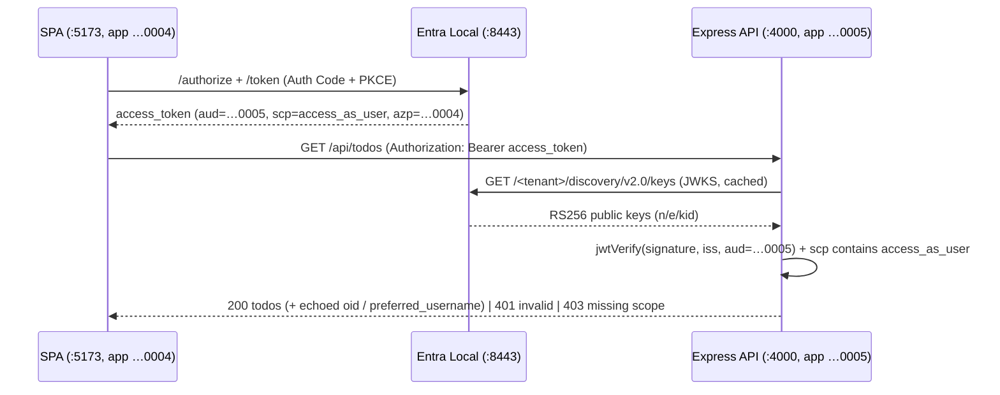

# Full-stack sample: JS SPA + Node/Express protected API

A complete, runnable **full-stack** sample for [Entra Local](../../README.md) with **one app
registration per tier**:

- **Front-end SPA** (`spa/`, port **5173**) — a [`@azure/msal-browser`](https://www.npmjs.com/package/@azure/msal-browser)
  single-page app with its **own** public app registration (`…0004`). It signs the user in
  (Authorization Code + PKCE, silent renewal) and acquires an access token **for the API's scope**.
- **Back-end API** (`api/`, port **4000**) — an **Express** resource server with its **own** app
  registration (`…0005`) that **exposes** the `access_as_user` scope. It validates every incoming
  Bearer token (signature via the emulator JWKS, plus `iss` / `aud` / `scp`) and returns protected
  data only when validation passes.

This is the one sample that exercises the **separate-API-app** pattern: the SPA gets a delegated
access token whose **audience is the back-end API**, and the API validates it — proving the
emulator's per-app *App ID URI → exposed scope → audience* model end to end. It is the canonical
"SPA calls my protected API" scenario developers actually build.



---

## What you'll see

1. Sign in as a seeded user (e.g. `alice@entralocal.dev` / `Password1!`).
2. Click **Load todos**. The SPA acquires an access token **for the API** and calls
   `GET http://localhost:4000/api/todos` with it.
3. The API validates the token and returns sample todos plus the claims it read from the token.
4. The SPA renders the todos and an **Access-token claims** panel showing `aud = …0005`,
   `scp = access_as_user`, and `azp = …0004` — i.e. a token minted **for the API**, **by the SPA**.

---

## App registrations & ports

These are **seeded** into the emulator with fixed GUIDs (see [`src/store/seed.ts`](../../src/store/seed.ts)),
so the configs below work with no admin-portal steps.

| Tier | App registration (`appId`)              | Type            | Port   | Redirect URI            | Scope                                              |
| ---- | --------------------------------------- | --------------- | ------ | ----------------------- | -------------------------------------------------- |
| SPA  | `cccccccc-0000-0000-0000-000000000004`  | public          | `5173` | `http://localhost:5173` | requests `api://…0005/access_as_user`              |
| API  | `cccccccc-0000-0000-0000-000000000005`  | public resource | `4000` | —                       | **exposes** `access_as_user` and `access_as_admin` |

- Tenant: `11111111-1111-1111-1111-111111111111`
- Emulator origin (default): `https://localhost:8443`
- The API's App ID URI is `api://cccccccc-0000-0000-0000-000000000005`.
- The API exposes a **second** scope, `access_as_admin`. `GET /api/todos` requires `access_as_user`,
  so a token carrying only `access_as_admin` is the canonical **403** case (right `aud`, wrong `scp`).

---

## Prerequisites

- **Node.js ≥ 22.13** (same as the emulator).
- The **Entra Local emulator running** on `https://localhost:8443` with its seed data. From the repo
  root:
  ```bash
  npm install
  npm run build
  npm start            # serves https://localhost:8443, seeds the demo directory on first boot
  ```
  …or use the [optional docker compose](#optional-docker-compose) in this folder.
- The emulator's **dev certificate trusted** by the API process (see [Certificate trust](#certificate-trust)).

---

## Setup & run

Open **three** terminals: emulator, API, SPA.

> **Shortcut (npm workspace):** this folder is an npm workspace covering both `api/` and `spa/`,
> so you can install and run both tiers with two commands instead of installing each separately:
>
> ```bash
> cd samples/fullstack-spa-api
> npm install     # installs api + spa dependencies together
> npm run dev     # starts the API (:4000) and SPA (:5173) in parallel
> ```
>
> You still start the emulator in its own terminal (step 1 below, or the optional docker compose).
> The per-tier commands in steps 2–3 keep working if you prefer separate terminals.

### 1. Emulator (terminal 1, from the repo root)

```bash
npm start
```

This generates the dev TLS certificate at `data/tls/cert.pem` on first boot.

### 2. API (terminal 2)

```bash
cd samples/fullstack-spa-api/api
npm install
# Cert trust is automatic: the API reads the emulator's data/tls/cert.pem at the repo root and
# trusts it for the JWKS fetch. Only set EMULATOR_CA_CERT if your cert.pem is elsewhere
# (e.g. docker compose) — see Certificate trust below.
npm start
```

The API logs the issuer/audience/scope/JWKS it will enforce, the dev cert it trusted, and a
one-time JWKS reachability probe, then listens on `http://localhost:4000`.

### 3. SPA (terminal 3)

```bash
cd samples/fullstack-spa-api/spa
npm install
npm run dev          # Vite serves http://localhost:5173 (strict port)
```

Open <http://localhost:5173>, sign in, and click **Load todos**.

> The SPA and API run over plain **HTTP on loopback** — only the **emulator** is HTTPS. The only
> place cert trust matters is the API's JWKS fetch.

---

## Endpoints

### API (this sample)

| Method & path     | Auth        | Description                                                              |
| ----------------- | ----------- | ----------------------------------------------------------------------- |
| `GET /health`     | none        | Liveness probe → `{ "status": "ok" }`.                                   |
| `GET /api/todos`  | Bearer ✔    | Protected. Returns sample todos + the caller's validated claims.        |

`GET /api/todos` returns:

- **200** with `{ caller, todos }` for a valid token (`aud=…0005`, `scp` contains `access_as_user`);
- **401** for a missing / malformed / invalid / expired token;
- **403** for a valid token that **lacks** `access_as_user` (e.g. a token minted for
  `api://…0005/access_as_admin` only — right audience, wrong scope).

### Emulator endpoints the tiers use

| Purpose            | Path                                                                          |
| ------------------ | ----------------------------------------------------------------------------- |
| Discovery          | `https://localhost:8443/11111111-1111-1111-1111-111111111111/v2.0/.well-known/openid-configuration` |
| Authorize          | `https://localhost:8443/11111111-1111-1111-1111-111111111111/oauth2/v2.0/authorize` |
| Token              | `https://localhost:8443/11111111-1111-1111-1111-111111111111/oauth2/v2.0/token` |
| JWKS               | `https://localhost:8443/11111111-1111-1111-1111-111111111111/discovery/v2.0/keys` |
| Issuer (`iss`)     | `https://localhost:8443/11111111-1111-1111-1111-111111111111/v2.0`             |

> The API reads the JWKS/issuer from these conventions. To be safe against a non-default emulator,
> confirm them in the discovery document (the first URL above) rather than hard-coding.

---

## Expected token claims

The access token the SPA sends to the API (decoded and shown in the SPA's claims panel):

| Claim   | Value                                    | Meaning                                  |
| ------- | ---------------------------------------- | ---------------------------------------- |
| `aud`   | `cccccccc-0000-0000-0000-000000000005`   | The **API** app — the token's audience.  |
| `scp`   | `access_as_user`                         | The delegated scope the API requires.    |
| `azp`   | `cccccccc-0000-0000-0000-000000000004`   | The **SPA** app that requested the token.|
| `oid`   | the signed-in user's object id           | Delegated user identity.                 |
| `iss`   | `https://localhost:8443/…/v2.0`          | Concrete-GUID issuer (matches discovery).|

---

## Configuration

### API env vars (`api/.env.example`)

The API reads these from `process.env` (it does **not** auto-load `.env`). All have defaults that
match the seed, so usually only `NODE_EXTRA_CA_CERTS` must be set.

| Variable              | Default                                   | Purpose                                          |
| --------------------- | ----------------------------------------- | ------------------------------------------------ |
| `EMULATOR_CA_CERT`    | _(repo-root `data/tls/cert.pem`)_         | Path to the emulator dev cert trusted for the JWKS fetch. Override only if the cert is elsewhere. |
| `NODE_EXTRA_CA_CERTS` | _(unset)_ — optional                      | Still honoured as a fallback CA source if `EMULATOR_CA_CERT` is unset.|
| `PORT`                | `4000`                                    | API listen port.                                 |
| `EMULATOR_ORIGIN`     | `https://localhost:8443`                  | Emulator scheme+host+port.                       |
| `TENANT_ID`           | `11111111-1111-1111-1111-111111111111`    | Tenant GUID for issuer/JWKS URLs.                |
| `API_APP_ID`          | `cccccccc-0000-0000-0000-000000000005`    | Required `aud` of incoming tokens.               |
| `REQUIRED_SCOPE`      | `access_as_user`                          | Required `scp` value.                            |
| `SPA_ORIGIN`          | `http://localhost:5173`                   | CORS allow-origin for the SPA.                   |

### SPA env vars (`spa/.env.example`)

Vite **auto-loads** `spa/.env`. All have defaults that match the seed.

| Variable               | Default                                  | Purpose                                   |
| ---------------------- | ---------------------------------------- | ----------------------------------------- |
| `VITE_EMULATOR_ORIGIN` | `https://localhost:8443`                 | Authority origin.                         |
| `VITE_TENANT_ID`       | `11111111-1111-1111-1111-111111111111`   | Tenant in the authority URL.              |
| `VITE_CLIENT_ID`       | `cccccccc-0000-0000-0000-000000000004`   | The SPA app registration.                 |
| `VITE_API_APP_ID`      | `cccccccc-0000-0000-0000-000000000005`   | Used to build the API scope.              |
| `VITE_REDIRECT_URI`    | `http://localhost:5173`                  | Must match the seeded redirect URI.       |
| `VITE_API_BASE`        | `http://localhost:4000`                  | Where the SPA calls the API.              |
| `VITE_API_SCOPE`       | `api://${VITE_API_APP_ID}/access_as_user`| The scope requested for the API token.    |
| `VITE_API_ADMIN_SCOPE` | `api://${VITE_API_APP_ID}/access_as_admin`| Second scope requested at sign-in; used to demonstrate the 403 path. |

---

## Certificate trust

Only the **API → emulator JWKS** call is over HTTPS, so only the API needs to trust the emulator's
self-signed dev certificate.

**By default this now works with zero configuration.** On startup the API reads the emulator's
`cert.pem` directly and trusts it **only** for the JWKS fetch. The default location is the
emulator's `data/tls/cert.pem` at the repo root (resolved relative to the API source, independent of
where you run `npm start` from). The startup banner prints the cert path it used and the result of a
one-time JWKS reachability probe:

```text
  emulator cert (CA): S:\...\entra-local\data\tls\cert.pem
  JWKS reachable: yes (1 signing key(s) fetched).
```

You only need to set an env var if the cert is somewhere else (e.g. you ran the emulator via this
sample's docker compose, or on another machine):

| How you run the emulator          | `cert.pem` location                | What to set                                  |
| --------------------------------- | ---------------------------------- | -------------------------------------------- |
| `npm start` from the repo root    | `data/tls/cert.pem` (default)      | nothing — used automatically                 |
| This sample's `docker compose up` | `./.emulator-data/tls/cert.pem`    | `EMULATOR_CA_CERT=../.emulator-data/tls/cert.pem` |

```bash
# PowerShell
$env:EMULATOR_CA_CERT = "../.emulator-data/tls/cert.pem"
# bash / zsh
export EMULATOR_CA_CERT=../.emulator-data/tls/cert.pem
```

> `EMULATOR_CA_CERT` (relative paths resolve against the directory you run `npm start` from) takes
> precedence, then `NODE_EXTRA_CA_CERTS` (still honoured for backwards compatibility), then the
> default repo-root cert. Setting `NODE_EXTRA_CA_CERTS` is no longer required.

The **SPA in the browser** also needs the emulator cert trusted by the OS/browser for the sign-in
redirect over HTTPS. See the root README's TLS section for trusting the dev cert in your browser, or
accept the one-time browser warning when first redirected to `https://localhost:8443`.

---

## Non-default emulator configuration

Running the emulator on a different host/port/tenant? Override the matching env vars in **both**
tiers and re-register the SPA's redirect URI if its port changes:

- API: `EMULATOR_ORIGIN`, `TENANT_ID` (and `API_APP_ID` if you seed a different app).
- SPA: `VITE_EMULATOR_ORIGIN`, `VITE_TENANT_ID`, `VITE_REDIRECT_URI`, `VITE_API_BASE`.

If you change the SPA port, also add the new `http://localhost:<port>` redirect URI to app `…0004`
(via the admin portal or `POST /admin/api/apps/{appId}/redirectUris`) — the emulator matches
redirect URIs **exactly**.

---

## Optional: docker compose

[`docker-compose.yml`](./docker-compose.yml) in this folder launches **only the emulator** (the SPA
and API still run via their npm commands, for consistency with the other samples):

```bash
docker compose up -d        # emulator on https://localhost:8443
# cert.pem is written to ./.emulator-data/tls/cert.pem on the host
docker compose down         # add -v to also delete ./.emulator-data
```

Then point the API at the compose cert: `EMULATOR_CA_CERT=../.emulator-data/tls/cert.pem`.

---

## Troubleshooting

| Symptom                                                       | Cause & fix                                                                                                   |
| ------------------------------------------------------------ | ------------------------------------------------------------------------------------------------------------ |
| API logs `unable to verify the first certificate` / JWKS 500 | The API can't read/trust the emulator cert. The startup banner prints the cert path and a JWKS probe result. Set `EMULATOR_CA_CERT` to the emulator's `cert.pem` (see Certificate trust).   |
| API returns **401** for a token you expect to be valid       | Wrong `aud` (token not minted for `…0005`) or wrong issuer. Confirm the SPA requested `api://…0005/access_as_user`. |
| API returns **403**                                          | Token is valid but `scp` is missing `access_as_user`. Check the SPA's `VITE_API_SCOPE`.                       |
| Browser blocks the API call (CORS)                           | The API only allows `SPA_ORIGIN` (default `http://localhost:5173`). Update it if the SPA runs elsewhere.      |
| Sign-in redirect fails with an invalid `redirect_uri`        | The SPA's `redirectUri` must exactly equal a registered URI. Default seed registers `http://localhost:5173`. |
| Vite says port 5173 is in use                                | The redirect URI is bound to `5173` (strict). Free the port, or change both the port and the redirect URI.   |

---

## How it works (no emulator protocol change)

- The API app `…0005` carries an App ID URI (`api://…0005`) and an enabled exposed scope
  `access_as_user`.
- When the SPA requests `api://…0005/access_as_user`, the emulator's `scopesAreValid` accepts it
  (it resolves to a registered, enabled scope on `…0005`), and `resolveAudience` sets the access
  token's `aud` to the API app's GUID. The SPA app `…0004` becomes `azp`.
- The API validates that exact token shape against the emulator JWKS. No emulator code changes are
  needed beyond the additive seed apps.

### Why the SPA requests the API scope at sign-in

Unlike production Entra ID (whose refresh tokens are effectively multi-resource), the emulator
**scopes refresh tokens strictly**: a silent `acquireTokenSilent` may only request scopes that were
granted at sign-in. So the SPA's `loginRequest` includes `api://…0005/access_as_user` (and
`access_as_admin`) up front — that is what lets the silent API-token acquisition succeed without a
second interactive round-trip. Requesting an un-granted scope silently returns `invalid_scope`
(AADSTS70011), not a new token.

This same strict scoping is how the sample mints the 403 token deterministically: because
`access_as_admin` was granted at sign-in, a `forceRefresh` for **only** that scope narrows the grant
and yields an `aud=…0005` token whose `scp` omits `access_as_user` — exactly what the API rejects
with 403.
