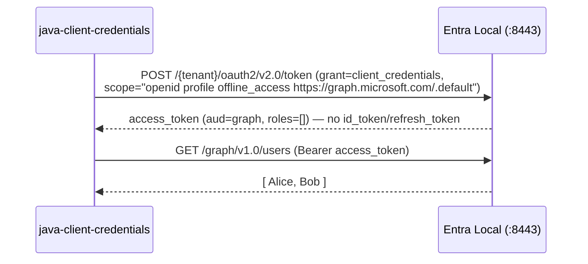

# java-client-credentials — Azure Identity / MSAL4J Client Credentials (OIDC companion scopes)

A minimal **Java daemon** that acquires an app-only token with the official
[Azure Identity](https://learn.microsoft.com/en-us/java/api/overview/azure/identity-readme) library's
`ClientSecretCredential` (MSAL4J underneath) against the local [Entra Local](../../README.md)
emulator, then calls the built-in Microsoft Graph `/users` endpoint.

This is the exact compatibility scenario reported in
[issue #28](https://github.com/cmaneu/entra-local/issues/28): Azure Identity always appends the
OIDC companion scopes `openid profile offline_access` to a client-credentials token request, even
though the app only asks for `https://graph.microsoft.com/.default`. Real Entra ID accepts that
request; see [`../../specs/2026-08-30_28-client-credentials-additional-scopes.md`](../../specs/2026-08-30_28-client-credentials-additional-scopes.md)
for the accepted contract this sample regression-tests.

**This is a client-credentials (app-only) flow — accepting the OIDC companion scopes does *not*
mean this becomes an interactive/OIDC flow.** The response has no `id_token`, no `refresh_token`,
and the access token has no `scp` or user-identity claims — only `aud`, `appid`/`azp`, and `roles`.

---

## What this sample demonstrates

- A **confidential client** (client secret) acquiring an app-only token via
  `ClientSecretCredentialBuilder` + `TokenRequestContext.addScopes("https://graph.microsoft.com/.default")`.
- Azure Identity's real, unmodified behavior of appending `openid profile offline_access` to that
  request — this sample never adds those scopes itself.
- The emulator resolving the request to a Graph-audience app-only token (`aud=https://graph.microsoft.com`,
  `roles: []`), and — with the seeded daemon app's own `api://…0002/.default` scope — an audience of
  that API with the seeded `Tasks.Read.All` application role.
- Calling `GET /graph/v1.0/users` with the resulting token.



---

## Prerequisites

- **JDK 17+** and **Maven 3.9+**.
- A **running Entra Local emulator** with its seeded demo directory, started with the
  **`localhost` compat origin** (see the [note in `../README.md`](../README.md)):

  ```bash
  # from the repo root
  npm install && npm run build
  PUBLIC_ORIGIN=https://localhost:8443 npm start
  ```

  The emulator writes its self-signed dev certificate to `data/tls/cert.pem` at the repo root. This
  sample trusts that file automatically (see [Certificate trust](#certificate-trust)).

  Prefer Docker? Use the [optional compose file](#optional-run-the-emulator-with-docker-compose).

This sample is a **standalone Maven project** — it is not part of the root build. Build and run it
from this folder.

## Run

```bash
mvn compile exec:java
```

Non-interactive / CI mode (functionally identical — this flow has no human interaction to begin
with — but prints one machine-readable status line instead):

```bash
mvn compile exec:java -Dexec.args=--smoke
```

## Configuration

| Variable          | Default                                  | Notes |
| ----------------- | ----------------------------------------- | ----- |
| `EMULATOR_ORIGIN`  | `https://localhost:8443`                  | The emulator's public origin; also used as the Azure Identity `authorityHost`. |
| `TENANT_ID`        | `11111111-1111-1111-1111-111111111111`    | The seeded default tenant. |
| `CLIENT_ID`        | `cccccccc-0000-0000-0000-000000000002`    | The seeded confidential **daemon** app registration. |
| `CLIENT_SECRET`    | `daemon-app-secret`                       | The seeded dev-only secret for that app (never a real credential). |
| `EMULATOR_CA_CERT` | `../../data/tls/cert.pem` (relative to this folder) | Path to the emulator's dev certificate; see [Certificate trust](#certificate-trust). |

## Expected output

```
Entra Local — Java Azure Identity client-credentials sample
  authority : https://localhost:8443/11111111-1111-1111-1111-111111111111
  clientId  : cccccccc-0000-0000-0000-000000000002
  requesting scope (Azure Identity appends OIDC companion scopes):
    https://graph.microsoft.com/.default

Token acquired. Decoded claims:
{"iss":"https://localhost:8443/11111111-1111-1111-1111-111111111111/v2.0","aud":"https://graph.microsoft.com","appid":"cccccccc-0000-0000-0000-000000000002","azp":"cccccccc-0000-0000-0000-000000000002","roles":[],"ver":"2.0", ...}

GET /graph/v1.0/users -> 200:
{"value":[{"displayName":"Alice Example", ...}, {"displayName":"Bob Example", ...}]}
```

Note there is no `id_token`, `refresh_token`, or `client_info` anywhere in this flow, and no `scp`
or user-identity claims in the decoded token — this is the app-only shape, unaffected by Azure
Identity's OIDC companion scopes.

## Certificate trust

The JDK doesn't trust the emulator's self-signed dev certificate by default. This sample builds a
single `java.net.http.HttpClient` (shared by Azure Identity via `azure-core-http-jdk-httpclient`
and by the plain `GET /graph/v1.0/users` call) with an explicit, **development-only** `SSLContext`
(`Trust.java`):

- If `EMULATOR_CA_CERT` (default `../../data/tls/cert.pem`, relative to this folder — i.e. the repo
  root's `data/tls/cert.pem`) exists, it's loaded as the **sole trusted CA**.
- Otherwise, the sample **falls back to trusting any certificate** and prints a loud warning. Never
  do this against anything but a local emulator.

Azure Identity also needs `.disableInstanceDiscovery()`: without it, MSAL tries to validate the
emulator's authority against `login.microsoftonline.com` first, which fails offline with an
unrelated-looking timeout.

## Dependency versions

- `com.azure:azure-identity:1.16.2` (latest stable at authoring time).
- `com.azure:azure-core-http-jdk-httpclient:1.1.7` — used instead of the Netty default so this
  sample can hand Azure Identity the *exact same* `java.net.http.HttpClient` (and dev-only
  `SSLContext`) used for the raw Graph call, in one place.

## Troubleshooting

| Symptom | Cause |
| --- | --- |
| `PKIX path building failed` / SSL handshake errors | The emulator's cert isn't trusted — check `EMULATOR_CA_CERT` points at `data/tls/cert.pem`, or that the emulator has actually started (it regenerates the cert on first run). |
| `invalid_client` | Wrong `CLIENT_SECRET`, or the client isn't the seeded confidential daemon app. |
| Connection refused | The emulator isn't running, or isn't listening on `EMULATOR_ORIGIN`. |
| `unexpected token/Graph response` | Confirm the emulator was started with `PUBLIC_ORIGIN=https://localhost:8443` (see [Prerequisites](#prerequisites)). |

## Optional: run the emulator with Docker Compose

```bash
docker build -t entra-local ../..   # from this folder, builds the root image
docker compose up
```

Then run the sample as above — it defaults to `https://localhost:8443`.
