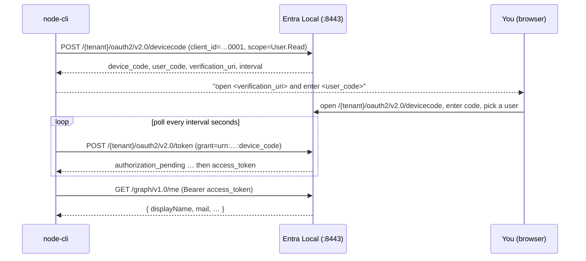

# node-cli — Device Authorization Grant (RFC 8628)

A minimal **Node.js CLI** that signs a user in with the **OAuth 2.0 Device Authorization Grant**
(a.k.a. *device code* flow) against the local [Entra Local](../../README.md) emulator, then calls
the built-in Microsoft Graph `/me` endpoint with the resulting token.

This is the flow you use from an environment that **can't pop a browser** — a terminal, an SSH
session, a TV app, a CI agent. Instead of redirecting, the app prints a short code and a URL; you
approve on any other device, and the CLI polls until it gets a token.

It uses [`@azure/msal-node`](https://www.npmjs.com/package/@azure/msal-node)'s
`PublicClientApplication.acquireTokenByDeviceCode` — the same MSAL code you'd ship against real
Microsoft Entra ID. Only the **authority** (and a dev-cert trust) point at the emulator.

---

## What this sample demonstrates

- The full device-code handshake (RFC 8628): device-authorization request → human approval → token
  polling → access token.
- A **public client** (no client secret) — the right registration type for a distributable CLI.
- Requesting a **Microsoft Graph** delegated scope (`User.Read`) so the minted token's audience is
  `https://graph.microsoft.com` and the emulator's `/me` endpoint accepts it.
- Reading the access token's claims and calling a protected resource. A successful `/me` response is
  itself proof the token validated against the emulator's live JWKS (signature / issuer / audience).



---

## Prerequisites

- **Node.js ≥ 22.13** (the emulator's floor; `node:sqlite` is available unflagged from 22.13).
- A **running Entra Local emulator** with its seeded demo directory. From the repo root:

  ```bash
  npm install && npm run build && npm start      # serves https://localhost:8443
  ```

  The emulator writes its self-signed dev certificate to `data/tls/cert.pem` at the repo root. This
  CLI trusts that file automatically (see [Certificate trust](#certificate-trust)).

  Prefer Docker? Use the [optional compose file](#optional-run-the-emulator-with-docker-compose).

This sample is a **standalone project** — it is not part of the root build. Install and run it from
this folder.

---

## Setup & run (one command after install)

```bash
cd samples/node-cli
npm install
npm start
```

You'll see something like:

```
Entra Local — device-code CLI sample
  authority: https://localhost:8443/11111111-1111-1111-1111-111111111111
  client_id: cccccccc-0000-0000-0000-000000000001
  scope:     User.Read

To sign in, open https://localhost:8443/11111111-…/oauth2/v2.0/devicecode in a browser and
enter the code BCDF-GHJK to authenticate.

VERIFICATION_URI=https://localhost:8443/11111111-…/oauth2/v2.0/devicecode
USER_CODE=BCDF-GHJK

Waiting for you to approve in the browser…
```

Open the URL, enter the code, and pick a seeded user (e.g. **Alice**, `alice@entralocal.dev`). Your
browser will warn about the self-signed certificate — that's expected for a local dev cert; accept
it to continue. With the emulator's default `REQUIRE_PASSWORD=false`, clicking the account signs you
in directly; otherwise the password is `Password1!`.

Once approved, the CLI prints the token claims and the `/me` result:

```
Signed in.
  account:  alice@entralocal.dev
Access-token claims:
  aud=https://graph.microsoft.com
  scp=openid profile User.Read
  oid=aaaaaaaa-0000-0000-0000-000000000001
  …
Calling GET https://localhost:8443/graph/v1.0/me …
  status: 200
  body:   {"@odata.context":"…","id":"aaaaaaaa-…","displayName":"Alice Example", …}
```

---

## Configuration

Every setting is read from an environment variable with a default that matches the emulator's seeded
demo directory, so the sample runs with **zero configuration** out of the box. (The CLI reads
`process.env` directly; it does **not** auto-load a `.env` file — export the vars in your shell, or
copy [`.env.example`](./.env.example) and source it with your own loader.)

| Variable           | Default                                    | Purpose                                                                                          |
| ------------------ | ------------------------------------------ | ------------------------------------------------------------------------------------------------ |
| `EMULATOR_ORIGIN`  | `https://localhost:8443`                   | Emulator origin (scheme + host + port). Used to build the authority and the Graph URL.           |
| `TENANT_ID`        | `11111111-1111-1111-1111-111111111111`     | Tenant GUID; the authority is `${EMULATOR_ORIGIN}/${TENANT_ID}`.                                  |
| `CLIENT_ID`        | `cccccccc-0000-0000-0000-000000000001`     | The seeded **public** "Sample SPA" app used as the device-code client.                           |
| `SCOPE`            | `User.Read`                                | Delegated Graph scope requested. A Graph scope ⇒ token `aud=https://graph.microsoft.com`.        |
| `EMULATOR_CA_CERT` | _(unset)_ → repo-root `data/tls/cert.pem`  | Path to the emulator's dev cert, trusted for the HTTPS calls. See [below](#certificate-trust).   |
| `NODE_EXTRA_CA_CERTS` | _(unset)_                               | Honoured as a fallback for `EMULATOR_CA_CERT`; also Node's standard "extra CA" mechanism.         |

**No port / no redirect URI.** A device-code client never receives a redirect, so this sample has no
listening port and registers no redirect URI — unlike the SPA / web samples.

### App registration

| Property        | Value                                    |
| --------------- | ---------------------------------------- |
| Display name    | `Sample SPA` (reused)                    |
| App (client) ID | `cccccccc-0000-0000-0000-000000000001`   |
| Client type     | **Public** (no secret)                   |
| Flow            | Device Authorization Grant (RFC 8628)    |

This app is **already seeded** by the emulator — there is nothing to register. (It's the same public
app the device-code end-to-end test uses.)

### Endpoints used

| Step                  | Method & path                                            |
| --------------------- | -------------------------------------------------------- |
| Device authorization  | `POST /{tenant}/oauth2/v2.0/devicecode`                  |
| Human approval page   | `GET  /{tenant}/oauth2/v2.0/devicecode` (enter the code) |
| Token polling         | `POST /{tenant}/oauth2/v2.0/token` (`grant_type=urn:ietf:params:oauth:grant-type:device_code`) |
| Protected resource    | `GET  /graph/v1.0/me`                                    |

### Expected token claims

| Claim | Value                                  | Why                                                            |
| ----- | -------------------------------------- | ------------------------------------------------------------- |
| `aud` | `https://graph.microsoft.com`          | A Graph scope was requested, so Graph is the audience.        |
| `scp` | contains `User.Read`                   | The granted delegated scope (plus OIDC scopes).               |
| `oid` | the approving user's object id         | Delegated (user) token — required by `/me`.                   |
| `tid` | `11111111-…`                           | The tenant.                                                   |

---

## Optional ID-token claims & group claims

This sample can also demonstrate **optional claims configured on the client app registration** — the
ID token receives claims from the **client** application's token configuration.

A dedicated client app, **`local-web-client`** (`cccccccc-0000-0000-0000-000000000006`), is seeded
with optional **ID-token** claims (`email`, `upn`, `given_name`, `family_name`, `groups`) and
`SecurityGroup` group claims. Configure your own app's claims from the portal's **Token
configuration** card, then decode the issued ID token. Sign in as:

- **`bob@entralocal.dev`** — 2 groups → inline `groups` array in the token.
- **`alice@entralocal.dev`** — 4 groups (over the demo overage limit of `3`) → the token carries an
  overage pointer, and you resolve the full list via `GET /graph/v1.0/me/memberOf`.

See **[../../docs/token-configuration.md](../../docs/token-configuration.md)** for the full reference,
portal steps, and decoded token examples.

---

## Certificate trust

The emulator serves HTTPS with a **self-signed dev certificate**, so the CLI's outbound calls (MSAL's
device-code/token requests and the Graph `/me` call) must trust it.

This sample does that **for you**: it reads the cert file and trusts it explicitly for its HTTPS
calls. The path is resolved in this order:

1. `EMULATOR_CA_CERT` (if set),
2. else `NODE_EXTRA_CA_CERTS` (if set),
3. else the emulator's default `data/tls/cert.pem` at the repo root.

So if you started the emulator with `npm start` from the repo root, **you don't need to set
anything**. If the cert lives elsewhere (e.g. the Docker volume below), point `EMULATOR_CA_CERT` at
it:

```bash
# PowerShell
$env:EMULATOR_CA_CERT = "./.emulator-data/tls/cert.pem"
# bash / zsh
export EMULATOR_CA_CERT=./.emulator-data/tls/cert.pem
```

> `NODE_EXTRA_CA_CERTS` is the standard msal-node recipe, but Node only reads it **at process
> startup**. This sample also reads the file explicitly, so it works whether or not the variable was
> exported before Node started. Never disable TLS verification
> (`NODE_TLS_REJECT_UNAUTHORIZED=0`) — trust the dev CA instead.

---

## Running against a non-default emulator

Point the CLI at a different host/port, tenant, or client app entirely through env vars — no code
change:

```bash
# bash / zsh
export EMULATOR_ORIGIN=https://127.0.0.1:9443
export TENANT_ID=22222222-2222-2222-2222-222222222222
export CLIENT_ID=cccccccc-0000-0000-0000-000000000001
export EMULATOR_CA_CERT=/path/to/that/emulator/cert.pem
npm start
```

(The `CLIENT_ID` must be a registered **public** app in that emulator; the default one is seeded.)

---

## Optional: run the emulator with Docker Compose

[`docker-compose.yml`](./docker-compose.yml) launches **only** the emulator (the CLI still runs with
`npm start`):

```bash
docker compose up -d     # emulator on https://localhost:8443; cert at ./.emulator-data/tls/cert.pem
export EMULATOR_CA_CERT=./.emulator-data/tls/cert.pem
npm start
docker compose down      # add -v to also wipe ./.emulator-data
```

---

## Smoke test (CI)

[`smoke.mjs`](./smoke.mjs) runs the whole flow headlessly: it spawns the **unmodified** CLI, reads
the `USER_CODE` it prints, drives the emulator's approval page as Alice (the same
`lookup → signin → decide` form posts a browser would make), and asserts the CLI minted a
Graph-audience token (`scp ⊇ User.Read`) and that `GET /me` returned Alice's profile.

```bash
# from the repo root, with the emulator running on :8443:
node samples/node-cli/smoke.mjs
# → SMOKE PASSED (5/5 assertions)
```

This is exactly what the `node-cli-sample` CI job runs.

---

## Troubleshooting

| Symptom                                                    | Cause / fix                                                                                                                |
| ---------------------------------------------------------- | -------------------------------------------------------------------------------------------------------------------------- |
| `self-signed certificate` / `unable to verify the first certificate` | The CLI can't find the emulator cert. Set `EMULATOR_CA_CERT` to the right `cert.pem` (see [Certificate trust](#certificate-trust)). |
| `ECONNREFUSED` / `fetch failed`                            | The emulator isn't running on `EMULATOR_ORIGIN`. Start it (`npm start` from the repo root) or fix the origin.               |
| Browser says **"That code didn't work"**                   | The code expires (default 15 min) — restart `npm start` for a fresh one. Codes are case-insensitive; the hyphen is optional. |
| `invalid_client` / `unauthorized_client`                  | `CLIENT_ID` isn't a registered public app in this emulator. Use the seeded default, or register one in the admin portal.    |
| `/me` returns **403**                                      | The token isn't a delegated user token (no `oid`). Make sure you completed the browser approval as a user.                 |
| `/me` returns **401**                                      | Wrong audience — the token's `aud` isn't Graph. Keep `SCOPE` a Graph scope like `User.Read`.                               |
| The CLI seems to hang                                      | It's polling — finish the browser approval. It polls every `interval` seconds (default 5) until you approve or it expires.  |

---

## Production notes

- A real CLI would **cache and reuse** tokens (and refresh tokens) across runs via an MSAL token-cache
  plugin so the user isn't prompted every time. This sample keeps the default in-memory cache for a
  single run to stay minimal.
- Against real Microsoft Entra ID, drop the dev-cert trust and the `knownAuthorities` override and
  point `authority` at `https://login.microsoftonline.com/<tenant>` — the MSAL call is otherwise
  identical.
