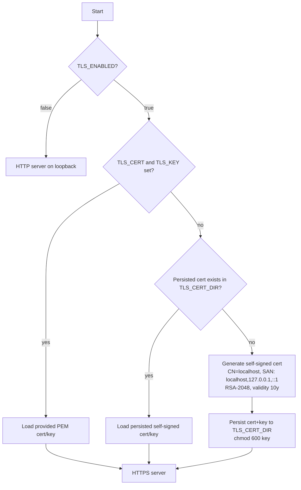

# Feature #1 — Server, Config & TLS Foundation + Scaffolding

- **Roadmap ref:** Iteration 1, feature #1 ("Server, config & TLS foundation + scaffolding").
- **Dependencies:** none. **This feature establishes the toolchain and canonical contracts every later feature is verified against.**
- **Status:** ⬜ Not started.

> **Canonical-reference notice.** This spec is the single source of truth for: the **repository/folder layout**, the **single-origin path map**, the **config/env reference table**, the **npm script contract**, and the **test harness + CI** wiring. Features #2–#14 MUST link here rather than redefine these. Data-model contracts live in [#2](2026-06-22_02-sqlite-store-schema-seed.md); token/claim contracts live in [#5](2026-06-22_05-token-service.md).

---

## Goal / outcome

A runnable, secure-by-default Fastify HTTPS server that loads and validates configuration, serves a `/health` endpoint, enforces the canonical single-origin path map (with reserved API prefixes and SPA fallback), and ships the full developer toolchain: project scaffold, npm scripts, a deterministic vitest unit+integration harness (boot-app + `fastify.inject`), a real-MSAL e2e harness skeleton, and a CI pipeline. After this feature, any later feature can be implemented and self-verified the moment it is written.

---

## Scope

### In scope
- Project scaffolding: `package.json`, TypeScript (`strict`, ESM, `NodeNext`), ESLint + Prettier, `.gitignore`, `.env.example`, `entra-local.config.example.json`.
- Fastify app factory (`buildApp()`), TLS-aware server bootstrap (`createServer()`), and process entrypoint (`src/index.ts`).
- HTTPS by default with an **auto-generated, persisted self-signed certificate** (stable fingerprint), custom cert/key override, and an HTTP-fallback toggle.
- `zod`-based config loading/validation from environment + optional config file, with a full env/config reference table.
- `/health` endpoint.
- The **canonical single-origin path map**: reserved API prefixes registered as Fastify plugins; SPA fallback (placeholder portal) for unmatched non-API GET routes; allowlisted `{tenant}` segment validation.
- The finalized repository/folder layout.
- The npm script contract (`dev`/`build`/`test`/`test:e2e`/`lint`/`typecheck`) plus `start`.
- vitest unit + integration harness with a shared boot-app + inject helper and deterministic test config; e2e harness skeleton (real `@azure/msal-node` + `@azure/msal-browser` headless via Playwright) that is wired but only exercises `/health` + cert trust until flow features land.
- CI pipeline outline (GitHub Actions).
- Pino structured logging via Fastify; request-id correlation.

### Out of scope (deferred to later features)
- Actual identity/token/graph/admin route handlers (only their plugin mount points + 501/empty stubs are reserved here). Each later feature fills in its own routes.
- The functional React portal UI (#12) — #1 ships only a static placeholder served by the SPA fallback so the `/` route and fallback behavior are testable.
- SQLite store and seed (#2) — #1 wires a config key for `DB_PATH` but does not open the DB; the store plugin lands in #2.
- Docker / `npm start` packaging hardening (#14) — `start` script exists; Dockerfile is finalized in #14.

---

## Contracts

### Canonical single-origin path map
One origin (default `https://localhost:8443`). All API surfaces are reserved path prefixes; everything else falls through to the SPA. `{tenant}` is **allowlisted** to the configured tenant GUID (`TENANT_ID`) plus the literal aliases `common`, `organizations`, `consumers`; any other value → `400 invalid_request` (for OAuth endpoints) or `404` (for discovery/JWKS). Tenant-alias normalization rules are owned by [#4](2026-06-22_04-oidc-discovery.md).

| Path pattern | Methods | Owner feature | Notes |
|---|---|---|---|
| `/health` | GET | #1 | Liveness/readiness JSON. |
| `/{tenant}/v2.0/.well-known/openid-configuration` | GET | #4 | OIDC discovery. |
| `/{tenant}/discovery/v2.0/keys` | GET | #3 | JWKS. |
| `/{tenant}/oauth2/v2.0/authorize` | GET, POST | #6 | Authorization endpoint + sign-in UI. |
| `/{tenant}/oauth2/v2.0/token` | POST | #6 (code), #7 (refresh), #8 (client_credentials), #15 (device) | Token endpoint, grant-multiplexed. |
| `/{tenant}/oauth2/v2.0/logout` | GET | #9 | Front-channel logout. |
| `/{tenant}/oauth2/v2.0/devicecode` | POST | #15 (Iteration 2) | **Path reserved now; returns `501` until #15.** |

**Reserved-stub rule (lockstep enablement).** So that discovery (#4) can advertise core endpoints in dependency order without producing advertised-`404`s, #1 registers **`501 Not Implemented` JSON stubs for every reserved OIDC/OAuth/UserInfo/Graph route in this map** (`authorize`, `token`, `logout`, `devicecode`, `userinfo`, `graph/*`) at the canonical paths. Each later feature **replaces** its stub with a real handler. Thus every path in this map always resolves to a registered route (never the SPA, never a bare `404`); only its behavior changes from `501` to implemented. #4's "advertised endpoint resolves to a registered route" check is therefore satisfied from the moment #4 ships.
| `/graph/v1.0/me` | GET | #10 | Current user from token `oid`. |
| `/graph/v1.0/users`, `/graph/v1.0/users/{id}` | GET | #10 | Users (paged) / single. |
| `/graph/v1.0/groups`, `/graph/v1.0/groups/{id}`, `/graph/v1.0/groups/{id}/members` | GET | #10 | Groups + membership. |
| `/graph/oidc/userinfo` | GET, POST | #9 | OIDC UserInfo (Bearer). |
| `/admin/api/...` | GET/POST/PATCH/DELETE | #11 | Admin REST API. |
| `/admin/api/health` | GET | #11 | Admin health (alias of `/health` semantics). |
| `/` and any other non-API GET | GET | #1/#12 | SPA fallback → portal `index.html`. |

**Reserved-prefix rule:** the API prefixes are `/{tenant}/...` (tenant-allowlisted), `/graph/...`, `/admin/...`, `/health`. The SPA fallback MUST NOT shadow these. Non-GET requests to unmatched routes return `404`. Requests under an API prefix that don't match a registered route return `404` with a JSON body (never the SPA HTML).

> **Resolved conflict (UserInfo path).** global-spec §6.2 lists UserInfo at `/{tenant}/openid/userinfo`. The locked single-origin decision (memory/decisions.md, 2026-06-22) places it at `/graph/oidc/userinfo`. **The locked decision wins** (it is the most recent and explicitly signed off). #4's discovery `userinfo_endpoint` and #9 MUST advertise/serve `/graph/oidc/userinfo`. Noted as a documented divergence from the draft global-spec.

### `/health` endpoint
- `GET /health` → `200` `application/json`:
  ```jsonc
  {
    "status": "ok",
    "version": "<package version>",
    "uptimeSeconds": 12,
    "tls": true,            // reflects TLS_ENABLED
    "tenantId": "11111111-1111-1111-1111-111111111111"
  }
  ```
- Never requires auth. Used by Docker healthcheck (#14) and e2e readiness polling.

### Config / env reference table
Configuration is loaded from (in precedence order, highest first): explicit environment variables → config file (`entra-local.config.json` or `CONFIG_FILE` path, JSON) → built-in defaults. The merged object is validated with a single `zod` schema; **any validation failure aborts startup with a non-zero exit and a human-readable error listing the offending keys** (fail-fast, no partial boot).

| Key (env) | Config-file field | Type | Default | Description |
|---|---|---|---|---|
| `HOST` | `host` | string | `localhost` | Bind host. |
| `PORT` | `port` | int (1–65535) | `8443` | Listen port (HTTPS or HTTP per `TLS_ENABLED`). |
| `TENANT_ID` | `tenantId` | GUID | `11111111-1111-1111-1111-111111111111` | Fixed tenant GUID; also the allowlisted `{tenant}` value. |
| `ISSUER` | `issuer` | URL | derived: `${scheme}://${host}:${port}/${tenantId}/v2.0` | Override when fronted by a proxy. MUST equal token `iss` and discovery `issuer`. |
| `PUBLIC_ORIGIN` | `publicOrigin` | URL | derived: `${scheme}://${host}:${port}` | Base origin used to build endpoint URLs in discovery + MSAL snippets. |
| `DB_PATH` | `dbPath` | path | `./data/entra-local.db` | SQLite file (opened by #2). |
| `TLS_ENABLED` | `tls.enabled` | bool | `true` | HTTPS on/off; `false` → HTTP on loopback. |
| `TLS_CERT` | `tls.certPath` | path | _(auto)_ | PEM cert override. If set, `TLS_KEY` required. |
| `TLS_KEY` | `tls.keyPath` | path | _(auto)_ | PEM private key override. |
| `TLS_CERT_DIR` | `tls.certDir` | path | `./data/tls` | Where the auto-generated cert/key are persisted. |
| `REQUIRE_PASSWORD` | `requirePassword` | bool | `false` | Account picker vs password login (consumed by #6/#16). |
| `SEED_ON_START` | `seedOnStart` | bool | `true` if DB empty | Apply default seed (consumed by #2). |
| `TOKEN_LIFETIME_AUTH_CODE_SECONDS` | `tokenLifetimes.authCode` | int | `300` | Authorization code TTL (single use). |
| `TOKEN_LIFETIME_ID_SECONDS` | `tokenLifetimes.idToken` | int | `3600` | ID token TTL. |
| `TOKEN_LIFETIME_ACCESS_SECONDS` | `tokenLifetimes.accessToken` | int | `3600` | Access token TTL. |
| `TOKEN_LIFETIME_REFRESH_SECONDS` | `tokenLifetimes.refreshToken` | int | `86400` | Refresh token TTL (rotating). |
| `TOKEN_LIFETIME_DEVICE_CODE_SECONDS` | `tokenLifetimes.deviceCode` | int | `900` | Device code TTL (reserved for #15). |
| `DEVICE_CODE_INTERVAL_SECONDS` | `deviceCodeInterval` | int | `5` | Device-code poll interval (reserved for #15). |
| `GRAPH_RESOURCE_ID` | `graphResourceId` | string | `https://graph.microsoft.com` | Default audience/identifier for Graph access tokens (consumed by #5/#10). |
| `LOG_LEVEL` | `logLevel` | enum | `info` | Pino level (`fatal|error|warn|info|debug|trace|silent`). |
| `CONFIG_FILE` | _(n/a)_ | path | `./entra-local.config.json` | Optional config-file location. Absent file is not an error. |
| `NODE_ENV` | _(n/a)_ | enum | `development` | `development|test|production`. |

The validated, frozen config object is exposed via a Fastify decorator (`app.config`) so all plugins read one canonical source.

---

## Behavior / flow

### Startup sequence (`src/index.ts`)
1. Load + validate config (`config/loadConfig.ts`). On failure → print errors, `process.exit(1)`.
2. Resolve TLS material (see TLS flow). If `TLS_ENABLED=false`, skip.
3. `buildApp(config)` → Fastify instance with plugins registered (health, path-map guards, reserved API mount points, SPA fallback, error handler). Later features add their plugins inside their own `register`.
4. `createServer(app, config)` → start listening with `{ https: { key, cert } }` or plain HTTP.
5. Log the resolved origin, issuer, and key endpoint URLs at `info`.
6. Graceful shutdown on `SIGINT`/`SIGTERM` (`app.close()`).

### TLS material resolution

- The auto-generated cert MUST be **stable across restarts** (generated once, then loaded). Fingerprint stability is asserted in tests by booting twice against the same `TLS_CERT_DIR`.
- Generation uses `node:crypto` (`generateKeyPairSync('rsa')`) + a minimal X.509 self-sign. (If a pure-Node self-sign proves impractical, `selfsigned` npm package is the approved fallback — recorded as a Decision.) SANs cover `localhost`, `127.0.0.1`, `::1`.
- Provided-cert override: if exactly one of `TLS_CERT`/`TLS_KEY` is set → config validation error.

### Path-map enforcement
- Each API surface is a Fastify plugin registered under its prefix. #1 registers placeholder plugins for `/{tenant}/...`, `/graph/...`, `/admin/...`. Per the **Reserved-stub rule** above, every canonical OIDC/OAuth/UserInfo/Graph path is registered as a `501 Not Implemented` JSON stub (replaced by its owning feature); unmatched sub-routes under a prefix return JSON `404` (via a prefixed `setNotFoundHandler`).
- `{tenant}` validation is a shared preHandler/param-schema utility (`http/tenant.ts`): allowlist = `[TENANT_ID, 'common', 'organizations', 'consumers']`. Reject otherwise.
- SPA fallback: a catch-all GET handler serves `portal/dist/index.html` (placeholder in #1). It is registered so it never matches API prefixes (guard: if `req.url` starts with a reserved prefix → `404` JSON).

### Error handling
- Central Fastify error handler emits OAuth-style JSON for `/{tenant}/oauth2/*` (shape owned by #6) and generic `{ "error": { "code", "message" } }` elsewhere. Validation errors from Fastify JSON-schema/zod → `400`. Unhandled → `500` with a generic message (details only in logs).

---

## Repository / folder layout (finalized)

Finalizes the tentative layout in conventions §Repository layout.

```
/                         package.json, tsconfig.base.json, tsconfig.json, vitest.config.ts,
                          vitest.e2e.config.ts, eslint.config.js, .prettierrc, .gitignore,
                          .env.example, entra-local.config.example.json, Dockerfile (stub→#14),
                          .github/workflows/ci.yml, README.md, DESIGN.md
specs/                    roadmap.md, global-spec.md, per-feature specs
memory/                   decisions.md, conventions.md
src/                      Emulator server (TypeScript, ESM)
  index.ts                Process entrypoint (npm start)
  app.ts                  buildApp(config) → Fastify instance factory (used by tests via inject)
  server.ts               createServer(app, config) → TLS/HTTP listen wrapper
  config/                 loadConfig.ts, schema.ts (zod), defaults.ts
  tls/                    cert.ts (generate/persist/load)
  store/                  (#2) db.ts, migrations/, repositories/, seed.ts, reset.ts
  identity/               (#4/#6/#7/#8/#9/#15) discovery.ts, authorize.ts, token.ts, logout.ts
  tokens/                 (#3/#5) keys.ts, jwks.ts, mint.ts, validate.ts, claims.ts
  graph/                  (#9/#10) me.ts, users.ts, groups.ts, userinfo.ts
  admin/                  (#11) users.ts, groups.ts, apps.ts, secrets.ts, seedReset.ts
  http/                   pathmap.ts (prefix constants), tenant.ts (allowlist guard),
                          errors.ts (error handler + OAuth error helpers), plugins.ts, spaFallback.ts
portal/                   React + TypeScript (Vite) admin portal (#12; placeholder index.html in #1)
  dist/                   Built static assets served by SPA fallback
samples/                  Iteration 3
docs/                     Iteration 4
test/
  helpers/                buildTestApp.ts, constants.ts, fixtures.ts, msalDrivers.ts (e2e)
  unit/                   *.test.ts
  integration/            *.test.ts (fastify.inject)
  e2e/                    Real-MSAL end-to-end (run via test:e2e)
data/                     Runtime SQLite + persisted cert (gitignored)
```

---

## npm script contract

| Script | Runs | Notes |
|---|---|---|
| `npm run dev` | `tsx watch src/index.ts` for the server **and** `vite` dev server for the portal (concurrently); Vite proxies API prefixes to the server for HMR. | Single command for local dev. |
| `npm run build` | `tsc -p tsconfig.json` (server → `dist/`) + `vite build` (portal → `portal/dist/`). | Used by CI + `start`. |
| `npm run typecheck` | `tsc --noEmit` across server + portal. | No emit. |
| `npm run lint` | `eslint .` + `prettier --check .`. | Lint + format gate. |
| `npm test` | `vitest run` with `vitest.config.ts` → unit + integration + token-conformance. | Deterministic; ephemeral DB; no network. |
| `npm run test:e2e` | `vitest run --config vitest.e2e.config.ts` → starts the emulator, runs real-MSAL drivers. | Slower; spawns a server + headless browser. |
| `npm start` | `node dist/index.js`. | Requires prior `build`. Packaging hardened in #14. |

Script names are a **stable contract**; CI and agents depend on them. They MUST exist (even if a suite is empty) from #1 onward.

---

## Test harness

### Unit + integration (vitest, `npm test`)
- **Shared boot helper** `test/helpers/buildTestApp.ts`:
  ```ts
  // Pseudocode contract
  export async function buildTestApp(overrides?: Partial<Config>): Promise<{
    app: FastifyInstance;       // built via buildApp(testConfig)
    config: Config;
    inject: FastifyInstance['inject'];
    dbPath: string;             // ephemeral, unique per call
    close(): Promise<void>;     // app.close() + unlink dbPath
  }>
  ```
- **Deterministic test config** (`test/helpers/constants.ts`): `TENANT_ID=11111111-1111-1111-1111-111111111111`; fixed seed (from #2) with fixed GUIDs; `DB_PATH` = unique temp file under `data/.tmp/<uuid>.db` (not the OS temp dir; **never use `/tmp`/`mktemp`** per repo policy) created and removed per test; `TLS_ENABLED=false` for inject-based tests (HTTPS irrelevant to `inject`); `PORT` unused for inject. Each test file gets an isolated DB → parallel-safe.
- Integration tests use `app.inject({ method, url, headers, payload })` and assert status, body, and persisted state (querying the repository directly).
- **Token-conformance** tests (added meaningfully in #3/#5) live under `test/integration` and verify issued JWTs against the live JWKS using `jose`.

### Real-MSAL e2e (`npm run test:e2e`)
- `vitest.e2e.config.ts` runs serially against a **real listening server** (not inject), started on a **fixed test port** (e.g. `8443` or a dedicated `E2E_PORT`) with an ephemeral DB and the deterministic seed, TLS enabled with the persisted self-signed cert.
- Drivers in `test/helpers/msalDrivers.ts`:
  - **Browser flows:** `@azure/msal-browser` driven headlessly via Playwright (Chromium). Cert trust handled by launching the browser with `ignoreHTTPSErrors`/accepting the self-signed cert, and Node's `NODE_EXTRA_CA_CERTS` pointed at the persisted cert for `@azure/msal-node`/fetch.
  - **Confidential/app flows:** `@azure/msal-node` (`ConfidentialClientApplication`) configured with `authority=<origin>/{tenant}`, `knownAuthorities=[host:port]`, OIDC `protocolMode`.
- In #1 the e2e suite only asserts: server boots over HTTPS, `/health` reachable, the self-signed cert is trusted by the Node MSAL client's HTTP stack, and MSAL can be instantiated against the authority (full discovery fetch asserted once #4 lands). Flow assertions are added by #6/#7/#8/#9/#13.
- Playwright is an e2e-only devDependency; its browser download is cached in CI.

---

## CI pipeline outline (`.github/workflows/ci.yml`)
- Trigger: PR + push to main.
- Runner: `ubuntu-latest`; Node **24** (matrix may add 22.5+ to assert the `node:sqlite` floor). `.NET`/Python provisioning deferred to #13.
- Steps: checkout → `npm ci` → `npm run lint` → `npm run typecheck` → `npm run build` → `npm test` → cache Playwright browsers → `npm run test:e2e`.
- Deterministic env: `NODE_ENV=test`, fixed `TENANT_ID`, ephemeral DB, fixed port. No external network.
- Fail the job on any non-zero step.

---

## Data changes
None. (DB is opened by [#2](2026-06-22_02-sqlite-store-schema-seed.md). #1 only validates `DB_PATH` as config.)

---

## Dependencies & assumptions
- **Runtime:** Node **22.5+** (target Node 24) for `node:sqlite` (used by #2). #1 pins `engines.node >= 22.5`.
- **Assumption:** the React portal is not functional yet; a static placeholder `portal/dist/index.html` is committed so SPA fallback is testable. Real portal in #12.
- **Assumption (UI identity):** the only user-facing surface #1 ships is the placeholder HTML and `/health` JSON — no brand-styled UI. `DESIGN.md` is still `Status: undefined`; the designer establishes visual identity before #6's sign-in page and #12's portal. #1 does not block on it.
- **Assumption:** pure-Node self-signed cert generation is feasible; the `selfsigned` package is an approved fallback if not.

---

## Testable acceptance criteria
1. `npm run lint`, `npm run typecheck`, and `npm run build` all exit `0` on a clean checkout. *(DoD #2)*
2. **Config validation (unit):** valid env/config produces a frozen `Config` matching the reference table defaults; missing/invalid values (e.g. non-GUID `TENANT_ID`, `PORT=0`, only `TLS_CERT` set) abort with a non-zero exit and an error naming the offending key.
3. **Config precedence (unit):** env overrides config-file overrides defaults; absent config file is not an error.
4. **TLS auto-gen (integration):** with no cert present, boot creates a persisted cert+key under `TLS_CERT_DIR`; a second boot loads the same cert (identical SHA-256 fingerprint). Key file perms are restricted (best-effort on Windows).
5. **TLS override (integration):** providing `TLS_CERT`/`TLS_KEY` uses them; supplying only one fails config validation.
6. **HTTP fallback (integration):** `TLS_ENABLED=false` serves `/health` over HTTP.
7. **/health (integration via inject):** `GET /health` → `200` with the documented JSON shape and `tenantId` = configured tenant.
8. **Path map / tenant allowlist (integration):** `GET /common/v2.0/.well-known/openid-configuration`-style routing reaches the discovery plugin mount (the `501` stub pre-#4 is acceptable — the route is matched, not the SPA); an invalid tenant segment (e.g. `/badtenant/oauth2/v2.0/authorize`) returns a JSON error, not SPA HTML; every reserved OIDC/OAuth/Graph/UserInfo path returns `501` (not `404`/SPA) until its owning feature lands.
9. **SPA fallback (integration):** `GET /` and `GET /some/portal/route` return the placeholder `index.html` (`text/html`); `GET /admin/api/does-not-exist` returns JSON `404`, never HTML.
10. **Boot helper (harness self-test):** `buildTestApp()` returns an injectable app and a unique ephemeral `dbPath` that is removed by `close()`; two concurrent `buildTestApp()` calls use distinct DB files.
11. **e2e skeleton (`npm run test:e2e`):** the suite starts the emulator over HTTPS, polls `/health` to ready, instantiates an `@azure/msal-node` client against the authority with the self-signed cert trusted, and tears down cleanly.
12. **CI:** the workflow runs lint → typecheck → build → test → test:e2e and fails on any error.

---

## Open questions
None blocking. *(Decision: pure-Node X.509 self-sign vs `selfsigned` package is settled in favor of trying pure-Node first with `selfsigned` as a recorded fallback; this does not affect any downstream contract.)*
