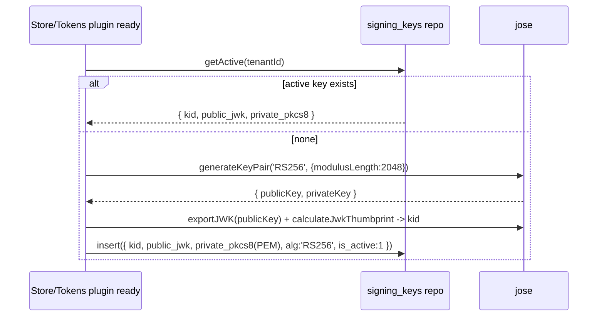

# Feature #3 — Signing Keys & JWKS Endpoint

- **Roadmap ref:** Iteration 1, feature #3 ("Signing keys & JWKS endpoint").
- **Dependencies:** [#1](2026-06-22_01-server-config-tls-foundation.md) (server, harness), [#2](2026-06-22_02-sqlite-store-schema-seed.md) (`signing_keys` table + repository).
- **Status:** ⬜ Not started.

> **Canonical-reference notice.** This spec owns RSA signing-key lifecycle and the JWKS endpoint. [#5](2026-06-22_05-token-service.md) signs tokens with the active key from here; [#4](2026-06-22_04-oidc-discovery.md) advertises `jwks_uri` → this endpoint; resource APIs (#10) and e2e verify tokens against it.

---

## Goal / outcome

Persisted RSA signing key(s) with stable `kid` values, generated on first run via `jose`, stored in the `signing_keys` table, and exposed as a standards-correct JWKS at `/{tenant}/discovery/v2.0/keys`. Keys survive restarts so signatures and `kid` are cacheable by MSAL and resource APIs. Built rotation-ready (multiple public keys can be advertised; one active signer) without a rotation UI.

---

## Scope

### In scope
- Key generation (`tokens/keys.ts`): RSA-2048, `RS256`, via `jose` (`generateKeyPair`), with a stable `kid` derived from the public key (RFC 7638 JWK thumbprint).
- Persistence/load of keys via the `signing_keys` repository ([#2](2026-06-22_02-sqlite-store-schema-seed.md)): public JWK + PKCS8 private key, `is_active`, `not_after`.
- "Ensure active key" bootstrap: on store-plugin ready, if no active key for the tenant, generate+persist one.
- JWKS endpoint (`tokens/jwks.ts`, registered under `/{tenant}`): returns all current public keys (active + not-yet-expired retired keys) as a JWK Set.
- Accessor used by #5: `getActiveSigner(tenantId)` → `{ kid, privateKey, alg }`; `getVerificationKey(kid)` for validation.
- Rotation-readiness primitives (no UI): repository supports inserting a new active key and demoting the previous to retired-but-published until `not_after`.
- Deterministic test key: harness can pre-seed a fixed RSA test key (fixed `kid`, fixed PEM) so CI token signatures/JWKS are byte-reproducible.

### Out of scope
- Token assembly/signing (#5) and validation flows (#5/#10).
- A rotation UI or scheduled rotation (deferred — see roadmap "Signing-key rotation UI").
- EC/`ES256` keys (RS256 only for MVP; MSAL/Entra default).
- Per-app or per-resource signing keys (single tenant key set).

---

## Contracts

### Endpoint
| Method | Path | Auth | Response |
|---|---|---|---|
| GET | `/{tenant}/discovery/v2.0/keys` | none | `200 application/json` JWK Set |

`{tenant}` allowlist + alias normalization per [#1](2026-06-22_01-server-config-tls-foundation.md)/[#4](2026-06-22_04-oidc-discovery.md). All aliases return the same key set (single tenant).

**Response shape** (JWK Set):
```jsonc
{
  "keys": [
    {
      "kty": "RSA",
      "use": "sig",
      "alg": "RS256",
      "kid": "<stable thumbprint kid>",
      "n": "<base64url modulus>",
      "e": "AQAB"
      // optional: "x5c", "x5t" omitted in MVP (Entra includes x5c; not required by MSAL JWKS verification)
    }
  ]
}
```
- Only public components (`n`, `e`) are exposed — never private material.
- `Cache-Control: public, max-age=86400` (keys are stable); `Content-Type: application/json`.
- Each published key includes `kid`, `use=sig`, `alg=RS256`.

### Token header contract (consumed by #5)
Tokens signed by #5 MUST set JWT header `{ "alg": "RS256", "typ": "JWT", "kid": "<active kid>" }`. The `kid` MUST exist in the JWKS response.

### Data
Uses the `signing_keys` table from [#2](2026-06-22_02-sqlite-store-schema-seed.md). No new tables.

---

## Behavior / flow

### Key bootstrap

- `kid` = RFC 7638 JWK thumbprint (base64url SHA-256) of the public RSA JWK → stable and content-derived.
- Generation happens once; subsequent boots load the persisted key (stable `kid`/signatures across restarts — a core requirement).

### JWKS request
1. Validate/normalize `{tenant}`.
2. `signingKeys.listPublic(tenantId)` → all keys where `is_active=1` OR (`not_after` is null/in the future). Map each to a public JWK (strip private).
3. Return `{ keys: [...] }` with cache headers.

### Rotation-readiness (no UI)
- A future `rotate(tenantId)` (not exposed via UI in MVP) would: generate a new key, set it `is_active=1`, demote the old key to `is_active=0` with `not_after = now + grace`. Until `not_after`, the old public key stays in JWKS so previously issued tokens still verify. #3 implements the repository primitives and ensures the JWKS query already unions active + unexpired retired keys; no endpoint triggers rotation in Iteration 1.

### Deterministic CI key
- In test mode the harness seeds a **fixed** RSA key (committed test-only PEM + precomputed `kid`) via `signingKeys.insert` before tokens are minted, so JWKS output and token signatures are reproducible across runs. This test key is clearly marked dev/test-only.

---

## Data changes
Inserts/reads rows in `signing_keys` ([#2](2026-06-22_02-sqlite-store-schema-seed.md)). No DDL.

---

## Dependencies & assumptions
- `jose` for key generation, JWK export, thumbprint, and (in #5) signing.
- **Assumption:** RSA-2048 / RS256 is the only algorithm MVP needs (matches Entra v2 defaults and MSAL expectations).
- **Assumption:** storing private keys in the local SQLite file in plaintext PKCS8 is acceptable for a documented dev tool.
- **Assumption:** a single active signing key per tenant suffices; the schema/query are rotation-ready for the future.

---

## Testable acceptance criteria
1. **Bootstrap (integration):** first boot against an empty DB generates and persists exactly one active RSA key; a second boot reuses it (identical `kid` and modulus `n`). *(stable across restarts)*
2. **JWKS shape (integration via inject):** `GET /{tenant}/discovery/v2.0/keys` → `200` JWK Set with `kty=RSA`, `use=sig`, `alg=RS256`, present `kid`, `n`, `e=AQAB`; no `d`/`p`/`q`/private fields appear.
3. **Alias parity (integration):** `common`/`organizations`/`consumers`/GUID all return the same key set.
4. **Thumbprint kid (unit):** `kid` equals the RFC 7638 thumbprint of the published public JWK.
5. **Verification round-trip (token-conformance):** a JWT signed by #5's `getActiveSigner` verifies against the key fetched from the JWKS endpoint (using `jose.createRemoteJWKSet` or local JWK import), and verification fails if the `kid` is altered.
6. **Cache headers (integration):** the JWKS response sets `Cache-Control` with a non-zero `max-age`.
7. **Rotation-readiness (unit):** inserting a second active key while marking the first retired with a future `not_after` causes JWKS to list **both** keys; a retired key past `not_after` is excluded.
8. **Deterministic CI (integration):** with the fixed test key seeded, JWKS output is byte-identical across runs.

---

## Open questions
None blocking. *(Decision: `kid` = RFC 7638 thumbprint for content-stability. Decision: omit `x5c`/`x5t` — Entra includes them but MSAL/`jose` JWKS verification only needs `n`/`e`/`kid`; flagged to #13 to confirm no cross-platform client requires `x5c`.)*
