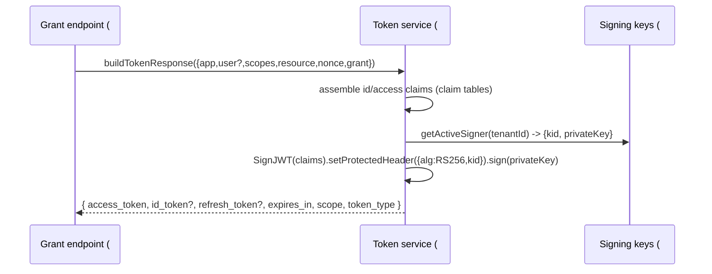

# Feature #5 — Token Service

- **Roadmap ref:** Iteration 1, feature #5 ("Token service").
- **Dependencies:** [#2](2026-06-22_02-sqlite-store-schema-seed.md) (data model: codes, refresh tokens, apps, users), [#3](2026-06-22_03-signing-keys-jwks.md) (active signing key + JWKS).
- **Status:** ⬜ Not started.

> **Canonical-reference notice.** This spec is the single source of truth for **JWT claim sets, token lifetimes, and the issuance/validation contracts for authorization codes and refresh tokens.** Features #6 (auth code), #7 (refresh), #8 (client credentials), #9 (userinfo), #10 (graph) MUST use these functions and claim tables — no divergent token assembly elsewhere.

---

## Goal / outcome

A pure, well-tested token service that mints and RS256-signs ID and access JWTs with Entra-parity claim sets, validates incoming access tokens (signature, issuer, audience, expiry, scope/role), and issues/validates the opaque authorization codes and refresh tokens that the grant endpoints exchange. Lifetimes are configurable. Signing uses the active key from [#3](2026-06-22_03-signing-keys-jwks.md); verification uses the JWKS.

---

## Scope

### In scope
- `tokens/claims.ts` — claim assembly for ID and access tokens (tables below).
- `tokens/mint.ts` — `mintIdToken(...)`, `mintAccessToken(...)` → signed compact JWTs via `jose.SignJWT` with the active key (`kid` header).
- `tokens/validate.ts` — `validateAccessToken(jwt, { audience?, requiredScopes?, requiredRoles? })` → decoded claims or a typed error; verifies signature against JWKS, `iss`, `aud`, `exp`/`nbf`, and scope/role presence.
- Authorization-code issuance + validation contract (opaque code → stored row → exchange/consume), used by #6.
- Refresh-token issuance + validation + rotation contract (opaque token, hashed at rest), used by #7.
- A `TokenResponse` builder producing the standard OAuth token JSON (used by #6/#7/#8/#15).
- Configurable lifetimes from [#1](2026-06-22_01-server-config-tls-foundation.md)'s `TOKEN_LIFETIME_*` keys.
- An injectable clock (`now()`) for deterministic tests.

### Out of scope
- HTTP endpoints (`/authorize`, `/token`) — owned by #6/#7/#8/#15; they call this service.
- Client authentication (secret verification) — #2 provides `verifySecret`; #6/#8 enforce it. #5 receives an already-authenticated context.
- Device-code semantics (#15) — #5's `TokenResponse` builder is reused but device grant validation is #15.
- Consent modeling — auto-consent; scopes are granted as requested+registered.

---

## Contracts

### Token response JSON (OAuth `token_endpoint` success)
```jsonc
{
  "token_type": "Bearer",
  "expires_in": 3600,            // access token TTL seconds
  "ext_expires_in": 3600,
  "scope": "openid profile email offline_access access_as_user",
  "access_token": "<JWT>",
  "id_token": "<JWT>",           // present when openid scope requested
  "refresh_token": "<opaque>",   // present when offline_access granted
  "client_info": "<base64url>"   // present for delegated (user) flows; see below
}
```

**`client_info` (MSAL account identity — required for parity).** Real Entra always returns `client_info` and MSAL (browser + node, AAD/default protocol mode) uses it to build the account `homeAccountId` and cache key; without it `acquireTokenSilent` cache lookups are unreliable. Value = `base64url(JSON.stringify({ uid: <user.oid>, utid: <tenantId> }))`. Included in all **delegated** (user-present) token responses (auth code #6, refresh #7); **omitted** for app-only client-credentials (#8), which has no user/account. Deterministic given fixed seed GUIDs.

### ID token claims
Header: `{ "alg":"RS256", "typ":"JWT", "kid":"<active kid>" }`.

| Claim | Source / value |
|---|---|
| `iss` | Discovery `issuer` ([#4](2026-06-22_04-oidc-discovery.md)) — GUID-form, `${origin}/${tenantId}/v2.0`. |
| `sub` | Stable per (user, app) pairwise subject. Deterministic hash of `user.id` + `app.appId` (+ tenant). |
| `aud` | The client app's `appId` (client_id). |
| `exp` | `iat + idTokenLifetime`. |
| `iat` | `now()`. |
| `nbf` | `now()`. |
| `tid` | Tenant GUID. |
| `oid` | `user.id` (object id). |
| `name` | `user.display_name`. |
| `preferred_username` | `user.user_principal_name`. |
| `email` | `user.mail` (omitted if null and `email` scope absent). |
| `nonce` | Echoed from the authorize request (if provided). |
| `ver` | `"2.0"`. |

### Access token claims
Header: same as ID token.

| Claim | Delegated (user) | App-only (client credentials) |
|---|---|---|
| `iss` | issuer | issuer |
| `sub` | pairwise subject (user+app) | the app's `appId` (no user) |
| `aud` | resource/audience (see audience rule) | resource/audience |
| `exp` | `iat + accessTokenLifetime` | same |
| `iat` / `nbf` | `now()` | `now()` |
| `tid` | tenant GUID | tenant GUID |
| `oid` | `user.id` | _omitted_ (no user) |
| `azp` | client `appId` | client `appId` |
| `appid` | client `appId` | client `appId` |
| `scp` | space-delimited granted delegated scopes | _omitted_ |
| `roles` | _omitted_ (delegated; app-role assignment out of MVP scope) | array of granted app roles (`roles` from the resource app) |
| `ver` | `"2.0"` | `"2.0"` |

**Audience rule:** 
- If the request targets a resource scope (e.g. `api://<appId>/access_as_user` or a Graph scope `https://graph.microsoft.com/.default`), `aud` = the resource identifier (the resource app's `appId` GUID, its `app_id_uri`, or `GRAPH_RESOURCE_ID` for Graph). 
- If only OIDC scopes (`openid profile email offline_access`) are requested with no resource, the access token `aud` defaults to the configured `GRAPH_RESOURCE_ID` (so `/me` works post-sign-in, matching the common MSAL default-scope behavior). 
- `scp` contains the granted scope **names** (without the resource prefix), space-delimited, matching Entra.

### Subject (`sub`) derivation
`sub = base64url(SHA-256(user.id + '|' + app.appId + '|' + tenantId))` — stable, pairwise, non-reversible. (Deterministic for CI.)

### Lifetimes (configurable; defaults from [#1](2026-06-22_01-server-config-tls-foundation.md))
| Token | Default | Config key |
|---|---|---|
| Authorization code | 300s, single-use | `TOKEN_LIFETIME_AUTH_CODE_SECONDS` |
| ID token | 3600s | `TOKEN_LIFETIME_ID_SECONDS` |
| Access token | 3600s | `TOKEN_LIFETIME_ACCESS_SECONDS` |
| Refresh token | 86400s, rotating | `TOKEN_LIFETIME_REFRESH_SECONDS` |
| Device code | 900s (reserved #15) | `TOKEN_LIFETIME_DEVICE_CODE_SECONDS` |

### Authorization-code contract (consumed by #6)
- `issueAuthCode({ appId, userId, redirectUri, scopes, resource, codeChallenge, codeChallengeMethod, nonce })` → opaque high-entropy `code` (≥256-bit, base64url), persisted to `authorization_codes` ([#2](2026-06-22_02-sqlite-store-schema-seed.md)) with `expires_at`, `consumed=0`.
- `redeemAuthCode({ code, appId, redirectUri, codeVerifier })` →
  1. Load row by `code`; error `invalid_grant` if missing.
  2. Reject if `consumed=1` (replay), expired, or `app_id`/`redirect_uri` mismatch.
  3. PKCE: if `code_challenge` present, verify `codeVerifier` against it per method (S256/plain); mismatch → `invalid_grant`. If a challenge was stored, a verifier is required.
  4. Atomically mark `consumed=1` (single-use; race-safe via [#2](2026-06-22_02-sqlite-store-schema-seed.md)'s `consume`).
  5. Return `{ userId, scopes, resource, nonce }` for token minting.

### Refresh-token contract (consumed by #7)
- `issueRefreshToken({ appId, userId, scopes, resource, rotatedFrom? })` → opaque token (returned to client); stored **hashed** (SHA-256) with TTL.
- `redeemRefreshToken({ token, appId, requestedScopes? })` →
  1. Hash + lookup; error `invalid_grant` if missing/revoked/expired.
  2. Verify `app_id` match.
  3. Scope down: requested scopes must be a subset of the original grant; default to the original.
  4. **Rotate:** revoke the presented token, issue a new refresh token (`rotated_from` = old id). Return `{ userId, scopes, resource, newRefreshToken }`. (#7 finalizes reuse-detection policy.)

### Access-token validation contract (consumed by #9/#10)
`validateAccessToken(bearer, opts)`:
- Verify compact JWT signature via JWKS (`getVerificationKey(kid)` from [#3](2026-06-22_03-signing-keys-jwks.md)); `alg` must be `RS256`.
- Verify `iss` == issuer, `exp`/`nbf` within clock skew (±60s), `aud` ∈ accepted audiences (`opts.audience` or `GRAPH_RESOURCE_ID` for Graph).
- If `opts.requiredScopes`: every required scope ∈ `scp`. If `opts.requiredRoles`: ∈ `roles`.
- On failure → typed error mapped by callers to `401`/`403` with `WWW-Authenticate` (Graph/userinfo error shape owned by #9/#10).

---

## Behavior / flow (mint path, shared)


---

## Data changes
Reads/writes `authorization_codes`, `refresh_tokens`; reads `app_registrations`, `app_scopes`, `app_roles`, `users`, `tenants`, `signing_keys` — all from [#2](2026-06-22_02-sqlite-store-schema-seed.md). No DDL.

---

## Dependencies & assumptions
- `jose` for signing/verification.
- **Assumption:** auto-consent — any registered+requested scope/role is granted (no consent modeling in MVP).
- **Assumption:** delegated tokens do **not** include `roles` (app-role-to-user assignment is out of MVP scope); only client-credentials tokens carry `roles`.
- **Assumption:** default audience = `GRAPH_RESOURCE_ID` when no resource scope is requested, so post-sign-in `/me` works (matches MSAL default behavior of acquiring a Graph token).
- **Assumption:** clock skew tolerance ±60s for validation.
- **Note to #10 (Graph):** emulator-minted Graph access tokens carry `ver:"2.0"` with `aud=GRAPH_RESOURCE_ID`; real Microsoft Graph tokens are `ver:"1.0"`. This is harmless because the emulator's own Graph (#10) validates against **this** issuer/JWKS — #10's validator must accept `ver:"2.0"` and the emulator issuer, not assume Microsoft's v1 shape.

---

## Testable acceptance criteria
1. **ID token claims (unit + token-conformance):** minted ID token contains every claim in the ID table with correct values; `iss` == discovery issuer; `aud` == client_id; `ver=2.0`; `nonce` echoed when provided.
2. **`client_info` (unit):** delegated token responses include `client_info` = `base64url({uid:oid,utid:tenantId})`; app-only responses omit it.
3. **Access token (delegated) claims (unit):** contains `scp` (space-delimited granted scopes), `azp`/`appid`, `oid`, `aud` per the audience rule; no `roles`.
4. **Access token (app-only) claims (unit):** contains `roles` array, no `oid`, no `scp`; `sub`==`appId`.
5. **Signature/JWKS (token-conformance):** every minted token verifies against the live JWKS ([#3](2026-06-22_03-signing-keys-jwks.md)); tampering the payload or `kid` fails verification.
6. **Lifetimes (unit):** `exp-iat` equals the configured lifetime for ID/access; overriding `TOKEN_LIFETIME_*` changes it; `expires_in` matches access TTL.
7. **Auth code single-use + PKCE (unit):** `redeemAuthCode` succeeds once with the correct verifier; fails on replay, expiry, wrong `redirect_uri`/`app_id`, missing/incorrect verifier; S256 and plain both validated.
8. **Refresh rotation (unit):** redeeming returns a new refresh token, revokes the old; redeeming the revoked token fails `invalid_grant`; requested scopes must be a subset of the grant.
9. **Validation (unit):** `validateAccessToken` accepts a fresh token with matching `aud`/scopes; rejects expired, wrong-issuer, wrong-audience, wrong-`alg`, and missing-required-scope/role tokens with typed errors.
10. **Deterministic `sub` (unit):** `sub` is stable across mints for the same (user, app) and differs across apps.
11. **Clock injection (unit):** with a fixed injected clock, all time-based claims and expiries are reproducible.

---

## Open questions
None blocking. *(Decisions recorded: pairwise `sub` via SHA-256; delegated tokens omit `roles`; default audience falls back to `GRAPH_RESOURCE_ID`; refresh tokens rotate on every redemption with hashed-at-rest storage.)*
