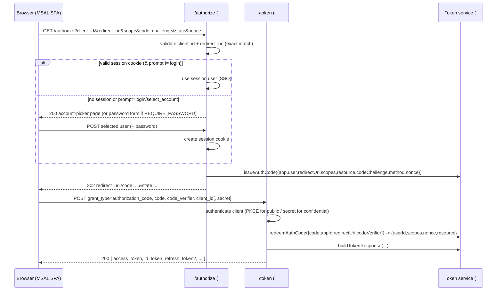

# Feature #6 — Authorization Code + PKCE + Interactive Sign-in

- **Roadmap ref:** Iteration 1, feature #6 ("Auth Code + PKCE + interactive sign-in"). **UI:** ✓ (sign-in / account-picker page).
- **Dependencies:** [#4](2026-06-22_04-oidc-discovery.md) (discovery/issuer/alias rules), [#5](2026-06-22_05-token-service.md) (token + code contracts). Transitively #1/#2/#3.
- **Status:** ⬜ Not started.

> **Canonical-reference notice.** This spec owns the **OAuth error-response conventions** for the STS endpoints (`/authorize`, `/token`), reused by #7/#8/#15. It is the primary MSAL flow; #7/#9 build directly on its e2e harness.

---

## Goal / outcome

A working Authorization Code + PKCE flow: `/{tenant}/oauth2/v2.0/authorize` renders an interactive account-picker sign-in page (or honors an existing emulator session for SSO), then redirects back with a code; `/{tenant}/oauth2/v2.0/token` (authorization_code grant) verifies PKCE and the client, and returns JWKS-verifiable ID + access tokens (and a refresh token when `offline_access` is granted). This is the core flow a real `@azure/msal-browser` SPA drives end to end.

---

## Scope

### In scope
- `GET|POST /{tenant}/oauth2/v2.0/authorize` — validate request, render sign-in/account-picker, or auto-redirect on existing session.
- Sign-in interaction: account-picker page (default) listing seeded users; optional password form when `REQUIRE_PASSWORD=true` (full password UX hardening is #16, but #6 honors the toggle at a basic level).
- Session creation (cookie) for SSO across `/authorize` calls.
- `POST /{tenant}/oauth2/v2.0/token` — `grant_type=authorization_code` only (other grants are multiplexed in by #7/#8/#15).
- PKCE **S256 and plain** verification.
- `state`/`nonce` handling, exact redirect-URI validation, scope parsing/granting (`openid profile email offline_access` + registered resource scopes).
- Standard OAuth error responses (the canonical error convention below).
- Client authentication for confidential clients on the token call (`client_secret_post`/`client_secret_basic`); public clients (SPA) authenticate via PKCE only.

### Out of scope
- Refresh-token grant (#7), client-credentials grant (#8), device-code grant (#15) — separate specs; they extend the same `/token` route.
- UserInfo/logout (#9).
- Full password-login UX, lockout, MFA (#16 / out of scope).
- Consent screen (auto-consent).
- Branded visual design — see UI note below.

---

## Contracts

### Authorization endpoint
`GET|POST /{tenant}/oauth2/v2.0/authorize`

**Request params** (query for GET; form for POST):
| Param | Required | Notes |
|---|---|---|
| `client_id` | yes | Must match a registered `app_id`. |
| `response_type` | yes | Must be `code`. |
| `redirect_uri` | yes | Must exactly match a registered redirect URI for the app. |
| `scope` | yes | Space-delimited; must include `openid` for OIDC. |
| `state` | recommended | Opaque; echoed back verbatim. |
| `code_challenge` | required for public clients | PKCE challenge. |
| `code_challenge_method` | with challenge | `S256` (preferred) or `plain`. |
| `nonce` | recommended | Echoed into ID token. |
| `response_mode` | no | `query` (default) or `fragment`. |
| `prompt` | no | `login`/`select_account`/`none` honored minimally (see flow). |
| `login_hint` | no | Pre-selects a user in the picker. |

**Success:** `302` redirect to `redirect_uri` with `code` (+ `state`) appended per `response_mode`.

**Error handling (authorize):**
- If `redirect_uri`/`client_id` are **invalid/unregistered** → do **not** redirect; render an error page (`400`) — never redirect to an unvalidated URI (security).
- If the request is otherwise invalid but `redirect_uri` is valid → redirect back with `error`/`error_description`/`state` (e.g. `unsupported_response_type`, `invalid_scope`, `login_required` for `prompt=none` with no session).

### Token endpoint (authorization_code grant)
`POST /{tenant}/oauth2/v2.0/token` — `application/x-www-form-urlencoded`.

| Param | Required | Notes |
|---|---|---|
| `grant_type` | yes | `authorization_code`. |
| `code` | yes | From the authorize redirect. |
| `redirect_uri` | yes | Must match the authorize request. |
| `client_id` | yes | Must match the code's app. |
| `code_verifier` | required if a challenge was issued | PKCE verifier. |
| `client_secret` | confidential clients | Via body (`client_secret_post`) or `Authorization: Basic` (`client_secret_basic`). |
| `scope` | no | Optional narrowing; subset of granted. |

**Success:** `200` `application/json` — the token response shape owned by [#5](2026-06-22_05-token-service.md) (`access_token`, `id_token`, `refresh_token` if `offline_access`, `token_type`, `expires_in`, `scope`). `Cache-Control: no-store`, `Pragma: no-cache`.

### Canonical OAuth error-response convention (owned here; reused by #7/#8/#15)
Token-endpoint errors → JSON, appropriate `4xx`, `Cache-Control: no-store`:
```jsonc
{
  "error": "invalid_grant",
  "error_description": "AADSTS-style human message. Code expired or already redeemed.",
  "error_codes": [70008],
  "timestamp": "2026-06-22T16:00:00Z",
  "trace_id": "<uuid>",
  "correlation_id": "<uuid>"
}
```
| Condition | `error` | HTTP |
|---|---|---|
| Unknown/invalid `grant_type` | `unsupported_grant_type` | 400 |
| Missing/invalid required param | `invalid_request` | 400 |
| Bad/expired/replayed code, PKCE mismatch, redirect mismatch | `invalid_grant` | 400 |
| Bad client secret / unknown client / public client sending secret | `invalid_client` | 401 |
| Requested scope not registered/allowed | `invalid_scope` | 400 |
| Unsupported tenant alias | `invalid_request` | 400 |

(`error_codes`/`trace_id`/`correlation_id` mimic Entra's `AADSTS` shape closely enough for MSAL error handling; exact AADSTS numeric codes are best-effort.)

---

## Behavior / flow



### Validation rules (authorize)
1. Normalize `{tenant}` ([#4](2026-06-22_04-oidc-discovery.md)); invalid → error page.
2. `client_id` must resolve to an app; else error page (no redirect).
3. `redirect_uri` must **exactly** match a registered URI for that app; else error page (no redirect).
4. `response_type` must be `code`; `scope` must include `openid` for an ID token. Public clients MUST send `code_challenge` (+ method). Confidential clients may use PKCE or secret-at-token.
5. Resolve session: if a valid session cookie exists and `prompt` is not `login`/`select_account`, reuse it (SSO). `prompt=none` with no session → redirect back with `error=login_required`. `prompt=select_account` always shows the picker.
6. `login_hint` pre-selects the matching seeded user.

### Sign-in interaction
- **Account picker (default):** server-rendered page listing seeded/enabled users (display name + UPN). Selecting a user POSTs back, creates a session, and continues. No password.
- **Password mode (`REQUIRE_PASSWORD=true`):** the page shows username + password; #6 verifies via `users.verifyPassword` ([#2](2026-06-22_02-sqlite-store-schema-seed.md)). Wrong credentials re-render with an error. (Polished password UX is #16.)
- Session cookie: `HttpOnly`, `Secure` (when TLS), `SameSite=None` is **not** used (same-origin); use `SameSite=Lax`. Backed by the `sessions` table.
- The authorize request parameters are preserved across the interactive POST (e.g. via a signed hidden form field / transient state) so the flow resumes after sign-in.

### Validation rules (token, authorization_code)
1. `grant_type=authorization_code`; else `unsupported_grant_type`.
2. Authenticate the client: confidential → verify `client_secret` (`verifySecret`); public → no secret allowed (sending one → `invalid_client`), rely on PKCE.
3. `redeemAuthCode` ([#5](2026-06-22_05-token-service.md)) — handles single-use, expiry, redirect/app match, PKCE verify.
4. Build and return the token response; include `refresh_token` iff `offline_access` was granted.

### UI note (DESIGN.md undefined)
The sign-in/account-picker page is the first user-facing UI. `DESIGN.md` is currently `Status: undefined`. **#6 ships a minimal, accessible, unstyled-but-functional server-rendered page**; final visual styling is applied once the designer (Murdock) establishes the visual identity in `DESIGN.md` (a prerequisite shared with #12 the portal). The functional contract (fields, POST targets, error states, redirect behavior) in this spec is independent of styling and is what tests assert. **Recommendation to the orchestrator: invoke the designer to define `DESIGN.md` before/in parallel with #6's implementation** so the sign-in page and portal share one identity.

---

## Data changes
- Writes `authorization_codes` (via #5), `sessions` (login). Reads `app_registrations`, `app_redirect_uris`, `app_secrets`, `app_scopes`, `users`. All from [#2](2026-06-22_02-sqlite-store-schema-seed.md). No DDL.

---

## Dependencies & assumptions
- **Assumption:** auto-consent — no consent screen; requested+registered scopes are granted.
- **Assumption:** account-picker (passwordless) is the default per the locked sign-in UX decision; `REQUIRE_PASSWORD` gives basic password login now, polished in #16.
- **Assumption:** confidential clients may complete code flow with secret and/or PKCE; public clients require PKCE.
- **Assumption:** redirect URIs are matched **exactly** (no wildcard/loopback-port relaxation in MVP) — documented; loopback flexibility can be a later enhancement.

---

## Testable acceptance criteria
1. **Authorize validation (integration via inject):** missing/invalid `client_id` or unregistered `redirect_uri` → error page (`400`), **no redirect**; invalid scope/`response_type` with a valid `redirect_uri` → `302` back with `error`/`state`.
2. **Account picker (integration):** `GET /authorize` with valid params and no session returns the picker page listing seeded enabled users; selecting a user issues a code and `302`s to `redirect_uri` with `code` + echoed `state`.
3. **SSO session (integration):** a second `/authorize` with the session cookie and no `prompt` skips the picker and issues a code directly; `prompt=select_account` forces the picker; `prompt=none` without a session → redirect with `error=login_required`.
4. **PKCE S256 (integration):** full code→token exchange with a valid S256 verifier returns tokens; a wrong verifier → `invalid_grant`.
5. **PKCE plain (unit/integration):** `plain` method validated equivalently.
6. **Single-use code (integration):** redeeming the same code twice → second attempt `invalid_grant`.
7. **Confidential client auth (integration):** confidential app exchange requires a correct `client_secret` (both `client_secret_post` and `client_secret_basic` accepted); wrong/missing secret → `invalid_client`; a public client sending a secret → `invalid_client`.
8. **Token shape + offline_access (token-conformance):** the response matches [#5](2026-06-22_05-token-service.md)'s shape; `refresh_token` present iff `offline_access` granted; `id_token`/`access_token` verify against JWKS with correct `nonce`, `aud`, `scp`.
9. **Error convention (integration):** each row of the error table returns the documented `error` + HTTP status with `Cache-Control: no-store`.
10. **Real-MSAL e2e (`npm run test:e2e`):** an `@azure/msal-browser` SPA driven headlessly (Playwright) completes Authorization Code + PKCE against the running emulator (authority `<origin>/{tenant}`, `knownAuthorities=[host:port]`), receives JWKS-verifiable ID + access tokens, and `acquireTokenSilent` finds them in cache (relies on `client_info` from [#5](2026-06-22_05-token-service.md)). The e2e driver pins MSAL's protocol mode explicitly — **default AAD `protocolMode` with `knownAuthorities`** (so `client_info`-based account identity is exercised); the alternative OIDC `protocolMode` is validated separately in #13. (This e2e is extended by #7 for refresh and #9 for userinfo/logout.)
11. **REQUIRE_PASSWORD (integration):** with the toggle on, the picker is replaced by a password form; correct seeded password completes the flow; wrong password re-renders with an error and issues no code.

---

## Open questions
None blocking. *(Decisions: exact redirect-URI matching for MVP; canonical OAuth error shape mimics AADSTS; sign-in page ships functional-but-unstyled pending DESIGN.md, with a recommendation to run the designer before finalizing visuals. Cross-platform MSAL.NET/Python sign-in is validated in #13.)*
