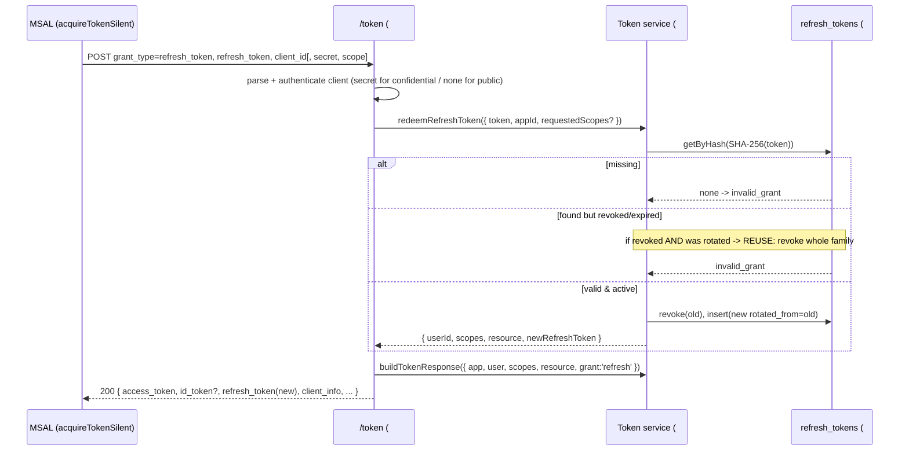

# Feature #7 — Refresh Token Flow

- **Roadmap ref:** Iteration 1, feature #7 ("Refresh Token flow").
- **Dependencies:** [#6](2026-06-22_06-auth-code-pkce-signin.md) (token endpoint, OAuth error convention, e2e harness). Transitively [#5](2026-06-22_05-token-service.md) (refresh-token contract, rotation, `client_info`), [#2](2026-06-22_02-sqlite-store-schema-seed.md) (`refresh_tokens`).
- **Status:** ⬜ Not started.

> **Canonical-reference notice.** This spec owns the **refresh-token rotation + reuse-detection policy** for the emulator. It finalizes the rotation semantics that [#5](2026-06-22_05-token-service.md)'s `issueRefreshToken`/`redeemRefreshToken` contract left to #7. It REPLACES the `501` token-endpoint behavior for `grant_type=refresh_token` only (the route itself is registered by #6; #7 multiplexes the new grant into it).

---

## Goal / outcome

Silent token renewal: a client that received a `refresh_token` (because `offline_access` was granted in #6) can `POST /{tenant}/oauth2/v2.0/token` with `grant_type=refresh_token` to obtain a fresh access token (and ID token), receiving a **new, rotated** refresh token each time. Replaying a consumed/rotated refresh token is detected and revokes the whole token family. This is what `@azure/msal-browser`/`@azure/msal-node` `acquireTokenSilent` drives when its cached access token has expired.

---

## Scope

### In scope
- Add `grant_type=refresh_token` handling to the existing `POST /{tenant}/oauth2/v2.0/token` route (grant multiplexing alongside #6's `authorization_code`).
- Refresh-token redemption via [#5](2026-06-22_05-token-service.md)'s `redeemRefreshToken` + `issueRefreshToken` (rotation on every redemption).
- **Reuse/replay detection** with family revocation (policy finalized here).
- Client authentication on refresh: confidential clients verify `client_secret`; public clients (SPA) authenticate by `client_id` + the bound refresh token only (PKCE is not re-checked on refresh).
- `offline_access` gating: a new `refresh_token` is returned only when the grant carried `offline_access`.
- Scope-narrowing: requested `scope` (if present) must be a subset of the original grant; defaults to the original grant.
- `client_info` echoed in the response (delegated flow — always present here).
- Token-endpoint error mapping per #6's canonical OAuth error convention.

### Out of scope
- Issuing the *first* refresh token (that is #6, at auth-code redemption).
- Client-credentials refresh (app-only flows do not issue refresh tokens — [#8](2026-06-22_08-client-credentials.md)).
- Device-code refresh (#15, Iteration 2 — same route, separate spec).
- Long-lived/sliding-window refresh policies, refresh-token revocation UI/endpoint (not in MVP).

---

## Contracts

### Token endpoint (refresh_token grant)
`POST /{tenant}/oauth2/v2.0/token` — `application/x-www-form-urlencoded`.

| Param | Required | Notes |
|---|---|---|
| `grant_type` | yes | `refresh_token`. |
| `refresh_token` | yes | The opaque token previously issued (matched by SHA-256 hash). |
| `client_id` | yes | Must equal the app the refresh token is bound to. |
| `client_secret` | confidential clients | `client_secret_post` (body) or `client_secret_basic` (Authorization header). Public clients MUST NOT send one. |
| `scope` | no | Optional narrowing; must be a subset of the original grant's scopes. |

**Success:** `200 application/json` — the token-response shape owned by [#5](2026-06-22_05-token-service.md): `access_token`, `id_token` (when `openid` was in the grant), **a new** `refresh_token` (when `offline_access` is in the (possibly narrowed) granted scopes), `token_type=Bearer`, `expires_in`, `ext_expires_in`, `scope`, and `client_info` (delegated). `Cache-Control: no-store`, `Pragma: no-cache`.

### Error mapping (reuses #6's canonical OAuth error convention)
| Condition | `error` | HTTP |
|---|---|---|
| Missing `refresh_token`/`client_id`/malformed body | `invalid_request` | 400 |
| Unknown / expired / revoked refresh token | `invalid_grant` | 400 |
| **Reused (already-rotated) refresh token** | `invalid_grant` | 400 (+ family revoked, see flow) |
| `client_id` does not match the token's bound app | `invalid_grant` | 400 |
| Requested `scope` not a subset of the original grant | `invalid_scope` | 400 |
| Bad/missing secret for a confidential client; public client sends a secret | `invalid_client` | 401 |
| Unsupported tenant alias | `invalid_request` | 400 |

The JSON body matches #6's shape (`error`, `error_description`, `error_codes[]`, `timestamp`, `trace_id`, `correlation_id`). `error_codes` for reuse/expiry: best-effort AADSTS-style (`70008` family for expired/invalid grant).

---

## Behavior / flow

### Rotation & reuse-detection policy (finalized)
1. Each refresh token is stored hashed (SHA-256 PK) with `rotated_from` linking to its predecessor ([#2](2026-06-22_02-sqlite-store-schema-seed.md)). `refreshTokens.getByHash` MUST return rows **regardless** of `revoked`/`expires_at` (it must not pre-filter revoked/expired rows), otherwise reuse detection silently degrades to a plain `invalid_grant` with no family revocation.
2. **Atomicity:** the whole redemption (lookup → decide → revoke presented → insert successor) executes inside **one SQLite transaction** using a compare-and-set on the presented token's `revoked` flag (`UPDATE ... SET revoked=1 WHERE token=? AND revoked=0`, then require `changes()==1` before inserting the successor). This makes concurrent redemptions of the same token safe: exactly one succeeds; the loser observes `revoked=1` and is treated as reuse (step 4). No two successors are ever minted from one parent.
3. **Every** successful redemption rotates: the presented (active, unexpired) token is marked `revoked=1` and a brand-new refresh token row is inserted (`rotated_from` = the presented token's hash). The plaintext new token is returned to the client.
4. **Reuse detection (takes precedence over expiry):** presenting a token that is already `revoked=1` is treated as a replay **regardless of whether it has also expired**. The emulator revokes the **entire token family** — the presented token plus every token reachable by following the `rotated_from` links forward (descendants) and backward (ancestors) of this specific rotation chain — so a leaked-then-rotated token can no longer mint anything. Independent sign-ins for the same `(app_id, user_id)` form **separate** chains (separate roots) and are **not** affected (concurrent browser/device sessions are preserved). Response is `invalid_grant`. (Mirrors the OAuth 2.1 / MSAL refresh-token rotation security model.)
5. **Expiry (only for a still-active token):** a token that is `revoked=0` but past `expires_at` → `invalid_grant` with **no** family revocation (natural expiry, not a replay).
6. The new refresh token's lifetime is a **fresh** `TOKEN_LIFETIME_REFRESH_SECONDS` from `now()` (rolling). The access/ID token lifetimes follow `TOKEN_LIFETIME_ACCESS_SECONDS`/`_ID_SECONDS`.

### `offline_access` gating
- A new `refresh_token` is included in the response **iff** `offline_access` is present in the granted (post-narrowing) scope set. If a client narrows scope to drop `offline_access`, no new refresh token is returned and the presented one is still rotated-and-revoked (it cannot be reused). Practically MSAL always keeps `offline_access`, so a fresh refresh token is the norm.

### Scope narrowing
- If `scope` is omitted, the new tokens carry the original grant's scopes.
- If `scope` is present, every requested scope must be in the original grant (subset check in [#5](2026-06-22_05-token-service.md)); otherwise `invalid_scope`. The narrowed set becomes the new grant's scopes and drives `aud`/`scp` per #5's audience rule.

### Client authentication on refresh
- **Public client (SPA, `is_confidential=0`):** no secret; binding to `client_id` + possession of the refresh token is the proof. A secret in the request → `invalid_client`.
- **Confidential client (`is_confidential=1`):** `client_secret` required and verified via `apps.verifySecret` ([#2](2026-06-22_02-sqlite-store-schema-seed.md)); missing/wrong → `invalid_client`.
- PKCE is **not** re-evaluated on refresh (it only protects the code exchange).

---

## Data changes
Reads/rotates `refresh_tokens` (insert new, revoke old/family) via [#5](2026-06-22_05-token-service.md)/[#2](2026-06-22_02-sqlite-store-schema-seed.md). Reads `app_registrations`, `app_secrets`, `users`. No DDL.

---

## Dependencies & assumptions
- **Assumption:** rolling refresh expiry (each rotation issues a fresh TTL) is acceptable for a dev tool; no absolute family-lifetime cap in MVP.
- **Assumption:** family-revocation on reuse is keyed by the `rotated_from` chain reachable from the presented token (one rotation chain = one family). Because rotation is strictly linear and atomic (one active token per chain), each chain has exactly one live tip; separate sign-ins are separate chains and are unaffected. It does **not** mean "revoke all tokens for that user+app".
- **Assumption:** auto-consent — narrowing can only shrink, never expand, the original grant.
- **Assumption:** ID token is re-minted on refresh when the grant includes `openid` (MSAL expects a refreshed ID token), with a fresh `iat`/`exp` and the same `nonce`-less assembly (no new `nonce` on refresh).

---

## Testable acceptance criteria
1. **Happy-path rotation (integration via inject):** redeeming a valid refresh token returns `200` with a new `access_token`, a new `id_token` (grant had `openid`), and a **different** `refresh_token`; `Cache-Control: no-store`.
2. **Old token revoked (integration):** after a successful rotation, redeeming the *previous* refresh token → `invalid_grant`.
3. **Reuse → family revocation (integration):** redeem token A→B (B active), then redeem A again → `invalid_grant`; a subsequent redemption of B (the descendant) also → `invalid_grant` (whole family revoked).
4. **offline_access gating (integration):** a grant without `offline_access` (e.g. narrowed) returns no `refresh_token`; a grant with `offline_access` always returns one.
5. **Scope narrowing (integration):** `scope` that is a subset succeeds and the new `access_token` `scp`/`aud` reflect the narrowed set; a superset/unknown scope → `invalid_scope`.
6. **Confidential client auth (integration):** confidential app refresh requires the correct `client_secret` (post + basic both accepted); wrong/missing → `invalid_client`; a public client sending a secret → `invalid_client`.
7. **Binding (integration):** a `client_id` that does not match the token's bound app → `invalid_grant`.
8. **Expiry (unit/integration):** with the injected clock advanced past `TOKEN_LIFETIME_REFRESH_SECONDS`, redemption of a still-active token → `invalid_grant` with no family revocation; new tokens carry a fresh TTL.
9. **Concurrency atomicity (integration):** two concurrent redemptions of the same valid refresh token result in exactly one `200` (with a successor) and one `invalid_grant`; only one successor row exists (no double-mint), and the reuse path revokes the family.
10. **Token conformance (token-conformance):** the refreshed `access_token`/`id_token` verify against the live JWKS with correct `iss`/`aud`/`scp`/`ver`; `client_info` decodes to `{uid:oid, utid:tenantId}`.
11. **Real-MSAL e2e (`npm run test:e2e`):** extends #6's Authorization Code + PKCE e2e — after sign-in, force an access-token expiry and call `acquireTokenSilent`; MSAL exchanges its refresh token at `/token` and receives a JWKS-verifiable access token (and a rotated refresh token), all from cache identity built on `client_info`. Asserted for both `@azure/msal-browser` (headless) and `@azure/msal-node`.

---

## Open questions
None blocking. *(Decisions: rotation on every redemption with whole-family revocation on reuse; rolling refresh TTL with no absolute cap in MVP; ID token re-minted on refresh when `openid` is granted; PKCE not re-checked on refresh. Recorded in `memory/decisions.md` under the Batch B cross-cutting entry.)*
