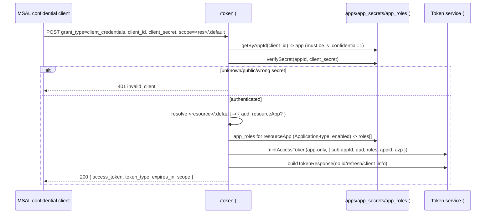

# Feature #8 — Client Credentials Flow

- **Roadmap ref:** Iteration 1, feature #8 ("Client Credentials flow").
- **Dependencies:** [#5](2026-06-22_05-token-service.md) (app-only access-token claims, audience rule, token-response builder). Transitively [#2](2026-06-22_02-sqlite-store-schema-seed.md) (`app_registrations`, `app_secrets`, `app_roles`, `verifySecret`), [#6](2026-06-22_06-auth-code-pkce-signin.md) (canonical OAuth error convention, the `/token` route it multiplexes into).
- **Status:** ✅ Implemented.

> **Canonical-reference notice.** This spec owns **`.default`-scope resolution and the app-role auto-grant model** for app-only tokens. It REPLACES the `501` token-endpoint behavior for `grant_type=client_credentials` only (the route is registered by #6; #8 multiplexes the grant in).

---

## Goal / outcome

Daemon/service apps obtain **app-only** access tokens (no user) by authenticating with their `client_id` + `client_secret` and requesting `<resource>/.default`. The minted token carries `roles` (the resource app's application permissions), `sub`=`appId`, `appid`/`azp`=`appId`, and **no** `oid`/`scp` — exactly the shape [#5](2026-06-22_05-token-service.md)'s app-only column defines. This is what an `@azure/msal-node` `ConfidentialClientApplication.acquireTokenByClientCredential` call drives.

---

## Scope

### In scope
- Add `grant_type=client_credentials` handling to `POST /{tenant}/oauth2/v2.0/token`.
- Client authentication: confidential client only; `client_secret` via `client_secret_post` (body) or `client_secret_basic` (Authorization header), verified against hashed `app_secrets` ([#2](2026-06-22_02-sqlite-store-schema-seed.md) `verifySecret`).
- `.default` scope parsing and **resource resolution** (which app/identifier the token targets).
- App-only access-token minting via [#5](2026-06-22_05-token-service.md)'s `mintAccessToken` (app-only) + `buildTokenResponse` (no `id_token`, no `refresh_token`, no `client_info`).
- App-role auto-grant model (roles included in the token).
- Token-endpoint error mapping per #6's canonical convention.

### Out of scope
- User-present scopes / ID tokens / refresh tokens (client credentials has no user; `offline_access`/`openid` are rejected if combined with `.default`).
- Per-client app-role *assignment* modeling (no assignment table in MVP — see auto-grant model).
- Certificate / `private_key_jwt` client auth (deferred — secret only).
- Consent.

---

## Contracts

### Token endpoint (client_credentials grant)
`POST /{tenant}/oauth2/v2.0/token` — `application/x-www-form-urlencoded`.

| Param | Required | Notes |
|---|---|---|
| `grant_type` | yes | `client_credentials`. |
| `client_id` | yes | Must resolve to a registered **confidential** app. |
| `client_secret` | yes | Body (`client_secret_post`) or `Authorization: Basic base64(client_id:client_secret)` (`client_secret_basic`). |
| `scope` | yes | Exactly one `<resource>/.default` value (e.g. `api://<appId>/.default` or `https://graph.microsoft.com/.default`). |

**Success:** `200 application/json`:
```jsonc
{
  "token_type": "Bearer",
  "expires_in": 3600,
  "ext_expires_in": 3600,
  "scope": "https://graph.microsoft.com/.default",   // echo of requested .default resource
  "access_token": "<JWT, app-only>"
  // NO id_token, NO refresh_token, NO client_info
}
```
`Cache-Control: no-store`, `Pragma: no-cache`.

### App-only access-token claims (from [#5](2026-06-22_05-token-service.md))
`iss`, `sub`=`appId`, `aud`=resolved resource, `exp`/`iat`/`nbf`, `tid`, `azp`=`appId`, `appid`=`appId`, `roles`=auto-granted app roles (array), `ver`="2.0". **No** `oid`, **no** `scp`.

### `.default` resource resolution (owned here)
The single `scope` is `<resource>/.default`. Strip the `/.default` suffix → `<resource>`. Resolve `<resource>` in order:
1. **Graph:** `<resource>` equals `GRAPH_RESOURCE_ID` (default `https://graph.microsoft.com`) → `aud` = `GRAPH_RESOURCE_ID`; resource app = (none registered) → `roles` empty.
2. **Registered app by `app_id_uri`:** `<resource>` equals some app's `app_id_uri` (e.g. `api://<appId>`) → `aud` = that `app_id_uri`; resource app = that app.
3. **Registered app by GUID `app_id`:** `<resource>` equals an `app_id` GUID → `aud` = that `app_id`; resource app = that app.
4. Otherwise → `invalid_scope`.

**Uniqueness requirement:** resolution by `app_id_uri` is unambiguous because [#11](2026-06-22_11-admin-rest-api.md) enforces that a non-null `app_id_uri` is unique across app registrations (duplicate create/patch → `409 conflict`). The seed ([#2](2026-06-22_02-sqlite-store-schema-seed.md)) sets distinct URIs. `app_id` GUIDs are PKs (inherently unique).

### App-role auto-grant model (MVP)
There is no app-role-*assignment* table in MVP (consistent with the locked auto-consent decision). The `roles` claim is therefore auto-granted: **`roles` = the `value`s of all enabled `app_roles` on the resolved *resource* app whose `allowed_member_types` includes `Application`.** If the resource is Graph or has no such roles, `roles` is an **empty array** (claim still present, `[]`). Documented divergence from real Entra (which requires explicit application-permission assignment + admin consent); acceptable for a dev tool and analogous to auto-consent.

### Error mapping (reuses #6's canonical OAuth error convention)
| Condition | `error` | HTTP |
|---|---|---|
| Missing `client_id`/`client_secret`/`scope`; malformed body | `invalid_request` | 400 |
| Unknown client, public client (not confidential), wrong/missing secret | `invalid_client` | 401 |
| `scope` not exactly one `<resource>/.default`, or resource unresolvable | `invalid_scope` | 400 |
| `scope` includes `openid`/`offline_access` or non-`.default` scopes | `invalid_scope` | 400 |
| Unsupported tenant alias | `invalid_request` | 400 |

JSON body matches #6's shape (`error`, `error_description`, `error_codes[]`, `timestamp`, `trace_id`, `correlation_id`).

---

## Behavior / flow



### Validation rules
1. Normalize `{tenant}` ([#4](2026-06-22_04-oidc-discovery.md)); invalid → `invalid_request`/400.
2. `grant_type=client_credentials`.
3. Resolve `client_id` → app; app **must** be `is_confidential=1`, else `invalid_client`.
4. Verify `client_secret` (post or basic). `verifySecret` against the app's hashed secrets; any one valid (non-expired) secret matches. Failure → `invalid_client` (401).
5. `scope` must be exactly one `<resource>/.default` value; resolve resource (rules above). Anything else → `invalid_scope`.
6. Compute `roles` (auto-grant model). Mint app-only token; build the response (no id/refresh/client_info).

### Seed-driven self-contained scenario (for e2e)
The seeded confidential daemon `cccccccc-0000-0000-0000-000000000002` ([#2](2026-06-22_02-sqlite-store-schema-seed.md)) has `app_id_uri` and an enabled app role `Tasks.Read.All` (`allowed_member_types` includes `Application`). Requesting `scope=<daemon app_id_uri>/.default` with its known dev secret yields `aud=<daemon app_id_uri>`, `roles=["Tasks.Read.All"]`, `sub=appId`. Requesting `https://graph.microsoft.com/.default` yields `aud=GRAPH_RESOURCE_ID`, `roles=[]` (token still usable against the emulator Graph #10, which does not require app roles in MVP).

---

## Data changes
Reads `app_registrations`, `app_secrets`, `app_roles`. No writes (app-only flow persists no code/refresh/session rows). No DDL.

---

## Dependencies & assumptions
- **Assumption:** app-only `roles` are auto-granted from the resource app's `Application`-type roles (no assignment/consent model in MVP). Documented divergence from Entra.
- **Assumption:** only `client_secret` auth (no certificate/`private_key_jwt`) in MVP.
- **Assumption:** exactly one `.default` resource per request (matches MSAL client-credential usage); mixing `.default` with OIDC scopes is rejected.
- **Assumption:** Graph-audience app-only tokens carry `roles=[]` and are still accepted by the emulator Graph (#10), which does not enforce Graph application permissions in MVP.
- **Documented divergence:** the emulator accepts `client_credentials` via the `common`/`organizations`/`consumers` aliases (all resolve to the single tenant), whereas real Entra rejects app-only grants on `/common`. Harmless for a single-tenant dev tool; the GUID authority is the recommended/normal configuration.

---

## Testable acceptance criteria
1. **Happy path (integration via inject):** confidential app + correct secret + `scope=<appUri>/.default` → `200` with an app-only `access_token`; no `id_token`/`refresh_token`/`client_info`; `Cache-Control: no-store`.
2. **App-only claims (token-conformance):** the token has `sub`=`appId`, `appid`=`azp`=`appId`, `aud`=resolved resource, `roles` array, `ver=2.0`, and **no** `oid`/`scp`; verifies against the live JWKS.
3. **Role auto-grant (integration):** requesting the seeded daemon's own `<app_id_uri>/.default` returns `roles` containing `Tasks.Read.All`; Graph `.default` returns `roles=[]`.
4. **Client auth (integration):** wrong secret → `invalid_client` (401); a **public** (SPA) app attempting client_credentials → `invalid_client`; both `client_secret_post` and `client_secret_basic` accepted.
5. **Scope validation (integration):** missing `scope` → `invalid_request`; a non-`.default` scope, an unresolvable resource, or `.default` combined with `openid`/`offline_access` → `invalid_scope`.
6. **Audience resolution (unit/integration):** `https://graph.microsoft.com/.default` → `aud=GRAPH_RESOURCE_ID`; `api://<appId>/.default` → `aud=api://<appId>`; bare `<appId GUID>/.default` → `aud=<appId>`.
7. **No persistence (integration):** a client_credentials call writes no `refresh_tokens`/`authorization_codes`/`sessions` rows.
8. **Real-MSAL e2e (`npm run test:e2e`):** an `@azure/msal-node` `ConfidentialClientApplication` (authority `<origin>/{tenant}`, `knownAuthorities`) calls `acquireTokenByClientCredential({ scopes:['<resource>/.default'] })` against the running emulator and receives a JWKS-verifiable app-only token with the expected `aud`/`roles`/`sub`.

---

## Open questions
None blocking. *(Decisions: app-role auto-grant from the resource app's `Application`-type roles, no assignment model; `client_secret` only; one `.default` resource per request. Recorded in `memory/decisions.md` under the Batch B cross-cutting entry.)*
