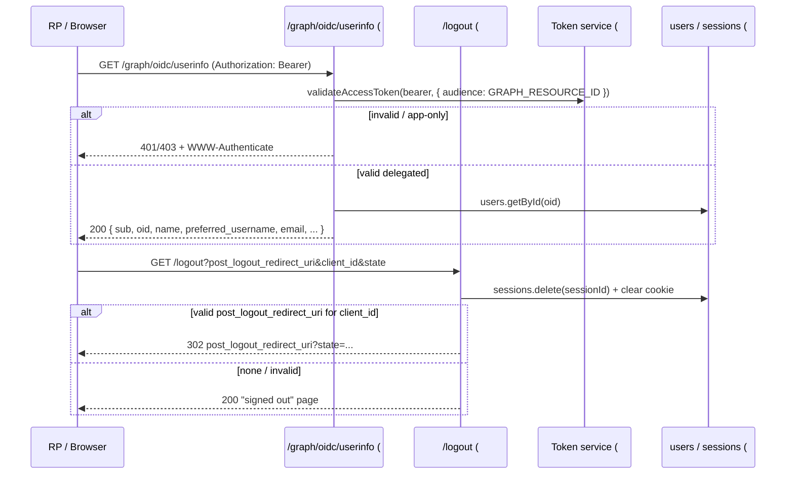

# Feature #9 — UserInfo & Logout Endpoints

- **Roadmap ref:** Iteration 1, feature #9 ("UserInfo & Logout endpoints").
- **Dependencies:** [#5](2026-06-22_05-token-service.md) (`validateAccessToken`, claim sets), [#6](2026-06-22_06-auth-code-pkce-signin.md) (sessions, sign-in, e2e harness). Transitively [#2](2026-06-22_02-sqlite-store-schema-seed.md) (`sessions`, `users`, redirect URIs), [#4](2026-06-22_04-oidc-discovery.md) (these endpoints are advertised in discovery).
- **Status:** ⬜ Not started.

> **Canonical-reference notice.** This spec owns the **UserInfo response claim set** and the **end-session / logout** behavior. It REPLACES the `501` stubs for `/graph/oidc/userinfo` and `/{tenant}/oauth2/v2.0/logout`. Both URLs are already advertised by [#4](2026-06-22_04-oidc-discovery.md) (`userinfo_endpoint`, `end_session_endpoint`).

---

## Goal / outcome

Two endpoints that close the OIDC loop: a Bearer-protected **UserInfo** endpoint returning the signed-in user's standard OIDC claims (so an RP can fetch profile data with an access token), and a **front-channel logout / end-session** endpoint that clears the emulator session and optionally redirects to a validated `post_logout_redirect_uri`. Both are asserted within #6's Authorization Code e2e (sign-in → `/userinfo` → sign-out).

---

## Scope

### In scope
- `GET|POST /graph/oidc/userinfo` — validate the Bearer access token via [#5](2026-06-22_05-token-service.md)'s `validateAccessToken`, return the user's OIDC claims as JSON.
- `GET /{tenant}/oauth2/v2.0/logout` — clear the emulator SSO session (cookie + `sessions` row), validate and honor `post_logout_redirect_uri`, render a "signed out" confirmation page when no redirect is supplied.
- `WWW-Authenticate` semantics for UserInfo 401s.
- Discovery alignment: confirm `userinfo_endpoint`/`end_session_endpoint` values and (optionally) `http_logout_supported`/`frontchannel_logout_supported` flags ([#4](2026-06-22_04-oidc-discovery.md) reserved the slots; #9 sets the values).

### Out of scope
- Token minting/validation internals (#5) — #9 only calls `validateAccessToken`.
- True multi-RP front-channel logout (iframing each RP's `frontchannel_logout_uri`) — not modeled; see logout behavior.
- Back-channel logout, `id_token_hint` signature enforcement beyond a best-effort hint (see logout rules).
- Branded styling of the signed-out page (shares the DESIGN.md dependency with #6/#12; ships functional-but-unstyled).

---

## Contracts

### UserInfo endpoint
| Method | Path | Auth | Response |
|---|---|---|---|
| GET, POST | `/graph/oidc/userinfo` | Bearer access token | `200 application/json` claims, or `401` |

**Request:** `Authorization: Bearer <access_token>`. POST is accepted for OIDC parity (no body needed). The token MUST be a **delegated** access token (has `oid`) whose `aud` ∈ accepted audiences (`GRAPH_RESOURCE_ID` by default, since post-sign-in tokens default to the Graph audience per [#5](2026-06-22_05-token-service.md)).

**Success response (claims):**
```jsonc
{
  "sub": "<pairwise subject, same as the token's sub>",
  "oid": "<user.id>",
  "tid": "<tenant GUID>",
  "name": "<user.display_name>",
  "preferred_username": "<user.user_principal_name>",
  "given_name": "<user.given_name>",     // omitted if null
  "family_name": "<user.surname>",        // omitted if null
  "email": "<user.mail>"                   // omitted if null
}
```
- `sub` MUST equal the access token's `sub` (the pairwise subject for that user+app) so the RP can correlate it with the ID token.
- Claims are sourced from the `users` row resolved by the token's `oid`.
- `Cache-Control: no-store`.

**Errors (UserInfo):** RFC 6750 Bearer style.
| Condition | HTTP | `WWW-Authenticate` |
|---|---|---|
| Missing/empty `Authorization: Bearer` | 401 | `Bearer error="invalid_token", error_description="..."` |
| Invalid signature / wrong issuer / expired / wrong audience | 401 | `Bearer error="invalid_token", error_description="..."` |
| App-only token (no `oid`/no user) | 403 | `Bearer error="insufficient_scope"` (UserInfo requires a user) |
| User referenced by `oid` not found / disabled | 401 | `Bearer error="invalid_token"` |

Body for 401: `{ "error": "invalid_token", "error_description": "..." }`. Body for 403: `{ "error": "insufficient_scope", "error_description": "..." }` (matching the `WWW-Authenticate` value).

### Logout / end-session endpoint
| Method | Path | Auth | Response |
|---|---|---|---|
| GET | `/{tenant}/oauth2/v2.0/logout` | none (uses session cookie) | `302` redirect or `200` signed-out HTML |

**Request params (query):**
| Param | Required | Notes |
|---|---|---|
| `post_logout_redirect_uri` | no | Where to send the browser after sign-out. Must be validated (see rules). |
| `client_id` | recommended | The app whose registered redirect URIs the `post_logout_redirect_uri` is validated against. |
| `id_token_hint` | no | OIDC hint; used only to infer `client_id`/session best-effort (signature not enforced in MVP). |
| `state` | no | Echoed back on the redirect if a valid `post_logout_redirect_uri` is used. |

**Behavior:**
1. Read the session cookie; delete the matching `sessions` row ([#2](2026-06-22_02-sqlite-store-schema-seed.md)) and clear the cookie (expired `Set-Cookie`). Logout is **idempotent** — a missing/invalid session still succeeds.
2. If `post_logout_redirect_uri` is provided:
   - Resolve `client_id` from the `client_id` param, or (best-effort) from the unverified `id_token_hint`'s `aud`. If no `client_id` can be resolved → render the signed-out page (do **not** redirect to an unvalidated URI — security).
   - Validate `post_logout_redirect_uri` by **exact match** against that app's registered redirect URIs (`app_redirect_uris`). MVP reuses the app's redirect URIs as the allowlist for post-logout URIs (no separate `post_logout_redirect_uris` table). On match → `302` to it (appending `state` if provided). On mismatch/unregistered → render the signed-out page (no redirect).
3. If no `post_logout_redirect_uri` → render a minimal, accessible "You are signed out" HTML page (`200`).

---

## Behavior / flow



### Discovery alignment (with #4)
- `userinfo_endpoint` = `${PUBLIC_ORIGIN}/graph/oidc/userinfo`, `end_session_endpoint` = `${PUBLIC_ORIGIN}/{tenant}/oauth2/v2.0/logout` — already set by [#4](2026-06-22_04-oidc-discovery.md).
- **Front-channel decision:** the emulator does not iframe RP logout URIs in MVP. #9 sets `frontchannel_logout_supported=false`/`http_logout_supported=false` (or omits them); it does **not** advertise capabilities it doesn't implement (lockstep). The single-RP browser logout (clear session + post-logout redirect) is the supported behavior.

---

## Data changes
- UserInfo: reads `users` (and `tenants`). No writes.
- Logout: deletes the `sessions` row for the cleared cookie. No DDL.

---

## Dependencies & assumptions
- **Assumption:** UserInfo accepts delegated Graph-audience tokens (`aud=GRAPH_RESOURCE_ID`), matching the default post-sign-in token from [#5](2026-06-22_05-token-service.md). An app-only token → 403 (no user).
- **Assumption:** `post_logout_redirect_uri` is validated against the app's registered redirect URIs (no separate post-logout-URI registry in MVP); requires a resolvable `client_id`.
- **Assumption:** `id_token_hint` signature is not enforced (used only as a hint) — acceptable for a dev tool; documented.
- **Assumption:** front-channel multi-RP logout is out of scope; session-clear + validated redirect is the MVP behavior.

---

## Testable acceptance criteria
1. **UserInfo happy path (integration via inject):** with a valid delegated access token from #6, `GET /graph/oidc/userinfo` → `200` with `sub` (== token `sub`), `oid`, `name`, `preferred_username`, and `email` (when set); `Cache-Control: no-store`.
2. **UserInfo `sub` correlation (token-conformance):** the `sub` returned equals the ID token's `sub` for the same (user, app).
3. **UserInfo 401 (integration):** missing Bearer, tampered signature, expired token, and wrong-audience token each → `401` with a `WWW-Authenticate: Bearer error="invalid_token"` header and JSON error body.
4. **UserInfo app-only 403 (integration):** an app-only client-credentials token (no `oid`) → `403 insufficient_scope`.
5. **UserInfo POST parity (integration):** `POST /graph/oidc/userinfo` with the same Bearer behaves identically to GET.
6. **Logout clears session (integration):** `GET /logout` with a valid session cookie deletes the `sessions` row and returns a `Set-Cookie` that expires the cookie; the signed-out page renders `200`.
7. **Logout redirect validation (integration):** a `post_logout_redirect_uri` that exactly matches a registered redirect URI for the given `client_id` → `302` to it with `state` echoed; an unregistered URI (or missing `client_id`) → no redirect, signed-out page `200`.
8. **Logout idempotent (integration):** `GET /logout` with no/invalid session still returns success and clears the cookie.
9. **Discovery lockstep (integration):** discovery's `userinfo_endpoint`/`end_session_endpoint` resolve to these handlers; no front-channel capability is advertised that isn't implemented.
10. **Real-MSAL e2e (`npm run test:e2e`):** within the Authorization Code e2e (sign-in → `/userinfo` → sign-out): after MSAL sign-in, calling `/graph/oidc/userinfo` with the acquired access token returns the user's claims; driving MSAL `logout`/`logoutRedirect` hits `/logout`, clears the session, and a subsequent silent/interactive auth requires re-login (the SSO session is gone). Asserted for `@azure/msal-browser` (headless).

---

## Open questions
None blocking. *(Decisions: UserInfo requires a delegated Graph-audience token; `post_logout_redirect_uri` validated against the app's registered redirect URIs; front-channel multi-RP logout out of scope, so its capability flags are not advertised. Recorded in `memory/decisions.md` under the Batch B cross-cutting entry.)*
