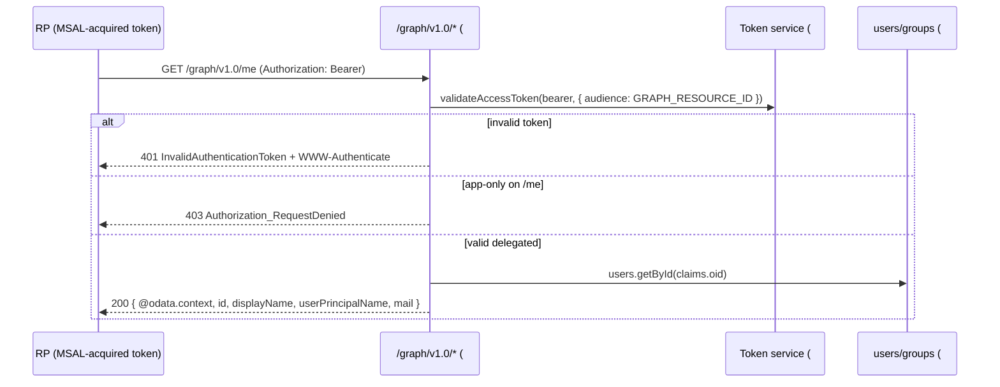

# Feature #10 — Minimal Microsoft Graph

- **Roadmap ref:** Iteration 1, feature #10 ("Minimal Microsoft Graph").
- **Dependencies:** [#2](2026-06-22_02-sqlite-store-schema-seed.md) (`users`, `groups`, `group_members` repositories), [#5](2026-06-22_05-token-service.md) (`validateAccessToken`, access-token claims). Transitively [#3](2026-06-22_03-signing-keys-jwks.md) (JWKS).
- **Status:** ⬜ Not started.

> **Canonical-reference notice.** This spec owns the **emulator Graph authorization model** (which access tokens Graph accepts) and the **Graph-shaped JSON envelopes**. It REPLACES the `501` stubs for `/graph/v1.0/{me,users,users/{id},groups,groups/{id},groups/{id}/members}`. It proves the mint→consume loop: a token minted by #5/#6/#8 is consumed here.

---

## Goal / outcome

A read-only minimal Microsoft Graph (`/graph/v1.0/...`) that validates the emulator's own Bearer access tokens against the live JWKS/issuer and returns Graph-shaped JSON (`@odata.context`, `value[]`, `id`, `displayName`, `userPrincipalName`, `mail`). This lets a developer call `/me`/`/users`/`/groups` with a token acquired via MSAL and see realistic Graph responses — closing the sign-in → token → protected-API loop entirely within the emulator.

---

## Scope

### In scope
- `GET /graph/v1.0/me` — the signed-in user, resolved from the token's `oid`.
- `GET /graph/v1.0/users` (paged) and `GET /graph/v1.0/users/{id}`.
- `GET /graph/v1.0/groups` (paged), `GET /graph/v1.0/groups/{id}`, `GET /graph/v1.0/groups/{id}/members`.
- Bearer validation that **accepts the emulator issuer + `ver:"2.0"` access tokens with `aud=GRAPH_RESOURCE_ID`** (NOT Microsoft's v1 token shape — flagged by [#5](2026-06-22_05-token-service.md)).
- Graph-shaped JSON envelopes (`@odata.context`, collection `value[]`, OData paging `@odata.nextLink`), and Graph-style `id`/`displayName`/`userPrincipalName`/`mail`/`givenName`/`surname`/`description`.
- 401/403 semantics with `WWW-Authenticate`.

### Out of scope
- Writes / `$filter` / `$select` / `$expand` / `$orderby` / advanced OData query (read + basic paging only).
- `$batch`, delta queries, directory objects beyond users/groups.
- Graph application-permission (app-role) enforcement — see authorization model.
- Real Graph parity for every field (a curated, realistic subset only).

---

## Contracts

### Endpoints
| Method | Path | Returns |
|---|---|---|
| GET | `/graph/v1.0/me` | Single `user` (delegated token's `oid`). |
| GET | `/graph/v1.0/users` | Collection of `user` (paged). |
| GET | `/graph/v1.0/users/{id}` | Single `user` by `id` (oid) or UPN. |
| GET | `/graph/v1.0/groups` | Collection of `group` (paged). |
| GET | `/graph/v1.0/groups/{id}` | Single `group`. |
| GET | `/graph/v1.0/groups/{id}/members` | Collection of member `user`s. |

All require `Authorization: Bearer <access_token>`.

### Authorization model (owned here)
- **Every** Graph endpoint requires a valid Bearer access token: signature verifies against the live JWKS ([#3](2026-06-22_03-signing-keys-jwks.md)), `iss` == emulator issuer, not expired/`nbf`, and `aud` ∈ accepted audiences = `{ GRAPH_RESOURCE_ID }` (the default audience #5 assigns post-sign-in and for `graph/.default` client-credentials). The validator MUST accept `ver:"2.0"` (emulator tokens are v2; do **not** require Microsoft's v1 shape).
- **`/me`** requires a **delegated** token (must have `oid`); an app-only token (no user) → `403`.
- **`/users`, `/users/{id}`, `/groups`, `/groups/{id}`, `/groups/{id}/members`** accept **either** a delegated or an app-only Graph-audience token (read).
- **No fine-grained Graph scope/role enforcement in MVP.** Because #5 does not mint Microsoft Graph scopes like `User.Read`/`Group.Read.All` as *enforced* permissions (it reflects the granted scope **names** in `scp` with `aud=Graph`), Graph endpoints do **not** require any specific `scp`/`roles`. Possession of a valid Graph-audience token is sufficient. Documented divergence from real Graph (which enforces `User.Read`, `User.Read.All`, `Group.Read.All`, etc.); acceptable for a dev tool and consistent with the locked auto-consent model.

### Graph delegated-scope acceptance (clarifying amendment to #5/#6 scope-granting)
The canonical MSAL quickstart requests `scopes: ["User.Read"]` (or other Microsoft Graph delegated permissions) and then calls `/me`. To make that work without registering Graph as an app, the emulator treats **Microsoft Graph delegated scopes as auto-consented and unregistered-but-valid**:
- A requested scope is recognized as a Graph scope when it is either the fully-qualified form `<GRAPH_RESOURCE_ID>/<name>` (e.g. `https://graph.microsoft.com/User.Read`) **or** a bare Graph short-name from a known set (`User.Read`, `User.ReadBasic.All`, `User.Read.All`, `Group.Read.All`, `openid`/`profile`/`email`/`offline_access` are handled as OIDC, not Graph).
- Such a scope is **granted without registration** (auto-consent), sets the access-token `aud = GRAPH_RESOURCE_ID`, and is reflected in `scp` by its **short name** (matching Entra: `scp` carries `User.Read`, not the resource-prefixed form).
- This is the rule #6 (scope parsing/granting at `/authorize`) and #5 (audience/`scp` assembly) implement; it carves the Graph resource out of #6's "registered resource scopes only" constraint so that `User.Read` is **not** rejected as `invalid_scope`. #10 itself enforces nothing beyond a valid Graph-audience token. *(Recorded as an amendment in `memory/decisions.md`; #5/#6 implement the carve-out, #10/#12/#13 depend on it.)*

### JSON shapes
**User** (`microsoft.graph.user` subset):
```jsonc
{
  "@odata.context": "https://localhost:8443/graph/v1.0/$metadata#users/$entity",
  "id": "<user.id (oid)>",
  "displayName": "<user.display_name>",
  "userPrincipalName": "<user.user_principal_name>",
  "mail": "<user.mail | null>",
  "givenName": "<user.given_name | null>",
  "surname": "<user.surname | null>",
  "accountEnabled": true
}
```
**Group** (`microsoft.graph.group` subset):
```jsonc
{
  "@odata.context": "https://localhost:8443/graph/v1.0/$metadata#groups/$entity",
  "id": "<group.id>",
  "displayName": "<group.display_name>",
  "description": "<group.description | null>",
  "mailEnabled": false,
  "securityEnabled": true
}
```
**Collection** (users/groups/members):
```jsonc
{
  "@odata.context": "https://localhost:8443/graph/v1.0/$metadata#users",
  "value": [ /* entity objects (without per-entity @odata.context) */ ],
  "@odata.nextLink": "https://localhost:8443/graph/v1.0/users?$top=1&$skiptoken=<n>"  // present only when more rows exist; preserves the caller's query params
}
```
- `@odata.context` is built from `PUBLIC_ORIGIN`.
- Single-entity responses include `@odata.context` with the `$entity` suffix; collection items omit their own context.

### Paging
- Query params: `$top` (default 100, max 999) and `$skiptoken` (opaque integer offset, emulator-internal). `@odata.nextLink` is emitted only when more rows remain; it **preserves all of the caller's original query parameters** (notably `$top`) and updates `$skiptoken` to the next offset, so page size is stable across continuations. (Simple offset paging — no cursors; deterministic over the seed.)

### Errors
| Condition | HTTP | Body / header |
|---|---|---|
| Missing/invalid/expired/wrong-audience token | 401 | `WWW-Authenticate: Bearer error="invalid_token"`; Graph error body (below) |
| App-only token calling `/me` | 403 | Graph error body, `code: "Authorization_RequestDenied"` |
| Unknown user/group `id` | 404 | Graph error body, `code: "Request_ResourceNotFound"` |

**Graph error body** (Graph-shaped):
```jsonc
{ "error": { "code": "InvalidAuthenticationToken", "message": "Access token is empty or invalid." } }
```

---

## Behavior / flow



### Resolution rules
- `/me`: resolve `users.getById(token.oid)`; 404 if the user no longer exists.
- `/users/{id}`: `{id}` may be the GUID `id` or the UPN (Graph accepts both); 404 if neither matches.
- `/groups/{id}/members`: return the member users via `group_members`; 404 if the group is unknown.
- Collections are ordered by `id` (stable) for deterministic paging.

---

## Data changes
Reads `users`, `groups`, `group_members`, `tenants`. No writes. No DDL.

---

## Dependencies & assumptions
- **Assumption:** the emulator Graph validates against **this** issuer/JWKS and accepts `ver:"2.0"`, `aud=GRAPH_RESOURCE_ID` tokens (per the note in [#5](2026-06-22_05-token-service.md)); it never expects Microsoft's `ver:"1.0"` Graph token shape.
- **Assumption:** no fine-grained Graph permission enforcement in MVP (any valid Graph-audience token reads); `/me` requires a user (delegated) token.
- **Assumption:** simple offset paging is sufficient for the small seed; `$skiptoken` is an opaque emulator integer offset, not a real Graph cursor.
- **Assumption:** the curated field subset is enough for post-sign-in smoke tests; full Graph parity is out of scope.

---

## Testable acceptance criteria
1. **`/me` happy path (integration via inject):** with a delegated access token (from #6), `GET /graph/v1.0/me` → `200` with `@odata.context`, `id`==token `oid`, `displayName`, `userPrincipalName`, `mail`.
2. **Mint→consume loop (token-conformance + integration):** a token minted by #5 and acquired via #6 is accepted by Graph; a tampered token or one signed by a different key → `401`.
3. **Audience/issuer enforcement (integration):** a token with `aud` ≠ `GRAPH_RESOURCE_ID` or a wrong `iss` → `401 InvalidAuthenticationToken`.
4. **`ver:"2.0"` accepted (unit/integration):** the validator accepts the emulator's `ver:"2.0"` token (does not reject for not being v1).
5. **App-only on `/me` (integration):** an app-only client-credentials token → `403`; the same token succeeds on `/users` and `/groups`.
6. **Users collection + paging (integration):** `GET /graph/v1.0/users` returns `{ @odata.context, value:[...] }`; with `$top=1` over the ≥2 seeded users, `@odata.nextLink` is present and **preserves `$top=1`**, and following it returns exactly one next row; the last page omits `nextLink`.
7. **User by id or UPN (integration):** `GET /graph/v1.0/users/{guid}` and `/users/{upn}` both resolve the seeded Alice; an unknown id → `404 Request_ResourceNotFound`.
8. **Groups + members (integration):** `GET /graph/v1.0/groups` lists the seeded `Engineering` group; `/groups/{id}/members` returns Alice + Bob as Graph users; unknown group → `404`.
9. **Missing token (integration):** any Graph call without `Authorization: Bearer` → `401` with `WWW-Authenticate` and Graph error body (never SPA HTML).
10. **Graph shape (token-conformance/integration):** all responses include a `PUBLIC_ORIGIN`-derived `@odata.context`; collections use `value[]`; entities expose Graph-cased fields (`displayName`, `userPrincipalName`).

---

## Open questions
None blocking. *(Decisions: accept emulator-issuer `ver:"2.0"` Graph-audience tokens; no fine-grained Graph permission enforcement in MVP; `/me` requires a delegated token; simple offset paging via `$skiptoken`. Recorded in `memory/decisions.md` under the Batch B cross-cutting entry.)*
