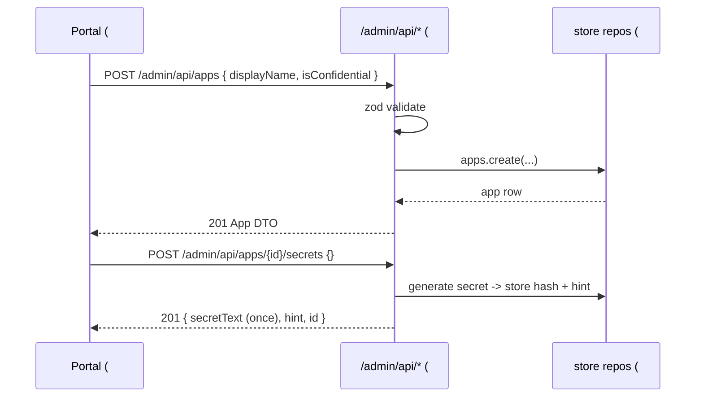

# Feature #11 — Admin REST API

- **Roadmap ref:** Iteration 1, feature #11 ("Admin REST API").
- **Dependencies:** [#2](2026-06-22_02-sqlite-store-schema-seed.md) (all repositories, `verifySecret`, hashing helpers, `store.reset`/`seed`). Transitively [#1](2026-06-22_01-server-config-tls-foundation.md) (path map, config, zod).
- **Status:** ⬜ Not started.

> **Canonical-reference notice.** This spec owns the **Admin REST API surface, request/response schemas, validation rules, the admin error envelope, pagination, and the secret show-once contract.** It REPLACES the `501` stub for `/admin/api/...`. Feature [#12](2026-06-22_12-web-portal.md) (the portal) is the primary consumer.

---

## Goal / outcome

An unauthenticated, JSON, zod-validated CRUD API under `/admin/api` over the [#2](2026-06-22_02-sqlite-store-schema-seed.md) repositories: manage users, groups (+ membership), app registrations (+ redirect URIs, secrets, exposed scopes, app roles), and run seed/reset. It powers the portal (#12) and scripted CI seeding. Secrets are returned in plaintext exactly once (on creation) and stored hashed.

---

## Scope

### In scope
- `/admin/api/users`, `/admin/api/groups`, `/admin/api/apps` CRUD + sub-resources.
- Group membership management; app redirect-URI / secret / exposed-scope / app-role sub-resources.
- `POST /admin/api/seed`, `POST /admin/api/reset`.
- `GET /admin/api/health`.
- A single consistent admin error envelope, zod request validation, and offset pagination on list endpoints.

### Out of scope
- Authentication/authorization on the admin API (locked decision: open/unauthenticated local dev tool — documented security disclaimer).
- The portal UI (#12).
- Token/flow behavior (#5–#10).
- Server-Sent-Events / websockets / real-time updates.

---

## Contracts

### Conventions (apply to all endpoints)
- Base path `/admin/api`. `Content-Type: application/json` for requests with a body and all responses.
- **Unauthenticated** (locked decision). No CORS needed (same origin; the portal is served from `/`).
- Request bodies validated by `zod`; on failure → `400` with the admin error envelope listing field issues.
- **IDs:** server-generated lowercase UUIDs for created users/groups/apps/scopes/roles/secrets (the data layer's GUID columns). Client-supplied `id` on create is ignored.
- **Timestamps** in responses are ISO-8601 strings derived from the stored epoch-seconds (`createdAt`, `expiresAt`).
- **Pagination** (list endpoints): query `top` (default 50, max 200) and `skip` (default 0). Response: `{ "value": [...], "count": <totalMatching>, "top": <n>, "skip": <n> }`.

### Admin error envelope (owned here)
```jsonc
{
  "error": {
    "code": "validation_error",          // machine code (see table)
    "message": "Human-readable summary.",
    "target": "userPrincipalName",        // optional offending field
    "details": [                            // optional, for multi-field validation
      { "field": "mail", "message": "Invalid email." }
    ]
  }
}
```
| Code | HTTP | Used for |
|---|---|---|
| `validation_error` | 400 | zod/body/query validation failure. |
| `not_found` | 404 | Unknown resource id. |
| `conflict` | 409 | Unique-constraint violation (e.g. duplicate UPN / redirect URI / scope value). |
| `invalid_reference` | 400 | FK target missing (e.g. adding a non-existent user to a group). |
| `internal_error` | 500 | Unexpected failure. |

### Users
| Method | Path | Body | Success |
|---|---|---|---|
| GET | `/admin/api/users` | – (query `top`/`skip`/`search`) | `200` paged `value[]` of User |
| POST | `/admin/api/users` | UserCreate | `201` User |
| GET | `/admin/api/users/{id}` | – | `200` User |
| PATCH | `/admin/api/users/{id}` | UserPatch | `200` User |
| DELETE | `/admin/api/users/{id}` | – | `204` |
| GET | `/admin/api/users/{id}/groups` | – | `200` paged Groups the user belongs to |

**User** (response): `{ id, userPrincipalName, displayName, givenName?, surname?, mail?, accountEnabled, hasPassword, createdAt }`. The `password_hash` is **never** returned; `hasPassword` is a boolean.
**UserCreate** (zod): `{ userPrincipalName: string(min1, unique), displayName: string(min1), givenName?, surname?, mail?: email, accountEnabled?: bool=true, password?: string }`. `password` (when present) is hashed (argon2id/scrypt via [#2](2026-06-22_02-sqlite-store-schema-seed.md)).
**UserPatch:** any subset of UserCreate fields (except changing `id`); `password: null` clears it (account-picker mode); `password: "<value>"` sets a new one.
- `search` (optional) filters by `userPrincipalName`/`displayName` substring (case-insensitive).
- Duplicate `userPrincipalName` → `409 conflict`.

### Groups
| Method | Path | Body | Success |
|---|---|---|---|
| GET | `/admin/api/groups` | – (query `top`/`skip`/`search`) | `200` paged Groups |
| POST | `/admin/api/groups` | GroupCreate | `201` Group |
| GET | `/admin/api/groups/{id}` | – | `200` Group |
| PATCH | `/admin/api/groups/{id}` | GroupPatch | `200` Group |
| DELETE | `/admin/api/groups/{id}` | – | `204` |
| GET | `/admin/api/groups/{id}/members` | – | `200` paged member Users |
| POST | `/admin/api/groups/{id}/members` | `{ userId }` | `204` (idempotent add) |
| DELETE | `/admin/api/groups/{id}/members/{userId}` | – | `204` |

**Group** (response): `{ id, displayName, description?, memberCount, createdAt }`.
**GroupCreate:** `{ displayName: string(min1), description? }`. **GroupPatch:** subset.
- Adding a non-existent `userId` → `400 invalid_reference`; adding an existing member is idempotent (`204`).

### App registrations
| Method | Path | Body | Success |
|---|---|---|---|
| GET | `/admin/api/apps` | – (query `top`/`skip`/`search`) | `200` paged Apps |
| POST | `/admin/api/apps` | AppCreate | `201` App |
| GET | `/admin/api/apps/{id}` | – | `200` App (with sub-collections) |
| PATCH | `/admin/api/apps/{id}` | AppPatch | `200` App |
| DELETE | `/admin/api/apps/{id}` | – | `204` (cascades sub-resources) |

**App** (response):
```jsonc
{
  "id": "<app_id (client_id GUID)>",
  "displayName": "Sample SPA",
  "isConfidential": false,
  "appIdUri": "api://<app_id>" ,        // null if unset
  "redirectUris": [ { "id", "uri", "type" } ],
  "exposedScopes": [ { "id", "value", "adminConsentDisplayName", "isEnabled" } ],
  "appRoles": [ { "id", "value", "displayName", "allowedMemberTypes": ["Application"], "isEnabled" } ],
  "secrets": [ { "id", "displayName", "hint", "expiresAt", "createdAt" } ],  // hint only, never the secret
  "createdAt": "<iso>"
}
```
**AppCreate:** `{ displayName: string(min1), isConfidential?: bool=false, appIdUri?: string, redirectUris?: [{ uri: url, type?: 'web'|'spa'|'native' }] }`. `app_id` is server-generated. A non-null `appIdUri` MUST be **unique** across apps (duplicate → `409 conflict`) so client-credentials `.default` resolution ([#8](2026-06-22_08-client-credentials.md)) is unambiguous. **AppPatch:** `{ displayName?, isConfidential?, appIdUri? }` (sub-collections are managed via the sub-resource endpoints below, not PATCH); changing `appIdUri` to a value already used by another app → `409 conflict`.

**App sub-resources:**
| Method | Path | Body | Success | Notes |
|---|---|---|---|---|
| POST | `/admin/api/apps/{id}/redirectUris` | `{ uri, type? }` | `201` redirect URI | Duplicate `(app,uri)` → `409`. |
| DELETE | `/admin/api/apps/{id}/redirectUris/{uriId}` | – | `204` | |
| POST | `/admin/api/apps/{id}/secrets` | `{ displayName?, expiresInDays? }` | `201` **SecretCreated** | **Show-once** (below). |
| DELETE | `/admin/api/apps/{id}/secrets/{secretId}` | – | `204` | |
| POST | `/admin/api/apps/{id}/scopes` | `{ value, adminConsentDisplayName?, isEnabled?=true }` | `201` scope | Duplicate `(app,value)` → `409`. |
| PATCH | `/admin/api/apps/{id}/scopes/{scopeId}` | `{ adminConsentDisplayName?, isEnabled? }` | `200` scope | |
| DELETE | `/admin/api/apps/{id}/scopes/{scopeId}` | – | `204` | |
| POST | `/admin/api/apps/{id}/roles` | `{ value, displayName?, allowedMemberTypes?=['Application'], isEnabled?=true }` | `201` role | Duplicate `(app,value)` → `409`. |
| PATCH | `/admin/api/apps/{id}/roles/{roleId}` | `{ displayName?, allowedMemberTypes?, isEnabled? }` | `200` role | |
| DELETE | `/admin/api/apps/{id}/roles/{roleId}` | – | `204` | |

**Secret show-once contract:** `POST .../secrets` returns the plaintext **once**:
```jsonc
// 201 SecretCreated — the ONLY time `secretText` is ever returned
{ "id": "<secretId>", "displayName": "...", "hint": "ab…yz", "secretText": "<plaintext>", "expiresAt": "<iso|null>", "createdAt": "<iso>" }
```
The server generates a high-entropy secret, stores only its hash + a `hint` (first/last few chars), and never returns `secretText` again (subsequent `GET /apps/{id}` lists secrets without it). `expiresInDays` (optional) sets `expires_at`.

### Seed / reset / health
| Method | Path | Body | Success |
|---|---|---|---|
| POST | `/admin/api/seed` | `{ force?: bool=false }` | `200 { seeded: bool }` |
| POST | `/admin/api/reset` | `{ reseed?: bool=true, resetKeys?: bool=false }` | `200 { reset: true, reseeded: bool }` |
| GET | `/admin/api/health` | – | `200` (same JSON as `/health`, per [#1](2026-06-22_01-server-config-tls-foundation.md)) |
- `seed`: applies the deterministic seed when the DB has no tenant (`{ seeded: true }`); a no-op when a tenant already exists and `force` is false (`{ seeded: false }`). `force:true` runs an **idempotent skip-existing** seed (insert rows that are missing, skip those already present by PK/unique key) — it never raises a conflict on the fixed seed GUIDs and never deletes data. *(This requires [#2](2026-06-22_02-sqlite-store-schema-seed.md)'s `seed.ts` to expose an idempotent/skip-existing mode, e.g. `INSERT OR IGNORE`; recorded as an amendment to #2's seed contract. `force` does NOT call `reset` and is non-destructive.)*
- `reset`: delegates to `store.reset({ reseed, resetKeys })` ([#2](2026-06-22_02-sqlite-store-schema-seed.md)). It empties the runtime **data** tables (codes, refresh tokens, sessions, users, groups, group_members, apps + sub-tables) within a transaction but **preserves the `tenants` row and the active `signing_keys` row(s)** when `resetKeys=false` — this is required because `signing_keys.tenant_id` and other rows FK-reference `tenants.id`, so the tenant must not be deleted. With `resetKeys=true`, signing keys are regenerated (new `kid`). After emptying, the seed is re-applied (skip-existing) when `reseed` is true. The active signing key `kid` is stable across a default reset.

---

## Behavior / flow
1. Fastify plugin mounts the admin routes under `/admin/api` (replacing #1's stub), reading `app.store` ([#2](2026-06-22_02-sqlite-store-schema-seed.md)).
2. Each route: zod-parse params/query/body → call the synchronous repository method(s) inside a transaction where multi-row → map repository result to the response DTO → set status.
3. Repository unique/FK constraint errors are caught and mapped to `409 conflict` / `400 invalid_reference`.
4. All responses use the admin error envelope on failure; success bodies are the DTOs above.



---

## Data changes
Creates/updates/deletes rows across `users`, `groups`, `group_members`, `app_registrations`, `app_redirect_uris`, `app_secrets`, `app_scopes`, `app_roles` via [#2](2026-06-22_02-sqlite-store-schema-seed.md) repositories; `seed`/`reset` operate on all data tables. No DDL.

---

## Dependencies & assumptions
- **Assumption:** the admin API is **unauthenticated** (locked decision); the README security disclaimer covers this. It binds to the same (default loopback) origin as everything else.
- **Assumption:** secrets/passwords are write-only over the API — never read back in plaintext (show-once for secrets; `hasPassword` boolean for users).
- **Assumption:** offset pagination (`top`/`skip`) is sufficient; no OData `$filter` (a simple `search` substring is provided for users/groups/apps).
- **Assumption:** server generates all entity IDs; client-supplied IDs are ignored (prevents collisions and keeps determinism).

---

## Testable acceptance criteria
1. **User CRUD (integration via inject):** create → `201` with no `password_hash` in the body and `hasPassword` reflecting whether a password was set; get/list/patch/delete round-trip; duplicate UPN → `409 conflict`; unknown id → `404 not_found`.
2. **Validation (integration):** a malformed body (missing `userPrincipalName`, invalid `mail`) → `400 validation_error` with `details[]` naming the offending fields.
3. **Group membership (integration):** create a group, add a seeded user (`204`), list members includes them, idempotent re-add (`204`), remove (`204`); adding a non-existent user → `400 invalid_reference`.
4. **App CRUD + sub-resources (integration):** create an app, add a redirect URI (duplicate → `409`), add an exposed scope and an app role; `GET /apps/{id}` returns all sub-collections; delete cascades (sub-resources gone). Creating/patching a second app with an already-used non-null `appIdUri` → `409 conflict`.
5. **Secret show-once (integration):** `POST .../secrets` returns `secretText` exactly once; `GET /apps/{id}` thereafter lists the secret with `hint` but **no** `secretText`; the persisted value is a hash (not the plaintext); the returned secret authenticates via `apps.verifySecret`.
6. **Pagination (integration):** `GET /admin/api/users?top=1&skip=0` over the seeded users returns one item plus `count`/`top`/`skip`; `skip=1` returns the next.
7. **Seed (integration):** `POST /admin/api/seed` on an empty DB seeds the fixed GUIDs (`{ seeded: true }`); a second call without `force` is a no-op (`{ seeded: false }`).
8. **Reset (integration):** `POST /admin/api/reset { reseed:true }` empties the data tables then restores the seed, and preserves the `tenants` row and the active signing key `kid` (unless `resetKeys:true`); no FK violation occurs (foreign_keys=ON).
9. **New app can sign in (integration/e2e — regression, requires #6):** an app created via the API (with a redirect URI + public client) is immediately usable in the Authorization Code flow (#6) — proving the portal/admin → working-app path (global-spec §15 criterion 6). *(This criterion is verified once #6 has landed; it is a cross-feature regression check, not a blocker on #11's own unit/integration DoD, which only depends on #2.)*
10. **Error envelope consistency (integration):** every error path returns the admin error envelope (`{ error: { code, message, ... } }`), never a raw stack or SPA HTML, with the documented HTTP status.

---

## Open questions
None blocking. *(Decisions: unauthenticated admin API; admin error envelope shape; offset pagination via `top`/`skip` with a `search` substring; secret show-once + hashed at rest; server-generated IDs. Recorded in `memory/decisions.md` under the Batch B cross-cutting entry.)*
