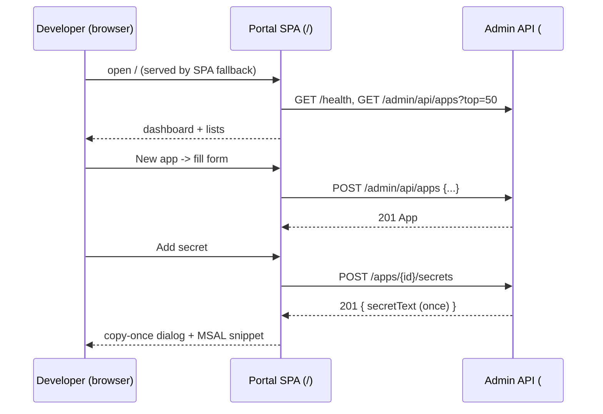

# Feature #12 — Web Portal

- **Roadmap ref:** Iteration 1, feature #12 ("Web portal"). **UI:** ✓
- **Dependencies:** [#11](2026-06-22_11-admin-rest-api.md) (Admin REST API — the portal's only backend). Transitively [#1](2026-06-22_01-server-config-tls-foundation.md) (SPA served at `/`, single-origin, Vite dev proxy), [#4](2026-06-22_04-oidc-discovery.md)/[#5](2026-06-22_05-token-service.md) (issuer/authority/scope values for the MSAL snippet).
- **Status:** ⬜ Not started.

> **Visual-identity dependency.** `DESIGN.md` is currently `Status: undefined`. This spec defines the portal **functionally** (screens, IA, components, states, behavior) — which is what tests assert — and is independent of styling. The portal ships **functional-but-unstyled** until the designer (Murdock) establishes the visual identity in `DESIGN.md` (the same prerequisite #6's sign-in page shares). **Recommendation to the orchestrator: invoke the designer to define `DESIGN.md`, then have the designer produce this spec's visual treatment**, before the portal's final styling pass. The functional contract here does not change when styling lands.

---

## Goal / outcome

A React + Vite + TypeScript single-page admin portal served at `/` (the locked single-origin SPA root) that lets a developer manage the emulator directory and app registrations entirely from the browser, and — critically — generates a **ready-to-paste, per-app MSAL config snippet** so pointing a real MSAL app at the emulator is turnkey. It consumes only the Admin REST API ([#11](2026-06-22_11-admin-rest-api.md)).

---

## Scope

### In scope
- React + Vite + TS SPA under `portal/`, built to static assets served by the SPA fallback at `/` ([#1](2026-06-22_01-server-config-tls-foundation.md)); HMR via the Vite dev server proxying `/admin/api`, `/health`, `/{tenant}/...`, `/graph/...` to the API in development.
- Screens: **Dashboard**, **Users**, **Groups**, **App registrations** (list + detail/edit with redirect URIs, secrets, exposed scopes, app roles), and a **per-app MSAL config snippet** generator.
- Seed / reset controls.
- Loading / empty / error / success states; client-side form validation mirroring [#11](2026-06-22_11-admin-rest-api.md)'s zod rules; secret show-once handling (display + copy the plaintext exactly once).
- Accessibility basics (semantic HTML, labelled controls, keyboard navigation, focus management, visible focus, `aria-live` for async feedback).

### Out of scope
- Portal authentication (the admin API + portal are open by locked decision).
- Visual styling/branding (pending `DESIGN.md`; functional-but-unstyled until then).
- Any direct DB access or token logic (everything goes through the Admin REST API).
- Real-time updates (manual refresh / refetch after mutations).
- Device-code approval UI (#15, Iteration 2) and the password-login screen (#6/#16; that is part of the sign-in surface, not the portal).

---

## Information architecture / screens

### Layout
- App shell: left nav (Dashboard, Users, Groups, App registrations) + main content; a header showing the emulator origin/tenant and a TLS/health indicator (from `/health`).
- Routing: client-side routes `#/` (or path-based) `/`, `/users`, `/groups`, `/apps`, `/apps/:id`. Deep links resolve via the SPA fallback.

### Dashboard
- Emulator status (from `/health`: status, version, tenantId, tls), the issuer and key endpoint URLs (discovery, JWKS, authorize, token) with **copy** buttons.
- Counts of users / groups / apps (from list endpoints).
- Seed / reset actions (calling `POST /admin/api/seed` / `/reset`) with a confirm dialog for reset.

### Users
- Table: UPN, display name, mail, accountEnabled, hasPassword; search box (maps to `?search=`); paging (top/skip).
- Create / edit drawer or modal: UPN, display name, given/sur name, mail, accountEnabled, optional password (set/clear). Delete with confirm.
- Per-user group membership view (read from `/users/{id}/groups`).

### Groups
- Table: display name, description, memberCount; search; paging.
- Create / edit; manage members (add via user picker, remove); delete with confirm.

### App registrations
- List: display name, app id (client_id), isConfidential, redirect-URI count; search; paging; "New app".
- Detail/edit (`/apps/:id`):
  - Basics: display name, isConfidential toggle, appIdUri.
  - **Redirect URIs:** add (uri + type) / remove.
  - **Secrets:** create (returns plaintext **once** — show in a copy-once dialog with a clear "you won't see this again" warning); list existing by hint/expiry; delete.
  - **Exposed scopes:** add/edit/enable/disable/delete (`value`, display name).
  - **App roles:** add/edit/enable/disable/delete (`value`, display name, allowedMemberTypes, enabled).
  - Delete app (confirm; warns about cascade).

### MSAL config snippet generator (per app)
On an app's detail page, generate a copyable snippet built from the app + emulator config (origin/tenant from `/health` + discovery):
- **Authority:** `<PUBLIC_ORIGIN>/<tenantId>` (e.g. `https://localhost:8443/11111111-1111-1111-1111-111111111111`).
- **clientId:** the app's `app_id`.
- **redirectUri:** a chosen registered redirect URI.
- **scopes:** for an auth-code/SPA app, the app's exposed scope(s) and/or `openid profile email offline_access`, plus — for Microsoft Graph calls — `User.Read` (a Graph delegated scope, auto-consented per [#10](2026-06-22_10-minimal-graph.md)'s Graph-scope acceptance rule, so it is **not** rejected as `invalid_scope`). For a confidential/daemon app, `<GRAPH_RESOURCE_ID>/.default` or `<app appIdUri>/.default`. The generator only emits scopes the emulator accepts (OIDC scopes, the app's registered scopes, recognized Graph delegated scopes, or `.default`).
- **Graph base:** `<PUBLIC_ORIGIN>/graph`.
- **knownAuthorities:** `[<host:port>]` and a note to set `protocolMode`/trust the cert (cross-platform details deferred to [#13](2026-06-22_13-msal-compat-validation.md)).
- Provide at least an `@azure/msal-browser` `Configuration` JS snippet; optionally tabs for `@azure/msal-node`. The snippet values are deterministic given the seed/config.

---

## Contracts
- **Backend:** the portal calls only `/admin/api/...` ([#11](2026-06-22_11-admin-rest-api.md)) and `/health` ([#1](2026-06-22_01-server-config-tls-foundation.md)) and reads discovery (`/{tenant}/v2.0/.well-known/openid-configuration`) for issuer/endpoint values in the snippet. No new server endpoints are introduced by #12.
- **Build:** `portal/` is a Vite project; `npm run build` builds it into the static assets the server serves at `/` (wired with the SPA fallback from #1). Dev: `npm run dev` runs Vite with a proxy to the API.
- **Error handling:** surface the admin error envelope's `message`/`details` in the UI; map `409 conflict`/`400 validation_error` to inline form errors.

---

## Behavior / flow

- After every mutation, the affected list/detail refetches.
- Secret plaintext is held only in component state for the show-once dialog and never persisted client-side.

---

## Data changes
None directly — all state changes go through [#11](2026-06-22_11-admin-rest-api.md).

---

## Dependencies & assumptions
- **Assumption:** `DESIGN.md` is undefined; the portal ships functional-but-unstyled and gains its visual identity once the designer defines `DESIGN.md` (recommendation flagged above). Tests assert function, not pixels.
- **Assumption:** the portal is unauthenticated (locked decision), consistent with the admin API.
- **Assumption:** single-origin means no CORS; in dev the Vite proxy forwards API calls (per #1's decision).
- **Assumption:** the MSAL snippet authority uses the **GUID** tenant (matches the concrete-GUID issuer from [#4](2026-06-22_04-oidc-discovery.md)) and `knownAuthorities`, so the generated config works with MSAL's custom-authority requirements.

---

## Testable acceptance criteria
1. **Build & serve (integration/e2e):** `npm run build` produces portal assets; the server serves the SPA at `/` and deep links (`/apps/:id`) resolve via the SPA fallback (not a `404`).
2. **Dashboard (e2e/component):** the dashboard shows tenantId/issuer/key endpoints from `/health` + discovery with working copy buttons, and live counts of users/groups/apps.
3. **User management (e2e):** creating, editing, and deleting a user through the UI calls the correct Admin API endpoints and reflects the result; validation errors (duplicate UPN) surface inline.
4. **Group + membership (e2e):** create a group and add/remove a member via the UI; member list updates.
5. **App registration lifecycle (e2e):** create an app, add a redirect URI, add an exposed scope and an app role, create a secret — each persists; the secret plaintext is shown exactly once in a copy dialog and is unavailable on reload.
6. **MSAL snippet (e2e/component):** the per-app snippet contains the correct authority (`<origin>/<tenantId>`), `clientId` (= app_id), a registered `redirectUri`, scopes, `knownAuthorities`, and the Graph base — all matching the emulator's discovery/config; it is copyable.
7. **End-to-end "new app signs in" (e2e):** an app created entirely through the portal, with its generated MSAL snippet, completes an Authorization Code + PKCE sign-in (#6) — satisfying global-spec §15 criterion 6.
8. **States (component):** loading, empty (no users/groups/apps), error (API failure → envelope message shown), and success states render; `aria-live` announces async results.
9. **Accessibility basics (component/e2e):** all form controls are labelled; the app is keyboard-navigable with visible focus; dialogs trap focus and are dismissible via keyboard (automated a11y check, e.g. axe, passes with no critical violations).
10. **Reset/seed (e2e):** the reset control (with confirm) calls `/admin/api/reset` and the UI reflects the reseeded state.

---

## Open questions
- **`DESIGN.md` is undefined (needs designer input).** Final visual styling is blocked on the designer establishing the brand identity; the portal ships functional-but-unstyled until then. This is the same cross-cutting blocker as #6's sign-in page. *(Recommendation: run Murdock to define `DESIGN.md`, then produce the portal + sign-in visual treatment; does not block functional implementation/tests.)*
- Otherwise none blocking. *(Decisions: portal served at `/` per the locked single-origin decision — overrides the draft global-spec §9 `/admin` path; portal consumes only the Admin API; MSAL snippet uses the GUID authority + `knownAuthorities`.)*
