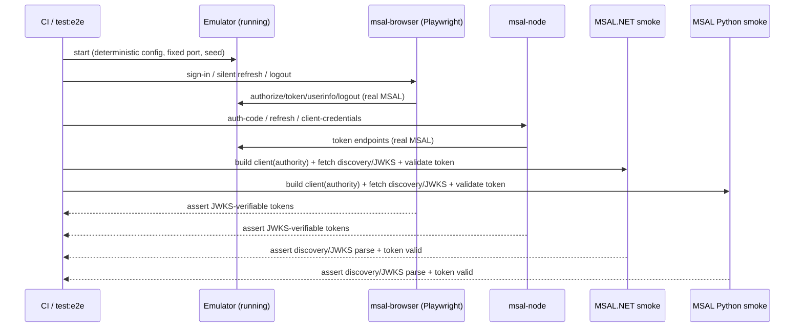

# Feature #13 — MSAL Compatibility Validation

- **Roadmap ref:** Iteration 1, feature #13 ("MSAL compatibility validation").
- **Dependencies:** [#6](2026-06-22_06-auth-code-pkce-signin.md) (auth code + PKCE), [#7](2026-06-22_07-refresh-token.md) (silent refresh), [#9](2026-06-22_09-userinfo-logout.md) (userinfo/logout). Transitively [#4](2026-06-22_04-oidc-discovery.md) (discovery/issuer/instance-discovery concerns), [#3](2026-06-22_03-signing-keys-jwks.md) (JWKS/`x5c`), [#8](2026-06-22_08-client-credentials.md) (client credentials), [#1](2026-06-22_01-server-config-tls-foundation.md) (e2e harness + CI).
- **Status:** ⬜ Not started.

> **Canonical-reference notice.** This spec owns the **cross-platform MSAL compatibility gate** and consolidates the real-MSAL e2e harness from [#1](2026-06-22_01-server-config-tls-foundation.md). It resolves the cross-platform field concerns flagged by [#4](2026-06-22_04-oidc-discovery.md) (concrete-GUID issuer, instance discovery, omitted Microsoft cloud-host fields) and the `x5c` omission flagged by [#3](2026-06-22_03-signing-keys-jwks.md). It is the project's #1-goal/highest-risk verification milestone.

---

## Goal / outcome

Proof — in CI — that the emulator is MSAL-compatible across the four platforms developers actually use: `@azure/msal-browser`, `@azure/msal-node`, MSAL.NET, and MSAL Python. The JS/Node clients run full real-MSAL e2e flows (sign-in, silent refresh, sign-out, client credentials) asserting JWKS-verifiable tokens; MSAL.NET and MSAL Python run authority/instance-discovery **smoke-tests** (they successfully build a client against the emulator authority and fetch+parse discovery/JWKS) with their runtimes provisioned in CI. The required `protocolMode`/`knownAuthorities`/`Authority`/`instance_discovery` settings per platform are documented.

---

## Scope

### In scope
- Consolidate the inline real-MSAL e2e drivers (from #1's harness) into a coherent `test/e2e/` suite covering, against a running emulator:
  - `@azure/msal-browser` (headless, Playwright): Authorization Code + PKCE sign-in, `acquireTokenSilent` (refresh), `logoutRedirect`.
  - `@azure/msal-node`: confidential auth-code web flow, `acquireTokenSilent` (refresh), `acquireTokenByClientCredential`, sign-out.
- MSAL.NET (C#) and MSAL Python **smoke-tests**: construct the app with the emulator authority, and perform a **real non-interactive MSAL token acquisition** — `AcquireTokenForClient` (MSAL.NET) / `acquire_token_for_client` (MSAL Python) against the client-credentials flow ([#8](2026-06-22_08-client-credentials.md)) using the seeded confidential daemon + its `<appIdUri>/.default` scope. This drives MSAL's own metadata fetch (discovery/JWKS) and authority/instance-discovery acceptance through the real library (not raw HTTP). The returned JWT is then validated with the platform's JWT library against the emulator JWKS (`iss`/`aud`/signature). This proves MSAL *token acquisition* works, not merely that a JWKS can be parsed.
- CI provisioning of the .NET SDK and Python runtime (+ MSAL packages) so the smoke-tests run in `npm run test:e2e` / CI.
- A per-platform **MSAL configuration matrix** doc (in this spec) resolving `protocolMode`, `knownAuthorities`, `Authority`, `instance_discovery`/`disableInstanceDiscovery`, and cert-trust.
- Resolution + assertions for the cross-platform field concerns flagged by #3/#4.

### Out of scope
- The full Iteration 3 sample apps (`samples/`) — those are a separate, additional regression surface; #13 uses minimal inline test drivers, not shippable samples.
- Adding Microsoft cloud-host fields to discovery (explicitly rejected by #4 — they'd point at real cloud hosts).
- Device-code MSAL validation (#15, Iteration 2).
- Browser-interactive MSAL.NET/Python flows (smoke-test scope is authority/discovery/JWKS acceptance + token validation, not a headless .NET/Python browser drive).

---

## Cross-platform MSAL configuration matrix (owned here)

| Platform | Authority | Key settings | Cert trust |
|---|---|---|---|
| `@azure/msal-browser` | `<origin>/<tenantId>` (GUID) | `knownAuthorities: ['<host:port>']`; default AAD `protocolMode` (exercises `client_info`). The secondary **OIDC `protocolMode`** case MUST use authority `<origin>/<tenantId>/v2.0` (OIDC mode requests `<authority>/.well-known/openid-configuration` with no `/v2.0` insertion, so the `/v2.0` must be in the authority to hit #1's only discovery route). | Browser must trust the self-signed cert (CI installs it / Playwright `ignoreHTTPSErrors`). |
| `@azure/msal-node` | `<origin>/<tenantId>` | `knownAuthorities: ['<host:port>']`; `protocolMode` default (AAD). | `NODE_EXTRA_CA_CERTS=<cert path>` (or `NODE_TLS_REJECT_UNAUTHORIZED=0` in CI only). |
| MSAL.NET | `<origin>/<tenantId>` | `.WithAuthority(authority, validateAuthority:false)` or `.WithOidcAuthority(...)`; `WithInstanceDiscovery(false)` (or `disableInstanceDiscovery`) to bypass `login.microsoftonline.com` instance discovery; treat as an unknown/custom authority. | Add the emulator cert to the test trust store / use an `HttpClientFactory` with a permissive validator in the test only. |
| MSAL Python | `<origin>/<tenantId>` | `PublicClientApplication/ConfidentialClientApplication(..., authority=<authority>, validate_authority=False, instance_discovery=False)` | `REQUESTS_CA_BUNDLE`/`verify=<cert>` (or disable verify in the test only). |

**Why these settings:** the emulator is a custom (non-Microsoft) authority. MSAL's default behavior probes `https://login.microsoftonline.com/common/discovery/instance`; pointing it offline requires disabling instance discovery and/or marking the authority known/unvalidated so MSAL trusts the emulator's own discovery document. The single fixed tenant returns a concrete-GUID issuer ([#4](2026-06-22_04-oidc-discovery.md)) that every token's `iss` matches, so issuer validation passes when the authority uses the GUID.

### Cross-platform field-concern resolutions (from #3/#4)
1. **Concrete-GUID issuer:** confirmed acceptable — all four MSALs validate `iss` against the GUID authority. The `/common` alias is **not** the primary configured authority for cross-platform clients (use the GUID authority); `/common`-with-templated-issuer parity is explicitly not required in MVP. Asserted by the smoke-tests.
2. **Instance discovery:** bypassed per the matrix (`instance_discovery=false` / `validateAuthority=false` / `knownAuthorities`). Asserted: each client builds and fetches discovery without contacting any real cloud host (CI runs offline).
3. **Omitted Microsoft cloud-host fields** (`cloud_instance_name`, `msgraph_host`, etc.): confirmed harmless given instance discovery is disabled; #13 does **not** add them. Asserted: discovery parse succeeds on all platforms without these fields.
4. **`x5c` omission in JWKS:** confirmed — MSAL.js/`jose`, MSAL.NET, and MSAL Python verify RS256 signatures from `n`/`e`/`kid` and do not require `x5c`. Asserted by token validation against the JWKS on each platform. **If** any platform's validator is found to require `x5c`, the resolution is to add `x5c` (a single self-signed leaf cert per signing key) to the JWKS in [#3](2026-06-22_03-signing-keys-jwks.md) — recorded as a contingency, not done preemptively.

---

## Behavior / flow

- The suite runs under `npm run test:e2e`; the .NET/Python smoke-tests are invoked from the suite (child processes) and require the provisioned runtimes. CI installs the .NET SDK and Python + MSAL packages (per the conventions note that #13 establishes this provisioning).
- Determinism: fixed tenant GUID, fixed seed, ephemeral DB, fixed test port; all MSAL clients point at the GUID authority; instance discovery disabled so no network egress.

---

## Data changes
None (test/CI-only feature; no schema or endpoint changes). If the `x5c` contingency triggers, the change lands in [#3](2026-06-22_03-signing-keys-jwks.md), not here.

---

## Dependencies & assumptions
- **Assumption:** disabling instance discovery + using `knownAuthorities`/`validateAuthority=false` is the supported configuration for all four MSALs (documented in the matrix); this is the standard custom-authority recipe.
- **Assumption:** RS256-from-`n`/`e`/`kid` (no `x5c`) is accepted by all four MSAL validators (contingency documented if not).
- **Assumption:** MSAL.NET/Python validation is a **smoke-test** (authority/discovery/JWKS acceptance + token validation), not a full interactive browser flow on those platforms — full interactive coverage on .NET/Python arrives with the Iteration 3 samples (#20/#21).
- **Assumption:** CI can install the .NET SDK + Python runtime; cert trust in CI uses `NODE_EXTRA_CA_CERTS`/`REQUESTS_CA_BUNDLE`/trust-store install or test-only verification bypass.

---

## Testable acceptance criteria
1. **msal-browser e2e (`npm run test:e2e`):** headless `@azure/msal-browser` completes Authorization Code + PKCE, `acquireTokenSilent` (refresh via #7), and `logoutRedirect` (#9) against the running emulator; all tokens verify against the JWKS; default AAD `protocolMode` exercised (account identity via `client_info`).
2. **msal-node e2e:** `@azure/msal-node` completes confidential auth-code, `acquireTokenSilent`, `acquireTokenByClientCredential` (#8), and sign-out; tokens verify against the JWKS.
3. **MSAL.NET smoke (CI):** an MSAL.NET `ConfidentialClientApplication` built with the emulator authority (`validateAuthority=false`/instance discovery disabled) performs `AcquireTokenForClient` against the client-credentials flow (#8) and obtains a token; the returned JWT validates (signature/issuer/audience) against the JWKS; passes with no contact to any real cloud host.
4. **MSAL Python smoke (CI):** an MSAL Python `ConfidentialClientApplication` built with `authority=<origin>/<tenantId>`, `validate_authority=False`, `instance_discovery=False` performs `acquire_token_for_client` (#8) and obtains a token that validates against the JWKS; passes offline.
5. **Issuer match (token-conformance):** every platform validates the concrete-GUID `iss` against the GUID authority; no `{tenantid}`-templating is required.
6. **Instance discovery bypass (CI):** the e2e/CI run performs no outbound request to `login.microsoftonline.com` (asserted via network isolation/no-egress or a request log), confirming the matrix settings bypass instance discovery.
7. **`x5c` independence (token-conformance):** token signature validation succeeds on all four platforms with a JWKS that omits `x5c` (or, if a platform requires it, the #3 contingency is applied and re-validated).
8. **CI provisioning (CI):** the pipeline provisions the .NET SDK and Python + MSAL, and `npm run test:e2e` runs all four platforms green; the per-platform config matrix is documented (this spec + a referenced docs stub for #22).
9. **Determinism (CI):** the whole suite is reproducible — fixed tenant/seed/port, ephemeral DB, no network egress.

---

## Open questions
None blocking. *(Decisions: GUID authority + disabled instance discovery + `knownAuthorities`/`validateAuthority=false` is the supported per-platform recipe; Microsoft cloud-host discovery fields stay omitted; `x5c` stays omitted unless a platform validator demands it (#3 contingency). MSAL.NET/Python are smoke-tested in Iteration 1, fully sampled in Iteration 3. Recorded in `memory/decisions.md` under the Batch B cross-cutting entry.)*
