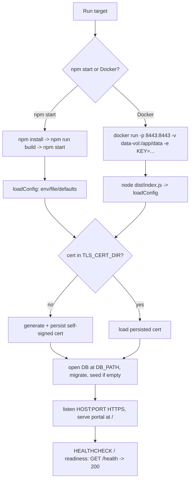

# Feature #14 — Run Targets: `npm start` + Docker

- **Roadmap ref:** Iteration 1, feature #14 ("Run targets: `npm start` + Docker").
- **Dependencies:** [#1](2026-06-22_01-server-config-tls-foundation.md) (server bootstrap, config, TLS/cert generation, `/health`, `start` script). Transitively #2 (DB path/volume), the whole emulator (the container runs the built app).
- **Status:** ⬜ Not started.

> **Canonical-reference notice.** This spec owns the **two Iteration-1 run targets — running from source (`npm start`) and a Docker container** — sharing the one config/data model from [#1](2026-06-22_01-server-config-tls-foundation.md). The single-executable target is **out of scope** (Iteration 2 #17).

---

## Goal / outcome

A developer can run the emulator two ways with identical behavior and one config/data model: (1) from source via `npm start` (after `npm install` + `npm run build`), and (2) as a Docker container with a persisted volume for `data/` (SQLite DB + auto-generated TLS cert), env/config passthrough, port mapping, a `HEALTHCHECK` hitting `/health`, and first-run cert generation. State persists across restarts in both targets.

---

## Scope

### In scope
- Harden the `npm start` flow: `start` runs the built server (`node dist/index.js` or equivalent) using the same config loader as `dev`; documents the `install → build → start` sequence; serves the built portal assets (#12) from `/`.
- A `Dockerfile` on a Node base that supports `node:sqlite` (Node **22.5+**; target Node 24 LTS).
- Container build that compiles the server + portal and produces a runnable image.
- A persisted **volume for `data/`** (DB at `DB_PATH`, TLS cert/key under `TLS_CERT_DIR`) so state + cert fingerprint survive container restarts.
- Env/config passthrough (all [#1](2026-06-22_01-server-config-tls-foundation.md) keys) and **port mapping** (default `8443`).
- A container `HEALTHCHECK` invoking `/health` (TLS-aware).
- First-run cert generation inside the container (reusing #1's auto-cert logic), persisted to the volume.
- A `.dockerignore`; documentation in `README` for both targets including cert-trust guidance.

### Out of scope
- Single-executable packaging (Node SEA / `pkg`) — Iteration 2 #17.
- Publishing the image to a registry / release automation (CI may build it, but publishing is not required for MVP).
- Multi-arch/`docker compose` orchestration beyond a documented example (a `compose` snippet may be provided but is not required).
- Kubernetes/Helm/production hardening.

---

## Contracts

### `npm start` (from source)
- Sequence: `npm install` → `npm run build` (builds server + portal per [#1](2026-06-22_01-server-config-tls-foundation.md)/conventions §16.2) → `npm start`.
- `start` boots the built server with the same `config/loadConfig` precedence (env → config file → defaults) and the same TLS/cert resolution as #1; binds `HOST:PORT` (default `localhost:8443`, HTTPS).
- On first run, generates + persists the self-signed cert to `TLS_CERT_DIR` (`./data/tls`) and the DB to `DB_PATH` (`./data/entra-local.db`); subsequent runs reuse them (stable fingerprint + persisted directory state).

### Docker image
- **Base:** an official Node image at **≥22.5** (target `node:24`-slim or equivalent) so `node:sqlite` is available. (Documented constraint: `node:sqlite` requires the newer runtime — the locked persistence-driver decision.)
- **Build:** multi-stage — a build stage runs `npm ci` + `npm run build` (server + portal); a runtime stage copies `dist/`, the built portal assets, `node_modules` (prod), migrations, and `package.json`. Runs as a non-root user.
- **Default command:** `node dist/index.js` (same entrypoint as `npm start`).
- **Exposed port:** `8443` (configurable via `PORT`); run with `-p 8443:8443`.
- **Bind host in the container:** the image sets `HOST=0.0.0.0` by default (overriding #1's `localhost` default) so the published port is reachable from the host; `PUBLIC_ORIGIN`/`ISSUER` still default to `https://localhost:8443` (what external clients use). Binding `0.0.0.0` inside an isolated container is acceptable; the README notes not to expose it on untrusted networks (dev tool).
- **Volume:** `/app/data` (maps to `DB_PATH` + `TLS_CERT_DIR` under `./data`) declared as a `VOLUME` and documented as `-v entra-local-data:/app/data` so DB + cert persist.
- **Env passthrough:** all [#1](2026-06-22_01-server-config-tls-foundation.md) config keys are read from the environment (`-e TENANT_ID=...`, `-e REQUIRE_PASSWORD=true`, etc.). `PUBLIC_ORIGIN`/`ISSUER` documented for when the container is fronted differently from `localhost:8443`.
- **HEALTHCHECK:** `HEALTHCHECK CMD` polls `https://localhost:${PORT}/health` (TLS-aware; uses `--no-check-certificate`/`--insecure` or `NODE_TLS_REJECT_UNAUTHORIZED=0` *inside the container only* against its own self-signed cert) and expects HTTP `200` with `{"status":"ok"}`.
- **First-run cert:** generated inside the container on first boot (reusing #1's logic) and written to the mounted volume; persists across restarts when the volume is reused.

### Shared config/data model
- One `config/loadConfig` and one schema (`data/entra-local.db`, `data/tls/*`) across both targets; the only difference is where `data/` lives (host CWD vs the container volume). No target-specific config branches.

---

## Behavior / flow

---

## Data changes
None (packaging/run-target feature). Uses the existing `DB_PATH`/`TLS_CERT_DIR` from [#1](2026-06-22_01-server-config-tls-foundation.md)/[#2](2026-06-22_02-sqlite-store-schema-seed.md). No DDL.

---

## Dependencies & assumptions
- **Assumption:** the Node base image is ≥22.5 (target 24 LTS) so `node:sqlite` works without native bindings (locked driver decision) — this is the key constraint that makes the container simple (no build toolchain for native modules in the runtime stage).
- **Assumption:** persisting `data/` (DB + cert) to a named volume is the supported way to keep state + a stable cert fingerprint across container restarts.
- **Assumption:** the in-container HEALTHCHECK may bypass cert verification against the container's own self-signed cert (loopback, inside the container); external clients still trust/verify per the README cert-trust guidance.
- **Assumption:** image publishing/registry is not required for MVP; building + running locally (and in CI) is sufficient.

---

## Testable acceptance criteria
1. **`npm start` from source (integration/manual + CI):** after `npm install && npm run build`, `npm start` boots an HTTPS server on `localhost:8443`, `/health` returns `200 {"status":"ok", tls:true}`, the portal is served at `/`, and discovery/JWKS resolve.
2. **Persistence across restart — source (integration):** data written (e.g. an app created via the admin API) and the generated cert survive a stop/start (same DB file + same cert fingerprint).
3. **Docker build (CI):** `docker build` produces a runnable image on a Node ≥22.5 base; the build runs `npm run build` (server + portal) in a build stage and the runtime stage starts via `node dist/index.js`.
4. **Docker run + health (CI/manual):** `docker run -p 8443:8443 -v <vol>:/app/data` starts the container; `/health` is reachable from the **host** via the mapped port (proving `HOST=0.0.0.0`) and returns `200`; the container `HEALTHCHECK` reports `healthy`.
5. **Volume persistence (CI/manual):** state created in the container (admin API write) and the auto-generated cert persist across `docker stop`/`docker start` when the same volume is reused (same cert fingerprint, same data).
6. **Env passthrough (CI/manual):** overriding config via `-e` (e.g. `PORT`, `TENANT_ID`, `REQUIRE_PASSWORD`) changes behavior accordingly (e.g. `/health.tenantId` reflects `TENANT_ID`).
7. **First-run cert generation (CI/manual):** a fresh container with an empty volume generates a self-signed cert on first boot, persists it to the volume, and serves HTTPS.
8. **Shared model (integration):** both targets read the same config schema and produce the same `data/` layout (`entra-local.db` + `tls/`); no target-specific config branch exists.
9. **Determinism (CI):** with the deterministic config (fixed tenant/seed) the container's `/health` and seeded data match the source run.

---

## Open questions
None blocking. *(Decisions: Node ≥22.5 / target 24 base for `node:sqlite`; single named volume for `data/` (DB + cert); in-container HEALTHCHECK bypasses cert verification against its own loopback cert; image publishing deferred — not required for MVP. Single-executable target remains Iteration 2 #17.)*
