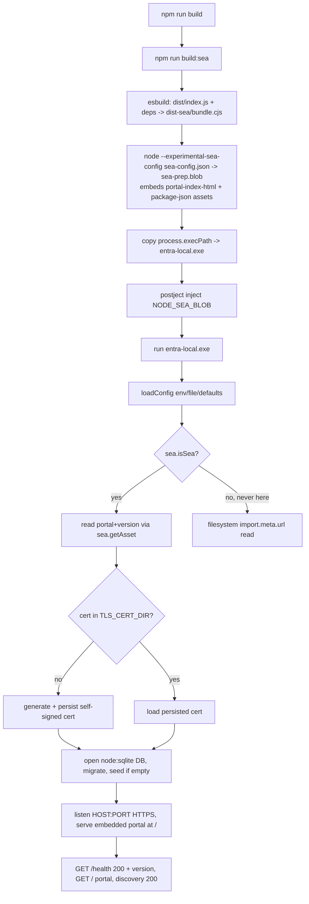

# Feature #17 — Single-Executable Packaging

- **Roadmap ref:** Iteration 2, feature #17 ("Single-executable packaging").
- **Dependencies:** [#14](2026-06-22_14-run-targets.md) (run targets `npm start` + Docker; shared config/data model, `prestart` build guard, single-file portal asset, HTTPS/cert bootstrap). Transitively #1 (server/config/TLS), #2 (SQLite store — inline schema/seed, no external migration files), #12 (single-file portal `portal/dist/index.html`).
- **Status:** ✅ Done.

> **Canonical-reference notice.** This spec owns the **third run target — a self-contained single-file executable** built with **Node SEA (Single Executable Applications)**. It reuses the one config/data model from [#14](2026-06-22_14-run-targets.md) unchanged; the binary is just a third way to launch the exact same server. It resolves the roadmap "Open Decision" **Single-exe approach: Node SEA vs `pkg`** → **Node SEA**.

---

## Goal / outcome

A developer can download/produce one platform-native executable (no Node install, no `npm install`, no external files) that boots the full emulator: HTTPS with a first-run self-signed cert, the OIDC/OAuth surface, the SQLite store (via the built-in `node:sqlite`, no native bindings), and the admin portal served from an **embedded** copy of `portal/dist/index.html`. Running the binary is behaviourally identical to `npm start` / Docker; it reads the same env/config keys and writes the same `data/` layout (DB + cert) relative to its working directory.

---

## Decision: Node SEA over `pkg`

**Chosen: Node SEA** (the official `--experimental-sea-config` + `postject` flow).

**Rationale:**
- **No native bindings to bundle.** Persistence uses the built-in `node:sqlite`, so the binary needs zero native-addon handling — the single biggest pain point of `pkg`-style packaging (shipping `better-sqlite3`/`node-sqlite3` `.node` files) does not exist here. The roadmap challenge "Native SQLite in a single executable" is resolved simply: the embedded Node runtime *is* the SQLite engine.
- **Officially supported & dependency-light.** SEA is a first-party Node feature (stable-ish, `--experimental-sea-config`) maintained alongside the runtime; it embeds *the running Node*, so the `node:sqlite`/`node:sea`/crypto builtins are guaranteed present and version-matched.
- **`pkg` is deprecated/unmaintained** (vercel/pkg archived), pins to older Node snapshots, and has known issues with newer builtins like `node:sqlite`.
- **Asset embedding is built in.** SEA's `assets` map lets us embed the two files the server reads at runtime (`portal/dist/index.html`, `package.json`) into the blob and read them via `sea.getAsset()` — no sidecar files.

**Trade-offs accepted:** SEA produces a per-platform binary (no cross-compile — build on each target OS) and the dev binary is **unsigned** (Windows SmartScreen / macOS Gatekeeper will warn; signing is out of scope for a dev tool). The blob injection requires `postject`.

---

## Scope

### In scope
- A **bundling step** (`scripts/build-sea.mjs`) that, after `npm run build`, uses **esbuild** to bundle the compiled ESM app (`dist/index.js`) plus all production npm deps into **one CJS file** (`dist-sea/bundle.cjs`), keeping `node:*` builtins (incl. `node:sqlite`, `node:sea`) external.
- A **runtime asset indirection** (`src/runtime/assets.ts`) so the two assets the server reads — the portal HTML and `package.json` (version) — are read from the SEA blob via `node:sea.getAsset()` when running as a SEA, and from the filesystem via the **existing** `import.meta.url` resolution otherwise (tsx/dev, `dist`, Docker). `version.ts` and `spaFallback.ts` are refactored to go through this indirection without changing their non-SEA behaviour.
- A **`sea-config.json`** mapping logical asset names → `portal/dist/index.html` and `package.json`.
- A **binary build** (`scripts/build-sea.mjs` + `npm run build:sea`) following the official SEA flow: bundle → `node --experimental-sea-config sea-config.json` (generate `sea-prep.blob`) → copy `process.execPath` → inject the blob with `postject` → produce `dist-sea/entra-local[.exe]`. Cross-platform-aware (exe name/extension by `process.platform`); fully verified on the current platform (Windows x64).
- A **smoke test** (`test/integration/sea-packaging.test.ts`) that, **gated on the binary existing** (skips cleanly otherwise), spawns the exe against an ephemeral data dir under `data/.tmp/<uuid>` and asserts the four DoD checks (boot+HTTPS, `/health` 200+version, `/` serves portal `<div id="root">`, discovery 200). A dedicated `npm run test:sea` builds then runs it.
- **Tooling** (`esbuild`, `postject`) added to **devDependencies**; outputs (`dist-sea/`, `*.exe`, `*.blob`) git/docker/prettier/eslint-ignored.
- **README** "Single-file binary" subsection.

### Out of scope
- Code signing / notarization (binary is unsigned for dev).
- Cross-compilation (build per target OS); CI matrix builds across OSes is a follow-up, not required for this feature.
- Publishing binaries to a release/CDN.
- Auto-update / installer packaging (MSI, dmg, deb).
- Any change to the server's behaviour, endpoints, schema, or the `npm start`/Docker targets — they must stay byte-for-byte unchanged.

---

## Contracts

### Asset indirection (`src/runtime/assets.ts`)
- `isSea(): boolean` — true only inside a SEA binary. Detects via a **guarded** `require('node:sea')` (`createRequire(import.meta.url)`, wrapped in try/catch) so plain Node/ESM/`dist`/Docker never fails to import `node:sea` and never treats itself as a SEA.
- `readTextAsset(seaKey: string, fileUrl: URL): string` — when `isSea()`, returns `sea.getAsset(seaKey, 'utf8')`; otherwise `readFileSync(fileURLToPath(fileUrl), 'utf8')`. The caller passes the **same** `new URL('…', import.meta.url)` it used before, so non-SEA path resolution is unchanged.
- `version.ts` → `readTextAsset('package-json', new URL('../package.json', import.meta.url))`.
- `spaFallback.ts` → `readTextAsset('portal-index-html', new URL('../../portal/dist/index.html', import.meta.url))`.

### `sea-config.json`
```json
{
  "main": "dist-sea/bundle.cjs",
  "output": "dist-sea/sea-prep.blob",
  "disableExperimentalSEAWarning": true,
  "useSnapshot": false,
  "useCodeCache": false,
  "assets": {
    "portal-index-html": "portal/dist/index.html",
    "package-json": "package.json"
  }
}
```
`useCodeCache:false` avoids V8-version coupling/flakiness; `disableExperimentalSEAWarning:true` keeps the boot output clean.

### esbuild bundle
`esbuild dist/index.js --bundle --platform=node --format=cjs --target=node22 --outfile=dist-sea/bundle.cjs` with `node:*` external (esbuild treats `node:`-prefixed imports as external automatically; `node:sqlite`/`node:sea` are additionally listed explicitly as a safety belt). All npm runtime deps (fastify, jose, zod, selfsigned, @fastify/*) are bundled INTO the file so the binary is self-contained.

### Build flow (`scripts/build-sea.mjs`, `npm run build:sea`)
1. Verify `dist/index.js` + `portal/dist/index.html` exist (run `npm run build` first; the script errors with guidance if missing).
2. esbuild → `dist-sea/bundle.cjs`.
3. `node --experimental-sea-config sea-config.json` → `dist-sea/sea-prep.blob`.
4. Copy `process.execPath` → `dist-sea/entra-local` (`.exe` on Windows).
5. `postject dist-sea/entra-local[.exe] NODE_SEA_BLOB dist-sea/sea-prep.blob --sentinel-fuse NODE_SEA_FUSE_fce680ab2cc467b6e072b8b5df1996b2` (plus `--macho-segment-name NODE_SEA` on macOS).
6. Print the exe path + size.

### npm scripts (added)
- `build:sea` → `node scripts/build-sea.mjs`.
- `test:sea` → `node scripts/build-sea.mjs && vitest run -c vitest.config.ts test/integration/sea-packaging.test.ts`.

### Runtime contract of the produced binary
- Reads the same env/config keys as `npm start` (`PORT`, `HOST`, `TENANT_ID`, `DB_PATH`, `TLS_CERT_DIR`, `TLS_ENABLED`, …) via the shared `loadConfig`.
- On first run, generates + persists the self-signed cert to `TLS_CERT_DIR` (default `./data/tls`) and opens/seeds the DB at `DB_PATH` (default `./data/entra-local.db`) relative to the working directory.
- Serves the **embedded** portal at `/` and reports the **embedded** `package.json` version at `/health`.

---

## Behavior / flow


---

## Data changes
None. No schema/DDL/seed change. The DB layer's schema + seed are inline SQL compiled into the build (`src/store/db.ts`, `src/store/seed.ts`) — **there are no external migration asset files**, so nothing extra is bundled for the DB. (Confirmed during implementation: the only two runtime-read non-code assets are `portal/dist/index.html` and `package.json`.)

---

## Dependencies & assumptions
- **Assumption:** the SEA host Node is ≥22.5 (matches `engines`), so the embedded runtime has `node:sqlite` and `node:sea`. The binary embeds the running Node, so building with the project's Node (≥22.5) guarantees parity.
- **Assumption:** `node:sqlite` needs no external file/bindings — the embedded Node *is* the SQLite engine. The binary opens/creates the DB on first run.
- **Assumption:** the two runtime-read assets are exactly `portal/dist/index.html` and `package.json`; everything else is code (bundled) or runtime state (DB/cert, written to `data/`).
- **Assumption:** esbuild treats `node:`-prefixed imports as external on `platform=node`, so builtins resolve at runtime in the SEA's embedded Node.
- **Assumption:** the dev binary is unsigned; OS reputation prompts are expected and documented.
- **Assumption:** SEA is per-platform; cross-OS binaries are produced by building on each OS (CI matrix is a follow-up).

---

## Testable acceptance criteria
1. **Asset indirection — non-SEA unchanged (unit):** `readTextAsset` falls back to the `import.meta.url` filesystem read when not in a SEA; `version.ts`/`spaFallback.ts` keep working under plain Node/`dist`. All existing gates (lint/typecheck/build/test/test:e2e) stay green.
2. **Bundle (build:sea):** esbuild produces a single self-contained `dist-sea/bundle.cjs` with npm runtime deps inlined and `node:*` external; running `node dist-sea/bundle.cjs` boots the server (sanity).
3. **Blob + binary (build:sea):** `node --experimental-sea-config` produces `sea-prep.blob` (with both assets), and `postject` injects it into a copy of the Node executable, producing `dist-sea/entra-local[.exe]`.
4. **Boot + HTTPS (smoke):** the binary boots and listens over HTTPS against a fresh ephemeral data dir, generating + persisting a self-signed cert on first run.
5. **`/health` 200 + version (smoke):** `GET /health` returns `200` with `status:"ok"` and `version` equal to the embedded `package.json` version (proves the embedded `package-json` asset works under SEA).
6. **Portal served (smoke):** `GET /` returns `200` HTML containing `<div id="root">` (proves the embedded `portal-index-html` asset works under SEA).
7. **Discovery (smoke):** `GET /{tenant}/v2.0/.well-known/openid-configuration` returns `200` with an `https` issuer (proves the full server + `node:sqlite`-backed startup works in the binary).
8. **Gated test integration:** the smoke test runs under `npm test`/`npm run test:sea` and **skips cleanly** when the binary is not built or the platform is unsupported, never breaking the default gates.
9. **No regression:** `npm start` (dist) and Docker behave exactly as before — the asset indirection falls back to filesystem reads when not in a SEA; `dist-sea/`/`*.exe`/`*.blob` are excluded from git and the Docker context.

---

## Open questions
None blocking. *(Decisions: Node SEA over `pkg`; embed exactly two assets (`portal/dist/index.html`, `package.json`); esbuild→CJS bundle with `node:*` external; asset indirection via `src/runtime/assets.ts` with a guarded `node:sea` require; dev binary unsigned; per-platform build (no cross-compile); smoke test availability-gated so default gates never depend on a SEA build. Recorded in `memory/decisions.md`.)*
