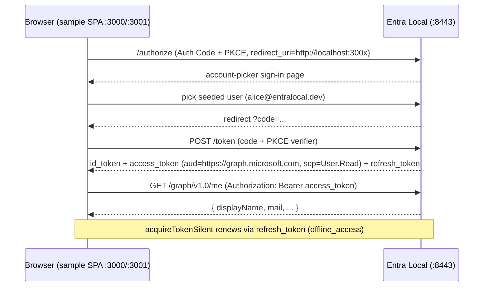

# Feature #18 — JS & React SPA samples

- **Roadmap ref:** Iteration 3, feature #18 ("JS & React SPA samples").
- **Dependencies:** [#6](2026-06-22_06-auth-code-pkce-signin.md) (auth code + PKCE), [#7](2026-06-22_07-refresh-token.md) (silent refresh), [#13](2026-06-22_13-msal-compat-validation.md) (MSAL config matrix + CI provisioning). Transitively [#4](2026-06-22_04-oidc-discovery.md), [#5](2026-06-22_05-token-service.md), [#2](2026-06-22_02-sqlite-store-schema-seed.md) (seed).
- **Status:** ⬜ Not started.

> **Canonical-reference notice.** This is the **first Iteration 3 sample** and therefore owns the
> shared **samples infrastructure**: the `samples/` layout convention, the canonical **port + app
> registration map**, the **seed additions** that back every sample, the **per-sample CI smoke**
> pattern, and the **optional `docker-compose.yml`** pattern. Specs [#19](2026-06-25_19-node-samples.md),
> [#20](2026-06-25_20-dotnet-sample.md), [#21](2026-06-25_21-python-sample.md), and
> [#24](2026-06-25_24-fullstack-spa-api-sample.md) reference these sections rather than redefining them.

---

## Goal / outcome

Two runnable, minimal **SPA** samples that sign a user in against a running Entra Local emulator
**out of the box**, acquire a **Graph-audience** delegated access token, call a protected endpoint
(the emulator's minimal Graph `GET /graph/v1.0/me`), and silently renew the token:

1. **Vanilla JS SPA** — `@azure/msal-browser` only, no framework, built with Vite.
2. **React SPA** — `@azure/msal-react` (wrapping `@azure/msal-browser`).

Both double as living documentation and as an **additional** real-MSAL regression surface (they are
**not** a prerequisite for the #13 e2e gate, which uses inline drivers).

---

## Shared samples infrastructure (owned here)

### `samples/` layout

```
samples/
  README.md                  # index: what each sample shows, prerequisites, the port/app map
  js-spa/                    # #18 vanilla msal-browser
  react-spa/                 # #18 msal-react
  node-web/                  # #19 confidential web (auth code)
  node-daemon/               # #19 client credentials
  node-cli/                  # #19 device code
  dotnet-console/            # #20 MSAL.NET
  python-console/            # #21 MSAL Python
  fullstack-spa-api/         # #24 SPA front + Express API back
    spa/
    api/
```

Conventions (also recorded in `memory/conventions.md`):

- **Self-contained.** Each JS/Node sample is a **standalone npm project** with its own
  `package.json` and lockfile — **not** a root npm workspace — so it builds/installs in isolation
  and never perturbs the emulator's dependency tree. `.NET` and Python samples are likewise
  self-contained (`dotnet` project / `pyproject.toml`).
- **One-command run.** Every sample documents a single primary command (table below). Config is
  read from environment variables with **working defaults** baked in (the seeded GUIDs + the
  default `https://localhost:8443` emulator), so the happy path needs no `.env` edits.
- **README per sample.** Each sample's README covers: what it demonstrates, prerequisites, the
  one-command run, a full environment/config table with defaults, **certificate trust**
  (per-platform; see below), the app registration + port it uses, expected token claims, endpoint
  paths, troubleshooting, and how to point it at a non-default emulator (`EMULATOR_ORIGIN` /
  authority override). `samples/README.md` indexes every sample.
- **Root ignores.** `samples/**` build output and dependency dirs (`node_modules`, `dist`,
  `bin`, `obj`, `.venv`, `__pycache__`) are added to `.gitignore`, `.prettierignore`, and the
  Docker `.dockerignore`; `samples/**` is excluded from the server `tsconfig`/eslint project so
  samples never enter the emulator build/lint/typecheck.

### Canonical port + app registration map (owned here)

Every sample runs on **its own port** (user requirement) and uses a **fixed, seeded** app
registration so app IDs are deterministic for docs, tests, and CI.

| Sample | App registration (seed GUID) | Client type | Sample port | Redirect URI | Scope / role requested |
|---|---|---|---|---|---|
| #18 vanilla SPA | Sample SPA `cccccccc-…-0001` | public | **3000** | `http://localhost:3000` | `User.Read` (Graph delegated token) |
| #18 React SPA | Sample SPA `cccccccc-…-0001` | public | **3001** | `http://localhost:3001` | `User.Read` (Graph delegated token) |
| #19 Node web | **new** Sample Web `cccccccc-…-0003` | confidential | **3002** | `http://localhost:3002/auth/redirect` | `openid profile offline_access` (sign-in) |
| #19 Node daemon | Sample Daemon `cccccccc-…-0002` | confidential | — | — | `https://graph.microsoft.com/.default` (Graph app-only token) |
| #19 Node CLI | Sample SPA `cccccccc-…-0001` | public | — | — | `User.Read` (device-code Graph token) |
| #20 .NET console | Sample SPA `cccccccc-…-0001` | public | **3003** | `http://localhost:3003` | `User.Read` (Graph delegated token) |
| #21 Python console | Sample SPA `cccccccc-…-0001` | public | **3004** | `http://localhost:3004` | `User.Read` (Graph delegated token) |
| #24 SPA (front) | **new** Sample SPA Front `cccccccc-…-0004` | public | **5173** | `http://localhost:5173` | `api://cccccccc-…-0005/access_as_user` |
| #24 Express API (back) | **new** Sample API `cccccccc-…-0005` | public (resource) | **4000** | — (resource server) | exposes `access_as_user` |

> Loopback `http://localhost:<port>` redirects are intentional: the **emulator** is HTTPS, but each
> sample's own dev server is plain HTTP on loopback (the MSAL/OAuth loopback exception), so samples
> need no second certificate. The existing seed redirect `https://localhost:3000` on `…-0001` is
> retained for back-compat; the `http://localhost:<port>` entries above are **added**.

### Seed additions (data change owned here)

Because deterministic app IDs require seed data (the admin REST `POST /api/apps` always
server-generates `appId`), the samples are backed by **additive, idempotent** changes to
`src/store/seed.ts` (`INSERT OR IGNORE`, single transaction, fixed GUIDs):

1. **New redirect URIs** on the existing Sample SPA (`cccccccc-…-0001`, `type='spa'`):
   `http://localhost:3000`, `http://localhost:3001`, `http://localhost:3003`,
   `http://localhost:3004`.
2. **New app — Sample Web** `cccccccc-…-0003` (`#19` confidential web): `is_confidential=1`,
   `app_id_uri='api://cccccccc-…-0003'`, redirect `http://localhost:3002/auth/redirect`
   (`type='web'`), one known dev secret `sample-web-app-secret` (hashed, with a new fixed secret
   GUID `ffffffff-…-0002`).
3. **New apps for #24** — Sample SPA Front `cccccccc-…-0004` (`is_confidential=0`, redirect
   `http://localhost:5173` `type='spa'`) and Sample API `cccccccc-…-0005` (`is_confidential=0`,
   `app_id_uri='api://cccccccc-…-0005'`) exposing scope `access_as_user`
   (new fixed scope GUID `dddddddd-…-0002`). (Detailed in [#24](2026-06-25_24-fullstack-spa-api-sample.md).)

These are **dev-only, publicly-known** values consistent with the existing seed contract. The
`SEED` constant object and the store **seed integration tests** are extended to assert the new rows;
the portal/admin API surface them automatically (no portal change required). New seed GUIDs are
added to the canonical list in the README security/seed section and `memory/conventions.md`.

### Per-sample CI smoke (pattern owned here)

User requirement: **every sample gets a CI build/smoke step.** A new CI job (`samples`) runs after
the main build/test gate. For each sample it: installs the sample's own deps, builds it, starts the
emulator (deterministic seed/port, cert exported), and runs a **headless smoke** asserting the
sample completes its flow and obtains a JWKS-verifiable token. Smoke depth per sample:

- **SPA samples (#18, #24 front):** Playwright headless drive of the real sign-in page (reusing the
  #13 browser-e2e harness and `ignoreHTTPSErrors`), asserting an access token is acquired and a
  protected call (`/graph/v1.0/me` for #18 or the #24 API) returns 200.
- **Node (#19), .NET (#20), Python (#21):** run each sample's build/config smoke and the
  non-interactive flows that can be automated reliably. Device-code/daemon paths run end-to-end.
  The .NET/Python interactive console samples explicitly define a CI-safe smoke mode rather than
  trying to automate an OS system browser that MSAL launches outside Playwright control.

CI provisions runtimes already established by #13 (`actions/setup-dotnet`, `actions/setup-python`)
plus `astral-sh/setup-uv` for #21. Smoke steps **skip cleanly** when a runtime is unavailable
locally (never fail a contributor's machine) but are **required** in CI.

### Optional `docker-compose.yml` (pattern owned here)

Each sample ships an **optional** `docker-compose.yml` that launches the emulator next to the
sample so a developer can start the IdP with one command:

```yaml
services:
  entra-local:
    image: ghcr.io/cmaneu/entra-local:latest
    ports:
      - '8443:8443'
    volumes:
      - entra-local-data:/app/data
volumes:
  entra-local-data:
```

The compose file launches **only the emulator** (the sample itself still runs via its one-command
script, against `https://localhost:8443`); this keeps the sample runnable with or without Docker.
The sample README documents `docker compose up -d` as the optional "get an emulator quickly" path
and how to export/trust the cert from the container (`docker cp`).

---

## Scope (this feature)

### In scope
- `samples/js-spa/` — Vite + TypeScript, `@azure/msal-browser`:
  - MSAL config from the matrix (authority `<origin>/<tenantId>`,
    `knownAuthorities: ['localhost:8443']`, default AAD `protocolMode`, redirect `http://localhost:3000`).
  - Login (redirect **and** popup variants documented; redirect is the default), `acquireTokenSilent`
    with interactive fallback, sign-out.
  - A "Call Graph" button that calls the emulator's minimal Graph `GET /graph/v1.0/me` with the
    Graph-audience access token and renders the result; a visible token/claims panel.
- `samples/react-spa/` — Vite + React + TypeScript, `@azure/msal-react`:
  - `MsalProvider`, `MsalAuthenticationTemplate`/`useMsal`, `useMsalAuthentication` for silent
    acquisition, protected route calling `GET /graph/v1.0/me`. Port `3001`.
- A README per sample + an entry in `samples/README.md`.
- The shared infrastructure above (layout, seed additions, CI smoke, compose) **as it pertains to
  these two samples** (the seed redirect URIs `3000`/`3001`).
- Cert-trust documentation (README only): import `data/tls/cert.pem` into the OS/browser trust
  store, **or** run the browser with the emulator origin trusted; CI uses Playwright
  `ignoreHTTPSErrors`.

### Out of scope
- Node/.NET/Python samples (#19/#20/#21) and the full-stack API sample (#24) — separate specs.
- Any emulator **protocol** change. The only server-side change is the additive seed data.
- A published docs site (Iteration 4 / #22) — these READMEs are the source the docs will reference.
- `msal-react` advanced patterns beyond a minimal protected-route demo.

---

## MSAL configuration (from #13 matrix)

```jsonc
// samples/js-spa & react-spa — msalConfig (env-overridable, defaults shown)
{
  "auth": {
    "clientId": "cccccccc-0000-0000-0000-000000000001",
    "authority": "https://localhost:8443/11111111-1111-1111-1111-111111111111",
    "knownAuthorities": ["localhost:8443"],
    "redirectUri": "http://localhost:3000"          // 3001 for react-spa
  },
  "cache": { "cacheLocation": "sessionStorage" }
}
// loginRequest.scopes  = ["User.Read"]
// tokenRequest.scopes  = ["User.Read"]
// graph call: GET https://localhost:8443/graph/v1.0/me
```

- **Authority is the concrete-GUID** authority; **instance discovery** is effectively disabled in
  `msal-browser` by marking the authority known (`knownAuthorities`). Default AAD `protocolMode`
  (the emulator serves the AAD-layout `/v2.0/.well-known/...`).
- **Override** the emulator origin with a build-time `VITE_EMULATOR_ORIGIN` (defaults to
  `https://localhost:8443`); authority/redirect derive from it.

---

## Behavior / flow



---

## Data changes
Additive seed only (see **Seed additions** above): the `http://localhost:3000` and
`http://localhost:3001` redirect URIs on Sample SPA `cccccccc-…-0001`. No schema/migration change
(the `app_redirect_uris` table already exists). Idempotent `INSERT OR IGNORE`.

---

## Dependencies & assumptions
- **Assumption:** `@azure/msal-browser` accepts the GUID authority as known via `knownAuthorities`
  and verifies RS256 from `n`/`e`/`kid` (proven by #13).
- **Assumption:** the emulator's account-picker (no-password) mode lets the SPA smoke complete
  sign-in headlessly without typing a password (matches #6 / #13 browser e2e); the README documents
  `REQUIRE_PASSWORD=true` as the password variant.
- **Assumption:** loopback HTTP redirects are accepted by `msal-browser` and by the emulator's
  redirect-URI matching (exact-match against the seeded value).
- **Assumption:** the sample's protected call targets the emulator's own `GET /graph/v1.0/me`
  (minimal Graph #10) using a Graph-audience token (`aud=https://graph.microsoft.com`). A token for
  a custom `api://...` resource would be rejected by Graph; the custom-resource pattern is covered
  by #24's Express API.

---

## Testable acceptance criteria
1. **One-command run (vanilla):** `cd samples/js-spa && npm install && npm run dev` serves the SPA
   on `http://localhost:3000`; with the emulator running on `:8443`, signing in as
   `alice@entralocal.dev` yields an ID token and an access token
   (`aud=https://graph.microsoft.com`, `scp` contains `User.Read`) and the "Call Graph" button
   renders `GET /graph/v1.0/me`.
2. **One-command run (react):** `cd samples/react-spa && npm install && npm run dev` serves on
   `http://localhost:3001` with the same sign-in → Graph token → `GET /graph/v1.0/me` result
   through `@azure/msal-react`.
3. **Silent renewal:** after initial sign-in, `acquireTokenSilent` returns a fresh access token
   without an interactive prompt (refresh-token rotation, #7).
4. **JWKS-verifiable tokens:** both samples' access/ID tokens validate against the emulator JWKS
   (`iss` = concrete-GUID issuer, signature via `n`/`e`/`kid`).
5. **Own ports / seeded redirects:** each SPA uses its own port and its seeded `http://localhost:<port>`
   redirect URI; the seed integration test asserts the new redirect rows exist on `…0001`.
6. **README completeness:** `samples/js-spa/README.md` and `samples/react-spa/README.md` cover what
   the sample demonstrates, prerequisites, setup, one-command run, full env-var/config table with
   defaults, app registration + port, exact Graph endpoint path, expected claims, cert trust,
   non-default emulator configuration, troubleshooting, and optional compose; `samples/README.md`
   indexes both.
7. **CI smoke (required):** the `samples` CI job builds both SPAs, starts the emulator, drives each
   headlessly (Playwright `ignoreHTTPSErrors`), and asserts token acquisition + a 200 from
   `GET /graph/v1.0/me`; CI also asserts each sample README exists.
8. **Cert-trust documented:** each README documents trusting `data/tls/cert.pem` (and the CI bypass)
   — no helper script.
9. **Optional compose:** `docker compose up -d` in each sample dir starts the emulator on `:8443`;
   the sample then runs unchanged against it.
10. **Isolation:** `npm run lint`/`typecheck`/`build` at the repo root are unaffected by `samples/`
   (excluded from the server project; ignored by prettier/eslint).

---

## Open questions
None blocking. *(Decisions: samples are standalone npm projects (not workspaces); SPA samples reuse
the seeded public SPA app `…0001` with added per-port loopback redirects; protected call targets the
emulator's own Graph `GET /graph/v1.0/me` with a Graph-audience token; CI smoke is required and uses
the #13 Playwright harness; optional compose
launches only the emulator. Seed-contract extension recorded in `memory/decisions.md`.)*
