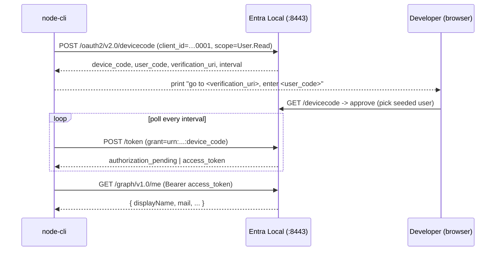

# Feature #19 — Node samples (`@azure/msal-node`)

- **Roadmap ref:** Iteration 3, feature #19 ("Node samples — confidential web, daemon, CLI").
- **Dependencies:** [#6](2026-06-22_06-auth-code-pkce-signin.md) (auth code), [#8](2026-06-22_08-client-credentials.md) (client credentials), [#13](2026-06-22_13-msal-compat-validation.md) (MSAL matrix + CI), [#15](2026-06-24_15-device-code-flow.md) (device code). Transitively [#5](2026-06-22_05-token-service.md), [#7](2026-06-22_07-refresh-token.md), [#10](2026-06-22_10-minimal-graph.md).
- **Status:** 🟡 Partially implemented — **`node-cli` (device code) shipped** 2026-06-25; `node-web`
  and `node-daemon` not yet started.

> Builds on the **shared samples infrastructure** owned by
> [#18](2026-06-25_18-js-react-spa-samples.md): `samples/` layout, the canonical port + app map,
> seed additions, the per-sample CI smoke pattern, and the optional `docker-compose.yml`. This spec
> defines only the three Node samples and the one new seed app they require.

---

## Goal / outcome

Three minimal **Node.js** samples using `@azure/msal-node`, each runnable with one command against a
running emulator out of the box:

1. **`node-web/`** — a **confidential web app** (Express) doing **Authorization Code** with a client
   secret: server-side sign-in, token cache, a protected route calling the emulator's
   `GET /graph/v1.0/me` with a Graph-audience token.
2. **`node-daemon/`** — a **daemon/service** doing **Client Credentials**: app-only Graph token
   calling a protected resource (`GET /graph/v1.0/users`) — no user, no browser.
3. **`node-cli/`** — a **CLI** doing the **Device Code** flow (RFC 8628): prints the verification
   URL + user code, polls, then calls `GET /graph/v1.0/me`. This is the living-doc sample for
   feature #15.

All three are an **additional** real-MSAL regression surface; the CLI gives Device Code its first
shippable sample.

---

## Scope

### In scope
- **`samples/node-web/`** (port **3002**, app **`cccccccc-…-0003`** confidential):
  - `@azure/msal-node` `ConfidentialClientApplication`; `getAuthCodeUrl` → emulator `/authorize`;
    `/auth/redirect` handler → `acquireTokenByCode`; in-memory token cache; `acquireTokenSilent`.
  - Routes: `/` (login link), `/auth/redirect` (callback), `/profile` (protected — calls
    `GET /graph/v1.0/me`).
  - Secret read from env (`CLIENT_SECRET`, default the seeded `sample-web-app-secret`).
- **`samples/node-daemon/`** (no port/redirect, app **`cccccccc-…-0002`** = seeded Sample Daemon):
  - `acquireTokenByClientCredential` with scope `https://graph.microsoft.com/.default`; prints the
    app-only token claims and calls minimal Graph `GET /graph/v1.0/users` with the Graph-audience
    token. (The existing daemon app role `Tasks.Read.All` remains a custom-resource example, but a
    token for `api://…0002/.default` cannot call the built-in Graph audience.)
  - Secret read from env (`CLIENT_SECRET`, default the seeded `daemon-app-secret`).
- **`samples/node-cli/`** (no port/redirect, app **`cccccccc-…-0001`** = seeded public Sample SPA):
  - `PublicClientApplication.acquireTokenByDeviceCode` with a `deviceCodeCallback` that prints the
    `verification_uri` + `user_code`; on success prints token claims and calls
    `GET /graph/v1.0/me`.
  - Targets the device-authorization endpoint (`POST /oauth2/v2.0/devicecode`) + the `device_code` grant (#15);
    relies on the emulator advertising `interval` (no `slow_down`, per #15).
- A README per sample + entries in `samples/README.md`.
- **One new seed app** (`cccccccc-…-0003`, owned here — see Data changes).
- **Cert trust** (README only): `NODE_EXTRA_CA_CERTS=<path to data/tls/cert.pem>` for all three
  (the standard `msal-node` recipe from the #13 matrix); CI sets it from the exported cert.
- **CI smoke** for each sample (per #18 pattern) and an **optional `docker-compose.yml`** (emulator).

### Out of scope
- SPA samples (#18), .NET (#20), Python (#21), full-stack API (#24).
- Persistent/distributed token-cache plugins for `msal-node` (in-memory cache is sufficient for a
  sample; README notes the production extension point).
- Any emulator protocol change (only the additive seed app).

---

## MSAL configuration (from #13 matrix)

```js
// Common — authority + cert trust (env-overridable; defaults shown)
const EMULATOR_ORIGIN = process.env.EMULATOR_ORIGIN ?? 'https://localhost:8443';
const TENANT_ID = '11111111-1111-1111-1111-111111111111';
const authority = `${EMULATOR_ORIGIN}/${TENANT_ID}`;
// process.env.NODE_EXTRA_CA_CERTS = path to the emulator cert.pem (documented in README)

const config = {
  auth: {
    clientId: '...',          // per-sample (…0003 / …0002 / …0001)
    authority,
    knownAuthorities: ['localhost:8443'],
    clientSecret: process.env.CLIENT_SECRET, // web + daemon only
  },
};
```

| Sample | Client | clientId | Scopes | Notes |
|---|---|---|---|---|
| node-web | `ConfidentialClientApplication` | `…0003` | `openid profile offline_access User.Read` | redirect `http://localhost:3002/auth/redirect`, Graph `/me` |
| node-daemon | `ConfidentialClientApplication` | `…0002` | `https://graph.microsoft.com/.default` | app-only Graph token, `/users` |
| node-cli | `PublicClientApplication` | `…0001` | `User.Read` | device code, Graph `/me` |

`knownAuthorities` marks the GUID authority known; instance discovery is bypassed (offline). Cert
trust via `NODE_EXTRA_CA_CERTS` (never `NODE_TLS_REJECT_UNAUTHORIZED=0` in sample docs except a
clearly-labelled dev fallback).

---

## Behavior / flow (device-code CLI)



(Web = standard server-side auth-code; daemon = single `acquireTokenByClientCredential` then a Graph
call — diagrams omitted for brevity, both follow the #6/#8 flows.)

---

## Data changes

Additive seed only (idempotent `INSERT OR IGNORE`, fixed GUIDs), defined here and implemented in
`src/store/seed.ts` alongside the #18 redirect additions:

- **New app — Sample Web** `cccccccc-0000-0000-0000-000000000003`:
  - `display_name='Sample Web App'`, `is_confidential=1`, `app_id_uri='api://cccccccc-…-0003'`.
  - Redirect URI `http://localhost:3002/auth/redirect` (`type='web'`).
  - One known dev secret (new secret GUID `ffffffff-0000-0000-0000-000000000002`,
    plaintext `sample-web-app-secret`, stored scrypt-hashed with a display hint).
- The daemon (`…0002`) and Sample SPA (`…0001`) already exist; no change beyond #18's redirect rows.

The `SEED` constant gains `appWebId`, `webSecretId`, `webSecret`, `webRedirectUri`; the seed
integration test asserts the new app + secret + redirect rows. New dev-only secret added to the
README seed/security list. No schema/migration change.

---

## Dependencies & assumptions
- **Assumption:** `@azure/msal-node` confidential auth-code, client-credentials, and device-code
  flows all work against the GUID authority with `knownAuthorities` + `NODE_EXTRA_CA_CERTS` (proven
  for client-credentials by #13's `client-credentials.e2e.ts`; device-code by #15).
- **Assumption:** the emulator's `device_code` grant uses the RFC URN
  `urn:ietf:params:oauth:grant-type:device_code` that `msal-node` sends (confirmed in #15).
- **Assumption:** built-in Graph endpoints require `aud=https://graph.microsoft.com`; therefore the
  daemon sample uses `https://graph.microsoft.com/.default` for `GET /graph/v1.0/users`, while
  custom-resource `.default` tokens (such as `api://…0002/.default`) are token-claim examples only
  and are not accepted by Graph.
- **Assumption:** in-memory token cache is acceptable for the web sample (no persistence needed for
  a demo; documented).

---

## Testable acceptance criteria
1. **node-web one-command:** `cd samples/node-web && npm install && npm start` serves on
   `http://localhost:3002`; visiting `/` → sign-in → `/auth/redirect` acquires a Graph-audience
   token; `/profile` renders `GET /graph/v1.0/me`. `acquireTokenSilent` returns a token from cache
   without re-prompting.
2. **node-daemon one-command:** `cd samples/node-daemon && npm install && npm start` prints an
   app-only access token with `aud=https://graph.microsoft.com`, and a successful
   `GET /graph/v1.0/users` result; no browser involved.
3. **node-cli one-command:** `cd samples/node-cli && npm install && npm start` prints a
   verification URL + user code; after approval in the browser it prints token claims
   (`aud=https://graph.microsoft.com`, `scp` contains `User.Read`) and the `GET /graph/v1.0/me`
   result (Device Code, #15).
4. **JWKS-verifiable tokens:** all three samples' tokens validate against the emulator JWKS
   (`iss`/`aud`/signature); web/cli are delegated (`scp`/`oid`), daemon is app-only. Tokens used
   for built-in Graph calls have `aud=https://graph.microsoft.com`.
5. **Seeded confidential web app:** the new `cccccccc-…-0003` app (secret `sample-web-app-secret`,
   redirect `http://localhost:3002/auth/redirect`) exists in seed; asserted by the seed test.
6. **README completeness:** `samples/node-web/README.md`, `samples/node-daemon/README.md`, and
   `samples/node-cli/README.md` cover what the sample demonstrates, prerequisites, setup,
   one-command run, full env-var/config table with defaults, app registration + port (if any),
   exact endpoint paths, expected claims, cert trust, non-default emulator configuration,
   troubleshooting, and optional compose; `samples/README.md` indexes all three.
7. **Cert trust documented:** each README documents `NODE_EXTRA_CA_CERTS`; no helper script.
8. **CI smoke (required):** the `samples` job runs daemon (client-credentials, headless) and cli
   (device-code, headless approval via the #13 harness) end-to-end and asserts token validation;
   node-web is smoke-driven headlessly (Playwright `ignoreHTTPSErrors`) through sign-in → `/profile`;
   CI also asserts each sample README exists.
9. **Optional compose:** `docker compose up -d` in each sample dir starts the emulator; the sample
   runs unchanged against it.
10. **Isolation:** root lint/typecheck/build unaffected by `samples/node-*` (standalone projects,
   ignored/excluded per #18).

---

## Open questions
None blocking. *(Decisions: dedicated confidential web app `…0003` rather than overloading the
daemon; daemon reuses `…0002`; CLI reuses the public SPA `…0001` as its device-code client — matching
the #15 decision; cert trust via `NODE_EXTRA_CA_CERTS`; in-memory token cache. Seed-contract
extension recorded in `memory/decisions.md`.)*

---

## Implementation notes (2026-06-25) — `node-cli` only

The **`samples/node-cli/`** device-code CLI is implemented and CI-smoked; `node-web` and
`node-daemon` (and the `…0003` seed app they need) remain unimplemented.

- **No seed change required.** The CLI reuses the already-seeded public app `…0001`, so this slice
  added **zero** server-side changes — purely the standalone sample project + a CI job.
- **Scope → audience.** The CLI requests the bare Graph scope `User.Read`. The emulator's
  `resolveResource` returns `null` for bare/OIDC-only scopes, so the minted token's `aud` falls back
  to the Graph resource (`https://graph.microsoft.com`) and the built-in `/me` accepts it. `scp`
  carries `User.Read` (only `offline_access` is stripped from `scp`). A 200 from `/me` is itself
  proof of JWKS validity (the endpoint validates signature/iss/aud), so the smoke needs no separate
  `jose` verification.
- **Cert trust (UX refinement over the spec's `NODE_EXTRA_CA_CERTS`-only recipe).** Matching the #24
  convention, the CLI resolves the dev cert via `EMULATOR_CA_CERT` → `NODE_EXTRA_CA_CERTS` →
  repo-root `data/tls/cert.pem` and trusts it **explicitly** (a custom MSAL `networkClient` for the
  device-code/token calls + an https `ca` for the Graph call). This makes it work out-of-the-box
  without exporting `NODE_EXTRA_CA_CERTS` before Node starts, while still honouring it. README
  documents both.
- **Headless CI smoke.** `smoke.mjs` spawns the unmodified CLI (`node --import tsx src/cli.ts`),
  parses the printed `USER_CODE`, and drives the emulator approval surface
  (`POST /{tenant}/oauth2/v2.0/devicecode/verify`, `lookup → signin → decide` as Alice — the same
  form sequence the #15 e2e harness uses), then asserts `aud=graph`, `scp ⊇ User.Read`, and that
  `/me` returns Alice. Added as the `node-cli-sample` CI job.
- **Files:** `samples/node-cli/{package.json,tsconfig.json,.gitignore,.env.example,docker-compose.yml,
  README.md,src/cli.ts,smoke.mjs}`; index row in `samples/README.md`; `node-cli-sample` job in
  `.github/workflows/ci.yml`.
