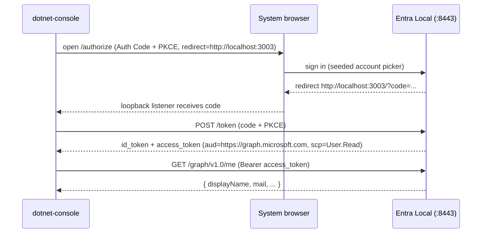

# Feature #20 — .NET sample (MSAL.NET)

- **Roadmap ref:** Iteration 3, feature #20 (".NET sample — MSAL.NET").
- **Dependencies:** [#6](2026-06-22_06-auth-code-pkce-signin.md) (auth code), [#13](2026-06-22_13-msal-compat-validation.md) (MSAL.NET config recipe + CI .NET SDK provisioning). Transitively [#5](2026-06-22_05-token-service.md), [#10](2026-06-22_10-minimal-graph.md).
- **Status:** ⬜ Not started.

> Builds on the **shared samples infrastructure** owned by
> [#18](2026-06-25_18-js-react-spa-samples.md) (layout, port + app map, seed additions, CI smoke,
> optional compose). Reuses the .NET SDK CI provisioning and the MSAL.NET config recipe established
> by [#13](2026-06-22_13-msal-compat-validation.md).

---

## Goal / outcome

A minimal **MSAL.NET** console sample that signs a user in against a running emulator out of the
box via **Authorization Code + PKCE** (interactive, system browser, loopback redirect), acquires a
Graph-audience access token, calls the emulator's `GET /graph/v1.0/me`, and prints the token claims —
runnable with a single **`dotnet run`**.

This is the first **shippable** MSAL.NET sample (feature #13 only smoke-tested MSAL.NET via client
credentials); it proves the interactive Auth Code flow on .NET.

---

## Scope

### In scope
- **`samples/dotnet-console/`** — a .NET console app (`net8.0`, `Microsoft.Identity.Client`):
  - `PublicClientApplicationBuilder` with the emulator authority, **instance discovery disabled**,
    authority **not validated**, and a **test-only `HttpClientFactory`** that trusts the emulator
    `cert.pem`.
  - `AcquireTokenInteractive` with `.WithRedirectUri("http://localhost:3003")` using the system
    browser + loopback listener; on success, call `GET /graph/v1.0/me` with the Graph-audience
    access token via the same cert-trusting `HttpClient`; print `iss/aud/scp/oid` + the Graph body.
  - A CI-safe `--smoke` mode that constructs the MSAL client with the same config, verifies the
    emulator discovery/JWKS can be fetched with the configured cert trust, prints the resolved
    authority/scope/redirect, and exits without launching the OS system browser.
  - Config via environment variables with defaults (`EMULATOR_ORIGIN`, `TENANT_ID`, `CLIENT_ID`,
    `API_SCOPE`, `EMULATOR_CERT` path).
  - Reuses the seeded **public Sample SPA** `cccccccc-…-0001` and its added loopback redirect
    `http://localhost:3003` (port **3003**, owned by #18's seed additions).
- A README (`dotnet run`, prerequisites = .NET 8 SDK, cert trust, app/port used, config table).
- **CI smoke** (per #18 pattern; .NET SDK already provisioned by #13) and an **optional
  `docker-compose.yml`** launching the emulator.

### Out of scope
- A separate ASP.NET web variant (the roadmap says "console/web" — **console** is chosen for the
  one-command `dotnet run` experience; a web variant can follow in docs/#22 without new emulator
  work). Recorded as a decision.
- Client-credentials on .NET (already covered by #13's smoke-test).
- Any emulator protocol change. No new seed app (reuses `…0001` + its #18 loopback redirect).
- Packaging/publishing the sample as a tool.

---

## MSAL.NET configuration (from #13 matrix)

```csharp
var origin   = Env("EMULATOR_ORIGIN", "https://localhost:8443");
var tenantId = Env("TENANT_ID", "11111111-1111-1111-1111-111111111111");
var clientId = Env("CLIENT_ID", "cccccccc-0000-0000-0000-000000000001");
var apiScope = Env("API_SCOPE", "User.Read");
var authority = $"{origin}/{tenantId}";

var app = PublicClientApplicationBuilder
    .Create(clientId)
    .WithAuthority(authority, validateAuthority: false)   // custom authority
    .WithInstanceDiscovery(false)                         // no login.microsoftonline.com
    .WithRedirectUri("http://localhost:3003")             // loopback, seeded on …0001
    .WithHttpClientFactory(new EmulatorHttpClientFactory(certPath)) // trusts emulator cert (test-only)
    .Build();

var result = await app.AcquireTokenInteractive(new[] { apiScope }).ExecuteAsync();
// then GET {origin}/graph/v1.0/me with result.AccessToken via the same trusting HttpClient
```

- **Authority** is the concrete-GUID authority; `validateAuthority:false` + `WithInstanceDiscovery(false)`
  is the supported custom-authority recipe (#13).
- **Cert trust** is done in-process via a custom `HttpClientFactory`/`HttpClientHandler` that pins
  the emulator `cert.pem` — **test/dev only**, documented as such (no machine trust-store change
  required for the sample to run).

---

## Behavior / flow



---

## Data changes
None beyond #18's seed additions (the `http://localhost:3003` loopback redirect on
`cccccccc-…-0001`). No new app, no schema change.

---

## Dependencies & assumptions
- **Assumption:** MSAL.NET interactive Auth Code works against the GUID authority with
  `validateAuthority:false` + instance discovery disabled (extends #13's client-credentials smoke to
  the interactive flow; same authority acceptance path).
- **Assumption:** the loopback `http://localhost:3003` redirect + system-browser interactive flow is
  supported by MSAL.NET's built-in loopback listener and matches the seeded redirect exactly.
- **Assumption:** a per-`HttpClient` cert pin is sufficient for cert trust in the sample (no OS
  trust-store mutation); CI can pass the exported `cert.pem` path.
- **Assumption:** CI's `actions/setup-dotnet` (from #13) provides the .NET 8 SDK. CI does **not** try
  to drive MSAL.NET's external system browser; the sample's `--smoke` mode verifies build/config,
  authority/discovery/JWKS/cert trust, and README presence. The full `dotnet run` interactive flow is
  a manual/local acceptance criterion.

---

## Testable acceptance criteria
1. **One-command run:** `cd samples/dotnet-console && dotnet run` (emulator on `:8443`) opens the
   system browser, signs in as the seeded user, and prints an access token with
   `aud=https://graph.microsoft.com` and `scp` containing `User.Read`, plus the
   `GET /graph/v1.0/me` body.
2. **JWKS-verifiable token:** the access token validates against the emulator JWKS
   (`iss` = concrete-GUID issuer, signature via `n`/`e`/`kid`); the sample prints `iss/aud/scp/oid`.
3. **Custom-authority config:** the app builds with `validateAuthority:false` +
   `WithInstanceDiscovery(false)` and performs **no** request to any real cloud host.
4. **Own port / seeded redirect:** uses loopback `http://localhost:3003` (seeded on `…0001`);
   redirect matching succeeds.
5. **README completeness:** `samples/dotnet-console/README.md` covers what the sample demonstrates,
   prerequisites, setup, `dotnet run`, `dotnet run -- --smoke`, full env-var/config table with
   defaults, app registration + port, exact Graph endpoint path, expected claims, cert trust,
   non-default emulator configuration, troubleshooting, and optional compose; `samples/README.md`
   indexes it.
6. **Cert trust documented:** README documents the in-process `HttpClientFactory` cert pin (test-only)
   and where to find `cert.pem`; no helper script.
7. **CI smoke (required):** the `samples` job runs `dotnet build` + `dotnet run -- --smoke`; the
   smoke verifies MSAL client construction, configured authority/redirect/scope, discovery/JWKS fetch
   with the cert pin, and README presence. It does not launch an external system browser in CI.
8. **Optional compose:** `docker compose up -d` starts the emulator; `dotnet run` then succeeds
   against it.
9. **Isolation:** the .NET project lives entirely under `samples/dotnet-console/` and does not affect
   the root JS toolchain (`bin/`, `obj/` ignored).

---

## Open questions
None blocking. *(Decisions: console interactive Auth Code (not a web variant) for a true one-command
`dotnet run`; reuse the seeded public SPA `…0001` with the #18 loopback redirect on port 3003;
in-process `HttpClientFactory` cert pin for trust; reuse #13's .NET SDK CI provisioning. Recorded in
`memory/decisions.md`.)*
