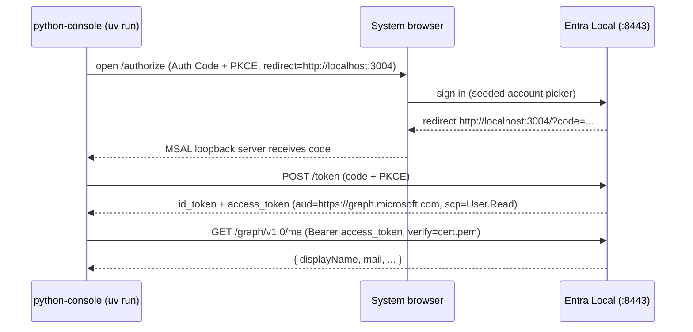

# Feature #21 — Python sample (MSAL Python)

- **Roadmap ref:** Iteration 3, feature #21 ("Python sample — MSAL Python").
- **Dependencies:** [#6](2026-06-22_06-auth-code-pkce-signin.md) (auth code), [#13](2026-06-22_13-msal-compat-validation.md) (MSAL Python config recipe + CI Python provisioning). Transitively [#5](2026-06-22_05-token-service.md), [#10](2026-06-22_10-minimal-graph.md).
- **Status:** ⬜ Not started.

> Builds on the **shared samples infrastructure** owned by
> [#18](2026-06-25_18-js-react-spa-samples.md) (layout, port + app map, seed additions, CI smoke,
> optional compose). Reuses the Python CI provisioning and the MSAL Python config recipe established
> by [#13](2026-06-22_13-msal-compat-validation.md). Run/dependency management uses **`uv`**.

---

## Goal / outcome

A minimal **MSAL Python** console sample that signs a user in against a running emulator out of the
box via **Authorization Code + PKCE** (interactive, system browser, loopback redirect), acquires a
Graph-audience access token, calls the emulator's `GET /graph/v1.0/me`, and prints the token claims —
runnable with a single **`uv run`** (uv manages the venv + dependencies).

This is the first **shippable** MSAL Python sample (feature #13 only smoke-tested MSAL Python via
client credentials); it proves the interactive Auth Code flow on Python.

---

## Scope

### In scope
- **`samples/python-console/`** — a Python console app using `msal`:
  - `msal.PublicClientApplication(client_id, authority=<origin>/<tenantId>,
    validate_authority=False, instance_discovery=False)`.
  - `acquire_token_interactive(scopes=[api_scope])` (MSAL Python's built-in local loopback server +
    system browser) with the redirect/port **3004**; on success, call `GET /graph/v1.0/me` with
    `requests` (`verify=<cert.pem>`); print `iss/aud/scp/oid` + the Graph body.
  - A CI-safe `--smoke` mode that constructs the MSAL client with the same config, verifies the
    emulator discovery/JWKS can be fetched with the configured cert trust, prints the resolved
    authority/scope/redirect, and exits without launching the OS system browser.
  - Cert trust via `REQUESTS_CA_BUNDLE` / `verify=<cert.pem>` (the #13 recipe). For MSAL's own
    metadata fetch, set `REQUESTS_CA_BUNDLE` so the emulator cert is trusted.
  - Config via environment variables with defaults (`EMULATOR_ORIGIN`, `TENANT_ID`, `CLIENT_ID`,
    `API_SCOPE`, `REQUESTS_CA_BUNDLE`).
  - **`pyproject.toml`** declaring deps (`msal`, `pyjwt[crypto]`, `requests`); **`uv`** for venv +
    run. Primary command: `uv run python main.py` (or a `uv run sample` script entry).
  - Reuses the seeded **public Sample SPA** `cccccccc-…-0001` and its added loopback redirect
    `http://localhost:3004` (owned by #18's seed additions).
- A README (`uv run`, prerequisites = `uv` + Python 3.11+, cert trust, app/port used, config table).
- **CI smoke** (per #18 pattern; `astral-sh/setup-uv` + Python from #13) and an **optional
  `docker-compose.yml`** launching the emulator.

### Out of scope
- A separate Flask/Django web variant (roadmap says "console/web" — **console** chosen for the
  one-command `uv run`; a web variant can follow in docs/#22). Recorded as a decision.
- Client-credentials on Python (already covered by #13's smoke-test).
- `pip`/`poetry`/`requirements.txt` flows (the project standard for this sample is **`uv`**; the
  README may mention `pip install -e .` as an alternative footnote).
- Any emulator protocol change. No new seed app (reuses `…0001` + its #18 loopback redirect).

---

## MSAL Python configuration (from #13 matrix)

```python
import os, msal, requests

origin    = os.environ.get("EMULATOR_ORIGIN", "https://localhost:8443")
tenant_id = os.environ.get("TENANT_ID", "11111111-1111-1111-1111-111111111111")
client_id = os.environ.get("CLIENT_ID", "cccccccc-0000-0000-0000-000000000001")
api_scope = os.environ.get("API_SCOPE", "User.Read")
ca_bundle = os.environ.get("REQUESTS_CA_BUNDLE")   # path to emulator cert.pem

app = msal.PublicClientApplication(
    client_id,
    authority=f"{origin}/{tenant_id}",
    validate_authority=False,        # custom authority
    instance_discovery=False,        # no login.microsoftonline.com
)
result = app.acquire_token_interactive(
    scopes=[api_scope],
    port=3004,                       # loopback redirect, seeded on …0001
)
# GET {origin}/graph/v1.0/me with result["access_token"], verify=ca_bundle
```

- **Authority** is the concrete-GUID authority; `validate_authority=False` + `instance_discovery=False`
  is the supported custom-authority recipe (#13).
- **Cert trust:** `REQUESTS_CA_BUNDLE=<cert.pem>` so both MSAL's metadata fetch (it uses `requests`)
  and the sample's own Graph call trust the emulator cert — **dev only**.

---

## Behavior / flow



---

## Data changes
None beyond #18's seed additions (the `http://localhost:3004` loopback redirect on
`cccccccc-…-0001`). No new app, no schema change.

---

## Dependencies & assumptions
- **Assumption:** MSAL Python interactive Auth Code works against the GUID authority with
  `validate_authority=False` + `instance_discovery=False` (extends #13's client-credentials smoke to
  the interactive flow; same authority acceptance path).
- **Assumption:** `acquire_token_interactive(port=3004)` binds the loopback redirect that matches the
  seeded `http://localhost:3004` value exactly.
- **Assumption:** `REQUESTS_CA_BUNDLE` is honored by MSAL Python's internal `requests` usage for
  metadata fetch (the #13 Python smoke relies on the same mechanism).
- **Assumption:** CI provisions Python (from #13) + `uv` (`astral-sh/setup-uv`). CI does **not** try
  to drive MSAL Python's external system browser; the sample's `--smoke` mode verifies build/config,
  authority/discovery/JWKS/cert trust, and README presence. The full `uv run` interactive flow is a
  manual/local acceptance criterion.

---

## Testable acceptance criteria
1. **One-command run:** `cd samples/python-console && uv run python main.py` (emulator on `:8443`)
   opens the system browser, signs in as the seeded user, and prints an access token with
   `aud=https://graph.microsoft.com` and `scp` containing `User.Read`, plus the
   `GET /graph/v1.0/me` body. `uv` creates
   the venv + installs deps automatically.
2. **JWKS-verifiable token:** the access token validates against the emulator JWKS (`iss`/signature)
   using `pyjwt[crypto]`; the sample prints `iss/aud/scp/oid`.
3. **Custom-authority config:** the app builds with `validate_authority=False` +
   `instance_discovery=False` and performs **no** request to any real cloud host.
4. **Own port / seeded redirect:** uses loopback `http://localhost:3004` (seeded on `…0001`);
   redirect matching succeeds.
5. **README completeness:** `samples/python-console/README.md` covers what the sample demonstrates,
   prerequisites, setup, `uv run python main.py`, `uv run python main.py --smoke`, full
   env-var/config table with defaults, app registration + port, exact Graph endpoint path, expected
   claims, cert trust, non-default emulator configuration, troubleshooting, and optional compose;
   `samples/README.md` indexes it.
6. **Cert trust documented:** README documents `REQUESTS_CA_BUNDLE=<cert.pem>` (dev only) and where
   to find it; no helper script.
7. **CI smoke (required):** the `samples` job runs `uv sync` + `uv run python main.py --smoke`; the
   smoke verifies MSAL client construction, configured authority/redirect/scope, discovery/JWKS fetch
   with `REQUESTS_CA_BUNDLE`, and README presence. It does not launch an external system browser in CI.
8. **Optional compose:** `docker compose up -d` starts the emulator; `uv run` then succeeds against it.
9. **Isolation:** the Python project lives entirely under `samples/python-console/` (`.venv/`,
   `__pycache__/` ignored) and does not affect the root JS toolchain.

---

## Open questions
None blocking. *(Decisions: console interactive Auth Code (not a web variant) for a one-command
`uv run`; `uv` is the canonical run/dependency tool for this sample; reuse the seeded public SPA
`…0001` with the #18 loopback redirect on port 3004; cert trust via `REQUESTS_CA_BUNDLE`; reuse #13's
Python CI provisioning plus `setup-uv`. Recorded in `memory/decisions.md`.)*
