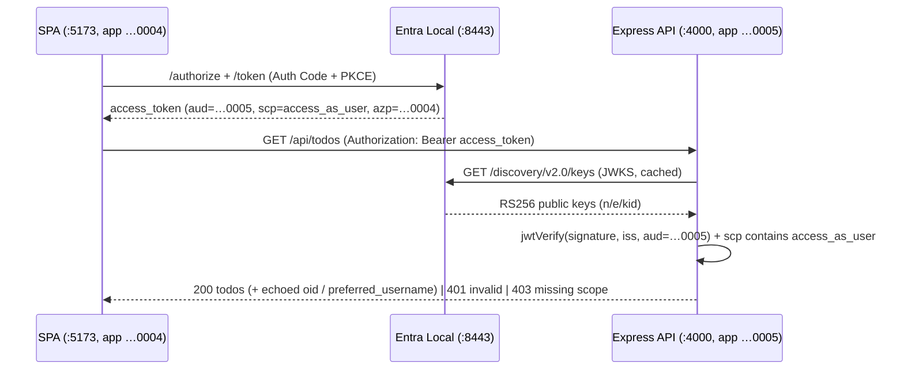

# Feature #24 — Full-stack sample: JS SPA + Node/Express protected API

- **Roadmap ref:** Iteration 3, feature #24 ("Full-stack SPA + protected API sample"). *(Added 2026-06-25 at user request; sits in Iteration 3 alongside #18–#21.)*
- **Dependencies:** [#6](2026-06-22_06-auth-code-pkce-signin.md) (auth code + PKCE), [#7](2026-06-22_07-refresh-token.md) (silent refresh), [#3](2026-06-22_03-signing-keys-jwks.md) (JWKS), [#13](2026-06-22_13-msal-compat-validation.md) (MSAL matrix), [#18](2026-06-25_18-js-react-spa-samples.md) (shared samples infrastructure). Transitively [#4](2026-06-22_04-oidc-discovery.md), [#5](2026-06-22_05-token-service.md).
- **Status:** ✅ Implemented (2026-06-25). Verified end-to-end: Playwright smoke passes all 200/401/403 assertions; root `lint`/`typecheck`/`build`/`test` (311 tests) green.

> Builds on the **shared samples infrastructure** owned by
> [#18](2026-06-25_18-js-react-spa-samples.md) (layout, port + app map, seed additions, CI smoke,
> optional compose). This is the one sample that exercises the **separate-API-app** pattern: a
> front-end SPA acquires a delegated access token **scoped to a distinct back-end API app**, and the
> API **validates** that token — proving the emulator's per-app App ID URI / exposed-scope /
> audience model end to end.

---

## Goal / outcome

A complete, runnable **full-stack** sample with **one app registration per tier**:

- **Front-end SPA** (`samples/fullstack-spa-api/spa/`, port **5173**) — `@azure/msal-browser`, its
  **own** public app registration (`cccccccc-…-0004`). Signs the user in (Auth Code + PKCE, silent
  renewal) and acquires an access token **for the API's scope** `api://cccccccc-…-0005/access_as_user`.
- **Back-end API** (`samples/fullstack-spa-api/api/`, port **4000**) — an **Express** resource
  server with its **own** app registration (`cccccccc-…-0005`) that **exposes** `access_as_user`.
  It validates the incoming Bearer token (signature via the emulator JWKS, `iss`, `aud`, `scp`) and
  returns protected data only when validation passes.

The client authenticates to the server with a token whose `aud` is the **API app**, demonstrating
the canonical SPA → protected-API scenario developers actually build. No emulator **protocol** change
is needed — only additive seed apps.

---

## Why this works on the emulator (no protocol change)

Verified against the token service and scope helpers:

- Each app registration carries an `app_id_uri` (`api://<appId>`) and per-app **exposed scopes**
  (`app_scopes`). The seeded API app `…0005` exposes `access_as_user`.
- `scopesAreValid` (`src/identity/scopes.ts`) accepts the fully-qualified
  `api://cccccccc-…-0005/access_as_user` **because** it resolves to a registered, enabled scope on
  the resource app `…0005`.
- `resolveAudience` (`src/tokens/claims.ts`) maps the resource `api://cccccccc-…-0005` to the API
  app's `appId` GUID, so the minted access token has **`aud = cccccccc-…-0005`** and
  **`scp = access_as_user`** (delegated: also `oid`, `azp`/`appid` = the SPA app `…0004`).
- The API validates that exact token shape with the JWKS. ✔

---

## Scope

### In scope
- **`samples/fullstack-spa-api/api/`** — Express + TypeScript resource server (port **4000**):
  - JWT validation middleware using `jose` `createRemoteJWKSet(<origin>/<tenantId>/discovery/v2.0/keys)`
    + `jwtVerify`, asserting: signature (RS256 via `n`/`e`/`kid`), `iss` = concrete-GUID issuer from
    discovery, **`aud` = `cccccccc-…-0005`** (the API app), and **`scp`** contains `access_as_user`
    (a small scope-check helper → 403 on missing scope, 401 on invalid/missing token).
  - Routes: `GET /api/todos` (protected — returns sample data + the caller's `oid`/`preferred_username`
    echoed from validated claims), `GET /health` (open). CORS allowing the SPA origin
    `http://localhost:5173`.
  - Cert trust for the JWKS fetch via `NODE_EXTRA_CA_CERTS=<cert.pem>` (documented).
  - Config from env with defaults (`EMULATOR_ORIGIN`, `TENANT_ID`, `API_APP_ID`, `REQUIRED_SCOPE`).
- **`samples/fullstack-spa-api/spa/`** — Vite + TypeScript SPA (port **5173**), `@azure/msal-browser`:
  - Its own app `…0004`; `loginRedirect` / `acquireTokenSilent` for scope
    `api://cccccccc-…-0005/access_as_user`; a "Load todos" button calling
    `http://localhost:4000/api/todos` with the Bearer token and rendering the result + the claims the
    API echoed back.
- **Two new seed apps** (`…0004`, `…0005`) + the API's exposed scope (owned here — see Data changes).
- A combined README (architecture diagram, the two app registrations, how the token flows SPA→API,
  cert trust, how to run both tiers) + an entry in `samples/README.md`.
- **CI smoke** (per #18): start emulator + API + SPA, Playwright-drive sign-in, assert
  `GET /api/todos` returns 200 with a JWKS-verifiable `aud=…0005` token and 401/403 for a
  missing/wrong-scope token.
- An **optional `docker-compose.yml`** launching the emulator; the SPA/API still run with their
  normal npm commands for consistency with the other samples.

### Out of scope
- A confidential/back-channel variant (this is a public SPA + bearer-protected API; On-Behalf-Of is
  explicitly deferred per the roadmap).
- Persisting todos (in-memory sample data) or a database.
- Any emulator **protocol** change (only additive seed apps).
- Reusing the generic Sample SPA `…0001` (the point is **dedicated** front + back apps, one per tier).

---

## Configuration

### SPA (`@azure/msal-browser`, from #13 matrix)
```jsonc
{
  "auth": {
    "clientId": "cccccccc-0000-0000-0000-000000000004",        // front app
    "authority": "https://localhost:8443/11111111-1111-1111-1111-111111111111",
    "knownAuthorities": ["localhost:8443"],
    "redirectUri": "http://localhost:5173"
  },
  "cache": { "cacheLocation": "sessionStorage" }
}
// tokenRequest.scopes = ["api://cccccccc-0000-0000-0000-000000000005/access_as_user"]  // the API
```

### API (Express, `jose`)
```ts
const ORIGIN = process.env.EMULATOR_ORIGIN ?? 'https://localhost:8443';
const TENANT = process.env.TENANT_ID ?? '11111111-1111-1111-1111-111111111111';
const API_APP_ID = process.env.API_APP_ID ?? 'cccccccc-0000-0000-0000-000000000005';
const REQUIRED_SCOPE = process.env.REQUIRED_SCOPE ?? 'access_as_user';
// NODE_EXTRA_CA_CERTS = emulator cert.pem (for the JWKS fetch over HTTPS)

const jwks = createRemoteJWKSet(new URL(`${ORIGIN}/${TENANT}/discovery/v2.0/keys`));
const { payload } = await jwtVerify(token, jwks, {
  issuer: `${ORIGIN}/${TENANT}/v2.0`,   // concrete-GUID issuer (matches discovery/#4)
  audience: API_APP_ID,                  // aud must be THIS API app
});
// then assert (payload.scp ?? '').split(' ').includes(REQUIRED_SCOPE)  -> else 403
```

The exact discovery/JWKS/issuer paths are taken from the emulator's discovery document
(`<origin>/<tenantId>/v2.0/.well-known/openid-configuration`) — the README instructs reading them
from discovery rather than hard-coding, with the defaults above.

---

## Behavior / flow



---

## Data changes

Additive seed only (idempotent `INSERT OR IGNORE`, fixed GUIDs), implemented in `src/store/seed.ts`
alongside the #18/#19 additions:

- **New app — Sample SPA Front** `cccccccc-0000-0000-0000-000000000004`:
  - `display_name='Sample Full-stack SPA'`, `is_confidential=0`, `app_id_uri='api://cccccccc-…-0004'`.
  - Redirect URI `http://localhost:5173` (`type='spa'`).
- **New app — Sample API** `cccccccc-0000-0000-0000-000000000005`:
  - `display_name='Sample Full-stack API'`, `is_confidential=0`, `app_id_uri='api://cccccccc-…-0005'`.
  - Exposed scope `access_as_user` (new scope GUID `dddddddd-0000-0000-0000-000000000002`,
    `admin_consent_display_name='Access the Sample API as the signed-in user'`, `is_enabled=1`).
  - No secret (pure resource server; it never calls the token endpoint).

The `SEED` constant gains `appSpaFrontId`, `appApiId`, `apiScopeId`, `apiScopeValue`,
`spaFrontRedirectUri`; the seed integration test asserts the two apps + the exposed scope + the
redirect. No schema/migration change (`app_registrations`, `app_redirect_uris`, `app_scopes` already
exist). New GUIDs added to the README seed list + `memory/conventions.md`.

---

## Dependencies & assumptions
- **Assumption (verified in code):** a token requested by `…0004` for
  `api://…0005/access_as_user` mints with `aud=…0005`, `scp=access_as_user` — confirmed via
  `scopesAreValid` + `resolveAudience`. No protocol change required.
- **Assumption:** `jose` `createRemoteJWKSet` + `jwtVerify` validates the emulator's RS256 keys
  (no `x5c` needed) and the concrete-GUID issuer (per #3/#4/#13).
- **Assumption:** `@azure/msal-browser` issues a token for a **different** resource app's scope than
  its own client id — the standard SPA→API pattern (the resource app need not be a client).
- **Assumption:** loopback HTTP origins (`:5173` SPA, `:4000` API) are fine; only the **emulator** is
  HTTPS, so only the API's **JWKS fetch** needs cert trust (`NODE_EXTRA_CA_CERTS`).

---

## Testable acceptance criteria
1. **Two-tier one-command run:** `cd samples/fullstack-spa-api/api && npm install && npm start`
   serves the API on `:4000`; `cd ../spa && npm install && npm run dev` serves the SPA on `:5173`.
   With the emulator on `:8443`, signing in and clicking "Load todos" renders protected data.
2. **Audience is the API app:** the access token the SPA sends has **`aud = cccccccc-…-0005`** and
   `scp` containing `access_as_user` (asserted by the API and printed by the SPA claims panel).
3. **API validation enforced:** `GET /api/todos` returns **200** for a valid token, **401** for a
   missing/invalid/expired token, and **403** for a valid token lacking `access_as_user`.
4. **JWKS verification:** the API verifies the token signature against the emulator JWKS and the
   concrete-GUID `iss`; no `x5c` required.
5. **One registration per tier:** the SPA uses app `…0004`, the API uses app `…0005` (which exposes
   the scope); both exist in seed and the seed test asserts the two apps + the exposed scope.
6. **Silent renewal:** `acquireTokenSilent` refreshes the API-scoped token without an interactive
   prompt (#7).
7. **README completeness:** `samples/fullstack-spa-api/README.md` covers what the sample
   demonstrates, prerequisites, setup, how to run the API and SPA, full env-var/config tables with
   defaults for both tiers, the two app registrations + ports, exact API/Graph/JWKS endpoint paths,
   expected token claims (`azp=…0004`, `aud=…0005`, `scp=access_as_user`), cert trust,
   non-default emulator configuration, troubleshooting, and optional compose; `samples/README.md`
   indexes it.
8. **Cert trust documented:** README documents `NODE_EXTRA_CA_CERTS` for the API's JWKS fetch; no
   helper script.
9. **CI smoke (required):** the `samples` job starts emulator + API + SPA, Playwright-drives sign-in,
   asserts a 200 from `/api/todos` with `aud=…0005`, and asserts 401/403 negative cases.
10. **Optional compose:** `docker compose up -d` starts the emulator; the API and SPA run via their
   normal one-command npm scripts against it.
11. **Isolation:** both tiers are standalone npm projects under `samples/fullstack-spa-api/`; root
    lint/typecheck/build unaffected.

---

## Open questions
None blocking.

*(Decisions: dedicated front (`…0004`) + back (`…0005`) app registrations, one per tier; the API is a
public resource server exposing `access_as_user` with no secret; the SPA requests the API's scope so
`aud`=API app; API validates with `jose` against the JWKS + concrete-GUID issuer; optional compose
launches only the emulator for consistency; additive seed apps (no protocol change). Recorded in
`memory/decisions.md`.)*

---

## Implementation notes (2026-06-25)

Two behaviours of the emulator shaped the final implementation (both documented in the sample README
and `memory/decisions.md`):

1. **Refresh tokens are strictly scoped.** `src/tokens/refresh.ts` rejects any silent request whose
   scopes are not a subset of the scopes granted at sign-in (`invalid_scope` / AADSTS70011) — unlike
   production Entra, whose RTs are effectively multi-resource. Consequently the SPA's `loginRequest`
   requests the API scope **up front** (`openid profile offline_access api://…0005/access_as_user`);
   only then does `acquireTokenSilent` for the API succeed. This is a legitimate, documented MSAL SPA
   pattern and required no emulator change.

2. **The 403 path needs a second exposed scope.** Because the only way to obtain an `aud=…0005`
   token is to request an `…0005` resource scope, a single-scope API cannot mint a valid-audience
   token that *lacks* the required scope. The seed therefore exposes a second scope,
   **`access_as_admin`** (`dddddddd-…-0003`); the SPA holds it from sign-in, and the smoke uses
   `acquireTokenSilent({ forceRefresh: true })` for **only** that scope to narrow the grant and mint
   an `aud=…0005` token whose `scp` omits `access_as_user` → the deterministic `403` case. (The
   originally-planned `api://…0005/.default` approach is incompatible with the strict RT scoping, as
   `.default` is never in the granted set.)

Seed contract additions beyond the original plan: `apiAdminScopeId =
dddddddd-0000-0000-0000-000000000003`, `apiAdminScopeValue = access_as_admin` on app `…0005`
(`app_scopes` seed count 2 → 3). `test/integration/store.test.ts` updated accordingly.
