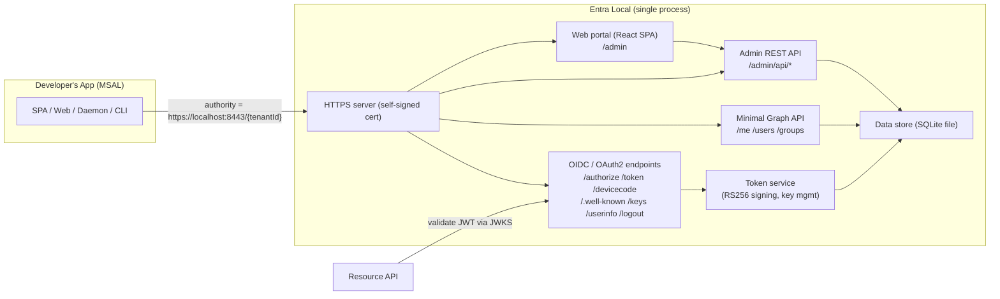

# Entra Local — Global Specification

> A local, developer-focused **emulator for Microsoft Entra ID** (formerly Azure AD).
> It exposes the same OpenID Connect / OAuth 2.0 endpoints that MSAL talks to, plus a
> minimal Microsoft Graph surface and a web portal to manage users and app registrations.
> Runs as a single executable, a Docker container, or via `npm start`.

- **Status:** Draft (v0.1)
- **Owner:** Project maintainers
- **Last updated:** 2026-06-22

---

## 1. Purpose & Vision

Application developers building against Microsoft Entra ID need a real tenant to test
sign-in, token acquisition, and protected-API calls. That dependency is slow, requires
cloud access and admin consent, pollutes shared tenants with test app registrations, and
cannot run offline or in CI.

**Entra Local** removes that dependency. It is a drop-in identity provider that speaks the
same protocols as Entra ID, so an app written with **MSAL** (any platform) can point its
`authority` at the emulator and work without code changes beyond configuration.

### Goals

1. **MSAL compatibility first.** If MSAL can do it against Entra ID for the supported
   flows, it should do it against Entra Local with only configuration changes.
2. **Standards-correct tokens.** Issue real, RS256-signed JWTs with a working OIDC
   discovery document and JWKS endpoint, so resource APIs validate tokens normally.
3. **Zero-friction setup.** One command (or one binary) to a running IdP with seeded
   data. No external services.
4. **Inspectable & resettable.** A portal and seed files make it easy to see what exists,
   create users/apps, and reset to a known state.

### Non-goals (for the MVP)

- Production use or any real security guarantees. **This is a development tool only.**
- Multi-tenant directory features (single tenant in MVP — see §14 Roadmap).
- Full Microsoft Graph parity (only a minimal read surface — see §6.3).
- SAML 2.0 / WS-Federation, B2C user flows, Conditional Access, MFA, consent framework.
- Implicit flow and ROPC (explicitly out of scope for MVP).

---

## 2. Target Users & Use Cases

| Persona | Use case |
|---|---|
| App developer | Run a local IdP, register their SPA/web/daemon app, sign in with a seeded user, acquire tokens. |
| API developer | Validate JWT access tokens (issuer, audience, signature, scopes/roles) against a stable local JWKS. |
| QA / CI engineer | Spin up the container in a pipeline, seed deterministic users/apps, run end-to-end auth tests offline. |
| Demo author | Show an Entra-style sign-in flow without a cloud tenant or network. |

### Primary scenarios

1. **SPA (Authorization Code + PKCE):** `@azure/msal-browser` redirects to the emulator's
   `/authorize`, the user signs in via the account picker, the app exchanges the code for
   ID + access tokens.
2. **Web app (Authorization Code, confidential client):** `@azure/msal-node` exchanges a
   code using a client secret.
3. **Daemon / service (Client Credentials):** app-only token with app roles in `roles`.
4. **CLI / device (Device Code):** poll-based flow for input-constrained scenarios.
5. **Token refresh:** long-lived refresh tokens exchanged for new access tokens.
6. **Call a protected API + minimal Graph:** use the access token against `/me`, `/users`,
   `/groups`.

---

## 3. Supported Protocols & Flows

| Capability | MVP | Notes |
|---|:--:|---|
| OIDC Discovery (`.well-known/openid-configuration`) | ✅ | Drives MSAL auto-config. |
| JWKS (`/discovery/v2.0/keys`) | ✅ | RSA public keys with `kid`. |
| Authorization Code + PKCE | ✅ | S256 and `plain` challenge methods. |
| Client Credentials | ✅ | Secret-based client auth (MVP). |
| Refresh Token | ✅ | Rotating refresh tokens. |
| Device Authorization (Device Code) | ✅ | RFC 8628. |
| Front-channel logout (`/logout`) | ✅ | Clears emulator session + `post_logout_redirect_uri`. |
| UserInfo endpoint | ✅ | OIDC userinfo from access token. |
| Implicit flow | ❌ | Out of scope. |
| ROPC (password grant) | ❌ | Out of scope. |
| On-Behalf-Of (OBO) | ✅ | Delegated JWT bearer exchange for one downstream resource. |
| SAML 2.0 / WS-Fed | ❌ | Out of scope. |

---

## 4. Architecture

### Components

- **HTTPS server** — single Node.js process. Hosts identity endpoints, Graph, the admin
  API, and serves the portal. HTTPS by default with an auto-generated self-signed cert.
- **Identity / OIDC module** — implements the discovery doc, authorize, token, device code,
  logout, userinfo, and JWKS endpoints.
- **Token service** — manages the RSA signing key(s), builds and signs ID/access tokens,
  validates incoming codes/refresh tokens, enforces expiry.
- **Minimal Graph module** — read endpoints backed by the same data store.
- **Admin REST API** — CRUD for users, groups, and app registrations; seed/reset.
- **Portal** — React SPA consuming the admin API.
- **Data store** — SQLite file via a thin repository layer.

---

## 5. Technology Stack

| Concern | Choice |
|---|---|
| Language / runtime | **Node.js + TypeScript** |
| HTTP framework | Fastify or Express (decided in detailed design) |
| JWT / crypto | `jose` (signing, JWKS, key generation) |
| Persistence | **SQLite** file (e.g. `better-sqlite3`) via a repository layer |
| Portal | **React + TypeScript** (Vite build), served as static assets |
| Validation | `zod` for request/config validation |
| Packaging | Single-exe (Node SEA or `pkg`), Docker image, and `npm start` |
| Tests | `vitest` (unit) + an MSAL-based end-to-end suite |

> Library choices that aren't load-bearing for the spec (HTTP framework, SQLite driver) are
> finalized in detailed design and recorded in `memory/decisions.md`.

---

## 6. API Surface

The emulator mirrors Entra ID's **v2.0** endpoint shapes so MSAL's metadata-driven config
works unchanged. A single fixed tenant is used in the MVP.

### 6.1 Tenant model

- A single tenant with a fixed GUID, default `11111111-1111-1111-1111-111111111111`
  (configurable).
- The path segment `{tenant}` accepts the tenant GUID and the aliases `common`,
  `organizations`, and `consumers`, all routing to the single tenant.
- `issuer` is `https://localhost:8443/{tenantId}/v2.0` (host/port configurable) and MUST
  match the discovery document and signed token `iss` claim.

### 6.2 OIDC / OAuth 2.0 endpoints

Base path: `/{tenant}`

| Method | Path | Purpose |
|---|---|---|
| GET | `/{tenant}/v2.0/.well-known/openid-configuration` | OIDC discovery metadata. |
| GET | `/{tenant}/discovery/v2.0/keys` | JWKS (RSA public keys + `kid`). |
| GET, POST | `/{tenant}/oauth2/v2.0/authorize` | Authorization endpoint (renders sign-in UI). |
| POST | `/{tenant}/oauth2/v2.0/token` | Token endpoint (code, client_credentials, refresh_token, device_code grants). |
| POST | `/{tenant}/oauth2/v2.0/devicecode` | Device authorization request (RFC 8628). |
| GET | `/{tenant}/oauth2/v2.0/logout` | Front-channel logout. |
| GET | `/{tenant}/openid/userinfo` | OIDC UserInfo (Bearer access token). |

**Discovery document** advertises at minimum: `issuer`, `authorization_endpoint`,
`token_endpoint`, `device_authorization_endpoint`, `jwks_uri`, `userinfo_endpoint`,
`end_session_endpoint`, `response_types_supported` (`code`), `grant_types_supported`,
`scopes_supported` (`openid profile email offline_access`), `subject_types_supported`,
`id_token_signing_alg_values_supported` (`RS256`),
`code_challenge_methods_supported` (`S256`, `plain`), `claims_supported`.

### 6.3 Minimal Microsoft Graph

Base path: `/graph/v1.0` (configurable). All require a valid Bearer access token whose
audience targets the Graph resource.

| Method | Path | Purpose |
|---|---|---|
| GET | `/graph/v1.0/me` | Current user from token `oid`. |
| GET | `/graph/v1.0/users` | List users (paged). |
| GET | `/graph/v1.0/users/{id}` | Single user. |
| GET | `/graph/v1.0/groups` | List groups (paged). |
| GET | `/graph/v1.0/groups/{id}` | Single group. |
| GET | `/graph/v1.0/groups/{id}/members` | Group membership. |

Responses use Graph-style JSON shapes (`id`, `displayName`, `userPrincipalName`, `mail`,
`@odata.context`, `value[]`). Read-only in MVP.

### 6.4 Admin / Management REST API

Base path: `/admin/api`. Unauthenticated (local dev tool). Powers the portal and enables
scripted seeding in CI.

| Resource | Endpoints |
|---|---|
| Users | `GET/POST /users`, `GET/PATCH/DELETE /users/{id}` |
| Groups | `GET/POST /groups`, `GET/PATCH/DELETE /groups/{id}`, membership management |
| App registrations | `GET/POST /apps`, `GET/PATCH/DELETE /apps/{id}` |
| App secrets | `POST /apps/{id}/secrets`, `DELETE /apps/{id}/secrets/{secretId}` |
| Scopes / app roles | manage exposed scopes and app roles on an app |
| Seed / reset | `POST /seed`, `POST /reset` |
| Health | `GET /admin/api/health` |

---

## 7. Token Design

All tokens are **RS256-signed JWTs**, validatable via the JWKS endpoint.

### 7.1 Signing keys

- One or more RSA key pairs generated on first run and **persisted** in the SQLite store so
  `kid` values and signatures are stable across restarts (important for caching resource
  APIs and MSAL).
- JWKS exposes the public key(s); the active `kid` is set in each token header.
- Key rotation supported via the admin API (roadmap), keeping old public keys in JWKS until
  expiry.

### 7.2 ID token (representative claims)

`iss`, `sub`, `aud` (= client_id), `exp`, `iat`, `nbf`, `tid`, `oid`, `name`,
`preferred_username`, `email`, `nonce` (echoed), `ver` (`2.0`).

### 7.3 Access token (representative claims)

`iss`, `sub`, `aud` (resource/API identifier), `exp`, `iat`, `nbf`, `tid`, `oid`, `azp`
(client_id), `scp` (delegated scopes, space-delimited) **or** `roles` (app-only roles),
`appid`, `ver`.

### 7.4 Lifetimes (configurable defaults)

| Token | Default lifetime |
|---|---|
| Authorization code | 5 minutes, single use |
| ID token | 1 hour |
| Access token | 1 hour |
| Refresh token | 24 hours, rotating |
| Device code | 15 minutes, 5s poll interval |

---

## 8. Data Model

Stored in SQLite. Conceptual entities:

- **Tenant** — `id` (GUID), `displayName`, `issuer`.
- **User** — `id`/`oid`, `userPrincipalName`, `displayName`, `mail`, `passwordHash?`,
  `accountEnabled`, group memberships.
- **Group** — `id`, `displayName`, `description`, members.
- **AppRegistration** — `appId` (client_id), `displayName`, `redirectUris[]`,
  `isConfidential`, `secrets[]` (hashed), `exposedScopes[]`, `appRoles[]`,
  `allowedFlows`.
- **SigningKey** — `kid`, public + private key material, `createdAt`, `notAfter`.
- **AuthorizationCode** — `code`, `appId`, `userId`, `redirectUri`, `scopes`,
  `codeChallenge`, `codeChallengeMethod`, `nonce`, `expiresAt`, `consumed`.
- **RefreshToken** — `token`, `appId`, `userId`, `scopes`, `expiresAt`, `rotatedFrom?`.
- **DeviceCode** — `deviceCode`, `userCode`, `appId`, `scopes`, `status`
  (`pending`/`approved`/`denied`/`expired`), `expiresAt`, `interval`.
- **Session** — emulator browser session for SSO during `/authorize`.

---

## 9. Web Portal

A React SPA served at `/admin`, open/unauthenticated (local dev tool).

**MVP features**

- **Dashboard:** emulator status, tenant ID, issuer, key endpoints (copy buttons), MSAL
  config snippet generator.
- **Users:** list, create, edit, delete; set optional password; manage group membership.
- **Groups:** list, create, edit, delete; manage members.
- **App registrations:** create/edit/delete; manage redirect URIs, client secrets (shown
  once on creation), exposed scopes, and app roles; per-app MSAL snippet.
- **Seed / reset:** apply the default seed or reset the store to empty.

---

## 10. Configuration, Persistence & TLS

### 10.1 Configuration

Configuration via environment variables and/or a config file (`entra-local.config.json`),
validated at startup. Representative settings:

| Setting | Default | Description |
|---|---|---|
| `HOST` | `localhost` | Bind host. |
| `PORT` | `8443` | HTTPS port. |
| `TENANT_ID` | `11111111-1111-1111-1111-111111111111` | Fixed tenant GUID. |
| `ISSUER` | derived from host/port/tenant | Override issuer if fronted by a proxy. |
| `DB_PATH` | `./data/entra-local.db` | SQLite file location. |
| `TLS_ENABLED` | `true` | HTTPS on/off. |
| `TLS_CERT` / `TLS_KEY` | auto-generated | Provide your own cert/key. |
| `REQUIRE_PASSWORD` | `false` | Enforce password login (vs account picker). |
| `SEED_ON_START` | `true` if DB empty | Apply default seed data. |
| `TOKEN_LIFETIMES_*` | see §7.4 | Override token lifetimes. |

### 10.2 Persistence

- **SQLite file** so users, apps, tenants, signing keys, and issued tokens survive
  restarts.
- A **default seed** creates the tenant, a couple of users, a group, and a sample SPA +
  daemon app registration so the emulator is usable immediately.
- Deterministic seed values (fixed GUIDs/secrets) support reproducible CI.

### 10.3 TLS

- **HTTPS by default** with an **auto-generated self-signed certificate** (persisted so the
  fingerprint is stable). The cert covers `localhost`/`127.0.0.1`.
- Developers can trust the generated cert locally or override with their own
  `TLS_CERT`/`TLS_KEY`.
- TLS can be disabled (`TLS_ENABLED=false`) to fall back to HTTP on loopback.

### 10.4 Sign-in experience

- **Account picker by default:** the `/authorize` UI lists seeded users; selecting one
  signs in without a password.
- **Optional password enforcement:** when `REQUIRE_PASSWORD=true`, users authenticate with
  username + password (hashed at rest).

---

## 11. Deployment & Packaging

Three first-class targets:

1. **`npm start`** — clone, `npm install`, `npm start`; runs from source/build.
2. **Single executable** — self-contained binary (Node SEA or `pkg`) bundling the runtime,
   portal assets, and migrations; no Node install required.
3. **Docker container** — published image; mount a volume for the SQLite file and cert to
   persist state; configure via environment variables.

All three share the same configuration model and data format.

---

## 12. MSAL Integration (developer experience)

A developer points MSAL at the emulator with minimal changes:

- **Authority:** `https://localhost:8443/{tenantId}` (or `/common`).
- For custom/non-Microsoft authorities, set MSAL's `knownAuthorities` / `protocolMode`
  appropriately so it uses the emulator's discovery document.
- **Trust** the self-signed cert (or run the app with cert validation relaxed in dev) so
  MSAL can fetch discovery/JWKS over HTTPS.
- Redirect URIs registered in the portal must match the app's MSAL config.

The portal generates a ready-to-paste MSAL config snippet per app registration to make this
turnkey.

---

## 13. Security Posture

**Entra Local is a development tool and is not secure for production.** Explicitly:

- The admin API and portal are unauthenticated by default.
- Self-signed certificates and seeded/known secrets are used.
- No rate limiting, lockout, consent, or threat protection is implemented.
- It must only be bound to local/trusted networks.

These trade-offs are intentional in service of developer ergonomics.

---

## 14. Roadmap (post-MVP)

- Multi-tenant support (multiple directories, `tid` per tenant).
- On-Behalf-Of (OBO) flow for multi-tier APIs.
- Broader Graph (write operations, app roles, directory objects).
- Certificate-based client authentication (`private_key_jwt`).
- Configurable signing-key rotation via the portal.
- Optional consent screen and scope-consent modeling.
- Import/export of directory state (JSON) for sharing fixtures.
- Sample applications under `samples/` using MSAL across JS, React, Node (web, daemon, and a
  Node.js CLI using Device Code), .NET, and Python, plus a full-stack JS SPA + Node/Express
  protected-API sample (one app registration per tier) — see [`roadmap.md`](roadmap.md) Iteration 3.
- Public developer documentation site (see [`roadmap.md`](roadmap.md) Iteration 4).

---

## 15. Acceptance Criteria (v1.0 "done")

> These criteria define the full **v1.0** bar, delivered across both iterations in
> [`roadmap.md`](roadmap.md). Criteria 1, 2, 4, 5, and 6 are met at the end of **Iteration 1
> (MVP)**; criterion 3 (Device Code) and the single-executable portion of criterion 7 are
> met at the end of **Iteration 2**.

1. An `@azure/msal-browser` SPA completes Authorization Code + PKCE against the emulator and
   receives valid, JWKS-verifiable ID and access tokens. *(Iteration 1)*
2. An `@azure/msal-node` confidential client completes Client Credentials and Refresh Token
   flows. *(Iteration 1)*
3. Device Code flow completes end-to-end via the portal/user-code approval. *(Iteration 2)*
4. The OIDC discovery document and JWKS validate with standard OIDC tooling, and issued
   tokens verify against the JWKS. *(Iteration 1)*
5. `/me`, `/users`, and `/groups` return Graph-shaped responses for a valid access token.
   *(Iteration 1)*
6. The portal can create a user, a group, and an app registration, and the new app can sign
   in immediately. *(Iteration 1)*
7. The emulator runs via `npm start` and as a Docker container *(Iteration 1)*, and as a
   single executable *(Iteration 2)*, persisting state across restarts.

---

## 16. Testing & Verification Strategy

Entra Local is built to be implemented feature-by-feature by agents that **verify their own
work along the way**, so testability is a first-class requirement. The toolchain (npm
scripts, test harness, CI) is established in [`roadmap.md`](roadmap.md) feature #1 and used by
every feature thereafter.

### 16.1 Test layers

- **Unit tests** (`vitest`) — pure logic: token-claim assembly, PKCE verification, code/
  refresh validation, config parsing, repository methods.
- **Integration tests** (HTTP-level against an in-process app) — each endpoint's
  request→response contract and persisted side effects, using an ephemeral SQLite file and
  deterministic seed. Covers the discovery document shape, JWKS, `/authorize`, `/token` per
  grant, `/devicecode`, `/userinfo`, `/logout`, Graph reads, and the admin API.
- **Token-conformance tests** (run under `npm test`) — every issued JWT verifies against the
  JWKS; required claims (`iss`, `aud`, `tid`, `oid`, `scp`/`roles`, `ver`, expiry) match Entra
  shapes.
- **End-to-end (real MSAL) tests** — drive each flow with the actual MSAL library against a
  running emulator. In Iterations 1-2 these use **inline MSAL drivers** shipped in feature
  #1's harness: `@azure/msal-browser` (headless browser) and `@azure/msal-node` for
  Authorization Code + PKCE, Refresh, and Client Credentials (Device Code added with #15).
  UserInfo and Logout are asserted within the Authorization Code e2e (sign-in → `/userinfo` →
  sign-out). Feature #13 adds the cross-platform compatibility gate — authority/instance-
  discovery smoke-tests for **MSAL.NET and MSAL Python** (their runtimes provisioned in CI).
  The Iteration 3 sample apps are an additional regression surface, not a prerequisite for the
  earlier e2e tests.

### 16.2 Commands (npm scripts)

| Script | Purpose |
|---|---|
| `npm run dev` | Run with reload for local development. |
| `npm run build` | Type-check and build server + portal assets. |
| `npm run typecheck` | TypeScript `--noEmit`. |
| `npm run lint` | Lint + format check. |
| `npm test` | Unit + integration + token-conformance tests. |
| `npm run test:e2e` | Real-MSAL end-to-end suite (starts the emulator; includes the MSAL.NET/Python discovery smoke-tests once feature #13 lands). |

These script names are a stable contract so CI and coding agents can rely on them.

### 16.3 CI

A CI pipeline runs `lint`, `typecheck`, `build`, `test`, and `test:e2e` on every change, and
provisions the **.NET and Python** runtimes required by feature #13's compatibility
smoke-tests and the Iteration 3 .NET/Python samples. Runs are deterministic: fixed tenant ID,
fixed seed, ephemeral DB, and a fixed test port.

### 16.4 Per-feature Definition of Done

A feature is "done" only when its per-feature spec is satisfied, all relevant layers above
are green in CI, its acceptance criteria are demonstrably met, and the roadmap status is set
to ✅. See [`roadmap.md` Execution Model](roadmap.md#execution-model-for-autopilot-agents).

---

## 17. Open Questions

- HTTP framework and SQLite driver selection (detailed design).
- Exact discovery-document field set required for MSAL across platforms — validated against
  `msal-browser`, `msal-node`, MSAL.NET, and MSAL Python; **resolved by roadmap feature #13**.
- Single-exe approach: Node SEA vs `pkg` (asset bundling of portal + native SQLite).
- Whether the account picker should also support "type any UPN" to mint ad-hoc users.
